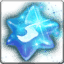

<!-- generated:start -->
<!-- generated-keys: title=e6c26c type=d36ca9 id=0d4d6c sources=ab7af3 name_key=410a05 kind=972a67 kind_name=a3317b classes=92d079 bind=883bf8 price=8c6ae2 cost_pair=982f5a rune_level=c1dfd9 stats=1933ec options=30ea72 icon=79e802 obtained_from=47b561 -->
|  |  |
|---|---|
|  |  |
| **Item id** | `7168` |
| **Kind** | Rune (35) |
| **Classes** | all |
| **Bind** | on pickup |
| **Buy price** | 10 Gold |
| **Rune level** | 6 |
| **Icon** | `ui/icons/Items_29.png` cell 58 |

### Tooltip

> The Rune ability is applied, when equip weapon which set Runes..

### Stats

| stat | value | applies | code |
|---|---|---|---|
| Movement(%) | Movement +8% | flat | 105 |
| Movement(%) | Movement +17% | flat (from Item_Jewel) | 105 |

### Other options

| code | value | meaning |
|---|---|---|
| 202 | 17 | rune grade? |

Jewel upgrade (JewelSocketMake 166): [[wiki/items/702-crystal-red|Crystal : Red]] × 10, [[wiki/items/614-red-passion-piece-c|Red Passion Piece (C)]] × 10, [[wiki/items/856-brilliant-passion|Brilliant Passion]] × 1 from [[wiki/items/7167-movement-rune|Movement(%) Rune]].

### Where to get it

Nothing in the client data. Monster drops are server data: add them to the monster's page (`drops:`) or to this page's `obtained_from:`.
<!-- generated:end -->

## Notes

<!-- hand-written: add what you know, with a source -->

## Behaviour

<!-- hand-written: add what you know, with a source -->

## Sources

<!-- hand-written: add what you know, with a source -->

## Open questions

<!-- hand-written: add what you know, with a source -->

<!-- credit:start -->
---
*Game content © GAMESinFLAMES / Joyimpact; reproduced for preservation and reference.*
<!-- credit:end -->
