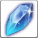

<!-- generated:start -->
<!-- generated-keys: title=19053b type=d36ca9 id=d04d50 sources=f45232 name_key=0dbc3a kind=7b5200 kind_name=59f0ad classes=92d079 bind=2be88c price=d9d29b cost_pair=0847b0 stats=97d170 icon=0f7651 obtained_from=97d170 -->
|  |  |
|---|---|
|  |  |
| **Item id** | `772` |
| **Kind** | Material (12) |
| **Classes** | all |
| **Buy price** | 640 Gold |
| **Icon** | `ui/icons/Items_07.png` cell 19 |

### Tooltip

> Gears Material Item

### Where to get it

Nothing in the client data. Monster drops are server data: add them to the monster's page (`drops:`) or to this page's `obtained_from:`.
<!-- generated:end -->

## Notes

<!-- hand-written: add what you know, with a source -->

## Behaviour

<!-- hand-written: add what you know, with a source -->

## Sources

<!-- hand-written: add what you know, with a source -->

## Open questions

<!-- hand-written: add what you know, with a source -->

<!-- credit:start -->
---
*Game content © GAMESinFLAMES / Joyimpact; reproduced for preservation and reference.*
<!-- credit:end -->
