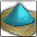

<!-- generated:start -->
<!-- generated-keys: title=78a8c0 type=d36ca9 id=f890d7 sources=480e56 name_key=febf7b kind=7b5200 kind_name=59f0ad classes=92d079 bind=2be88c price=a213ed cost_pair=32167a stats=97d170 icon=dc6755 obtained_from=148061 -->
|  |  |
|---|---|
|  |  |
| **Item id** | `805` |
| **Kind** | Material (12) |
| **Classes** | all |
| **Buy price** | 2 Gold |
| **Icon** | `ui/icons/Items_03.png` cell 20 |

### Tooltip

> Bloodstone powder item
> Used to create Scrolls and Tomes.

### Crafting

| recipe | materials | gold | success % |
|---|---|---|---|
| 602 | [[wiki/items/804-blue-bloodstone\|Blue bloodstone]] × 1 | 0 | 100 |
| 2402 | [[wiki/items/804-blue-bloodstone\|Blue bloodstone]] × 1 | 0 | 100 |

### Where to get it

Nothing in the client data. Monster drops are server data: add them to the monster's page (`drops:`) or to this page's `obtained_from:`.

### Used for

- Material (× 20) for [[wiki/items/709-scroll-of-the-magician-b|Scroll of the Magician (B)]] (recipe 504)
- Material (× 30) for [[wiki/items/710-scroll-of-the-magician-a|Scroll of the Magician (A)]] (recipe 505)
- Material (× 40) for [[wiki/items/711-scroll-of-the-magician-s|Scroll of the Magician (S)]] (recipe 506)
- Material (× 20) for [[wiki/items/709-scroll-of-the-magician-b|Scroll of the Magician (B)]] (recipe 2302)

### Mentioned in

- [[gameplay/consumables|Consumables and clickables]]
- [[gameplay/dungeon-drops|Dungeon drops (ores and herbs)]]
<!-- generated:end -->

## Notes

<!-- hand-written: add what you know, with a source -->

## Behaviour

<!-- hand-written: add what you know, with a source -->

## Sources

<!-- hand-written: add what you know, with a source -->

## Open questions

<!-- hand-written: add what you know, with a source -->

<!-- credit:start -->
---
*Game content © GAMESinFLAMES / Joyimpact; reproduced for preservation and reference.*
<!-- credit:end -->
