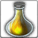

<!-- generated:start -->
<!-- generated-keys: title=b06f70 type=d36ca9 id=967d1c sources=6a2ea9 name_key=651677 kind=7b5200 kind_name=59f0ad classes=92d079 bind=2be88c price=1dc6ee cost_pair=bbc775 stats=97d170 icon=566f1e obtained_from=d4b805 -->
|  |  |
|---|---|
|  |  |
| **Item id** | `849` |
| **Kind** | Material (12) |
| **Classes** | all |
| **Buy price** | 50 Gold |
| **Icon** | `ui/icons/Items_04.png` cell 43 |

### Tooltip

> Crafting Material

### Where to get it

- Sold in [[wiki/shops/97-shop-97-no-npc|Shop 97 (no NPC)]] (no NPC found)
- Sold in [[wiki/shops/101-shop-101-no-npc|Shop 101 (no NPC)]] (no NPC found)
- Sold in [[wiki/shops/105-shop-105-no-npc|Shop 105 (no NPC)]] (no NPC found)

### Used for

- Material (× 1) for [[wiki/items/717-tome-of-cooldown-b|Tome of Cooldown (B)]] (recipe 510)
- Material (× 2) for [[wiki/items/718-tome-of-cooldown-a|Tome of Cooldown (A)]] (recipe 511)
- Material (× 3) for [[wiki/items/719-tome-of-cooldown-s|Tome of Cooldown (S)]] (recipe 512)
- Material (× 1) for Item 0 (recipe 522)
- Material (× 2) for Item 0 (recipe 523)
- Material (× 3) for Item 0 (recipe 524)
- Material (× 1) for [[wiki/items/717-tome-of-cooldown-b|Tome of Cooldown (B)]] (recipe 2304)
- Material (× 1) for Item 0 (recipe 2308)

### Mentioned in

- [[gameplay/consumables|Consumables and clickables]]
- [[gameplay/maps-and-dungeons|Maps and dungeons]]
<!-- generated:end -->

## Notes

<!-- hand-written: add what you know, with a source -->

## Behaviour

<!-- hand-written: add what you know, with a source -->

## Sources

<!-- hand-written: add what you know, with a source -->

## Open questions

<!-- hand-written: add what you know, with a source -->

<!-- credit:start -->
---
*Game content © GAMESinFLAMES / Joyimpact; reproduced for preservation and reference.*
<!-- credit:end -->
