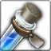

<!-- generated:start -->
<!-- generated-keys: title=8cfa45 type=d36ca9 id=7d9f2b sources=2cc7fb name_key=e1d1a6 kind=7b5200 kind_name=59f0ad classes=92d079 bind=2be88c price=d98d6c cost_pair=9a5091 stats=97d170 icon=603157 obtained_from=32af07 -->
|  |  |
|---|---|
|  |  |
| **Item id** | `874` |
| **Kind** | Material (12) |
| **Classes** | all |
| **Buy price** | 45 Gold |
| **Icon** | `ui/icons/Items_07.png` cell 14 |

### Tooltip

> Extracted Spartium Item
> Used to create Dyes.

### Crafting

| recipe | materials | gold | success % |
|---|---|---|---|
| 628 | [[wiki/items/828-spartium\|Spartium]] × 5 | 0 | 100 |
| 2428 | [[wiki/items/828-spartium\|Spartium]] × 5 | 0 | 100 |

### Where to get it

Nothing in the client data. Monster drops are server data: add them to the monster's page (`drops:`) or to this page's `obtained_from:`.

### Used for

- Material (× 1) for [[wiki/items/2505-white-dye|White Dye]] (recipe 756)
- Material (× 1) for [[wiki/items/2305-white-hair-dye|White Hair Dye]] (recipe 766)
- Material (× 1) for [[wiki/items/2505-white-dye|White Dye]] (recipe 2606)
- Material (× 1) for [[wiki/items/2305-white-hair-dye|White Hair Dye]] (recipe 2616)
<!-- generated:end -->

## Notes

<!-- hand-written: add what you know, with a source -->

## Behaviour

<!-- hand-written: add what you know, with a source -->

## Sources

<!-- hand-written: add what you know, with a source -->

## Open questions

<!-- hand-written: add what you know, with a source -->

<!-- credit:start -->
---
*Game content © GAMESinFLAMES / Joyimpact; reproduced for preservation and reference.*
<!-- credit:end -->
