<!-- generated by wiki/gamewiki (index.py); do not edit -->

# Items

Every item in the client's `Item_Base` table: equipment, weapons, runes, consumables, materials, quest items and the pseudo-items used for gold, fame and exp rewards.

1192 pages: 871 complete, 20 partial, 301 stub. Back to the [[wiki/index|game wiki]].

| | id | name | status | missing |
|---|---|---|---|---|
|  | 1 | [[wiki/items/1\|Item 1]] | stub | 1 |
|  | 2 | [[wiki/items/2\|Item 2]] | stub | 1 |
| 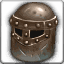 | 351 | [[wiki/items/351-novice-helmet\|Novice Helmet]] | stub | 1 |
|  | 352 | [[wiki/items/352-novice-armor\|Novice Armor]] | stub | 1 |
|  | 353 | [[wiki/items/353-novice-gloves\|Novice Gloves]] | stub | 1 |
| 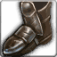 | 354 | [[wiki/items/354-novice-shoes\|Novice Shoes]] | stub | 1 |
|  | 397 | [[wiki/items/397-spell-necklace\|Spell Necklace]] | complete | 0 |
|  | 398 | [[wiki/items/398-spell-belt\|Spell Belt]] | complete | 0 |
|  | 399 | [[wiki/items/399-spell-bracelet\|Spell Bracelet]] | complete | 0 |
|  | 400 | [[wiki/items/400-spell-ring\|Spell Ring]] | complete | 0 |
|  | 401 | [[wiki/items/401-helmet-of-life\|Helmet of Life]] | complete | 0 |
|  | 402 | [[wiki/items/402-armor-of-life\|Armor of Life]] | complete | 0 |
|  | 403 | [[wiki/items/403-gloves-of-life\|Gloves of Life]] | complete | 0 |
|  | 404 | [[wiki/items/404-shoes-of-life\|Shoes of Life]] | complete | 0 |
|  | 405 | [[wiki/items/405-necklace-of-life\|Necklace of Life]] | complete | 0 |
|  | 406 | [[wiki/items/406-belt-of-life\|Belt of Life]] | complete | 0 |
|  | 407 | [[wiki/items/407-bracelet-of-life\|Bracelet of Life]] | complete | 0 |
|  | 408 | [[wiki/items/408-ring-of-life\|Ring of Life]] | complete | 0 |
|  | 409 | [[wiki/items/409-guardian-helmet\|Guardian Helmet]] | complete | 0 |
|  | 410 | [[wiki/items/410-guardian-armor\|Guardian Armor]] | complete | 0 |
| 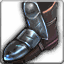 | 411 | [[wiki/items/411-guardian-shoes\|Guardian Shoes]] | complete | 0 |
|  | 412 | [[wiki/items/412-guardian-gloves\|Guardian Gloves]] | complete | 0 |
| 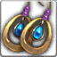 | 413 | [[wiki/items/413-spirit-earring\|Spirit Earring]] | complete | 0 |
|  | 414 | [[wiki/items/414-spirit-robe\|Spirit Robe]] | complete | 0 |
| 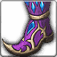 | 415 | [[wiki/items/415-spirit-shoes\|Spirit Shoes]] | complete | 0 |
|  | 416 | [[wiki/items/416-spirit-gloves\|Spirit Gloves]] | complete | 0 |
|  | 417 | [[wiki/items/417-helmet-of-honor\|Helmet of Honor]] | complete | 0 |
|  | 418 | [[wiki/items/418-armor-of-honor\|Armor of Honor]] | complete | 0 |
|  | 419 | [[wiki/items/419-shoes-of-honor\|Shoes of Honor]] | complete | 0 |
|  | 420 | [[wiki/items/420-gloves-of-honor\|Gloves of Honor]] | complete | 0 |
|  | 421 | [[wiki/items/421-necklace-of-mediation\|Necklace of Mediation]] | complete | 0 |
|  | 422 | [[wiki/items/422-belt-of-mediation\|Belt of Mediation]] | complete | 0 |
|  | 423 | [[wiki/items/423-bracelet-of-mediation\|Bracelet of Mediation]] | complete | 0 |
|  | 424 | [[wiki/items/424-ring-of-mediation\|Ring of Mediation]] | complete | 0 |
|  | 425 | [[wiki/items/425-necklace-of-transcendency\|Necklace of Transcendency]] | complete | 0 |
|  | 426 | [[wiki/items/426-belt-of-transcendency\|Belt of Transcendency]] | complete | 0 |
|  | 427 | [[wiki/items/427-bracelet-of-transcendency\|Bracelet of Transcendency]] | complete | 0 |
|  | 428 | [[wiki/items/428-ring-of-transcendency\|Ring of Transcendency]] | complete | 0 |
|  | 429 | [[wiki/items/429-bandolier-necklace\|Bandolier Necklace]] | complete | 0 |
|  | 430 | [[wiki/items/430-bandolier-belt\|Bandolier Belt]] | complete | 0 |
|  | 431 | [[wiki/items/431-bandolier-bracelet\|Bandolier Bracelet]] | complete | 0 |
|  | 432 | [[wiki/items/432-bandolier-ring\|Bandolier Ring]] | complete | 0 |
|  | 433 | [[wiki/items/433-barrier-necklace\|Barrier Necklace]] | complete | 0 |
|  | 434 | [[wiki/items/434-barrier-belt\|Barrier Belt]] | complete | 0 |
|  | 435 | [[wiki/items/435-barrier-bracelet\|Barrier Bracelet]] | complete | 0 |
|  | 436 | [[wiki/items/436-barrier-ring\|Barrier Ring]] | complete | 0 |
|  | 437 | [[wiki/items/437-necklace-of-courage\|Necklace of Courage]] | complete | 0 |
|  | 438 | [[wiki/items/438-belt-of-courage\|Belt of Courage]] | complete | 0 |
|  | 439 | [[wiki/items/439-bracelet-of-courage\|Bracelet of Courage]] | complete | 0 |
|  | 440 | [[wiki/items/440-ring-of-courage\|Ring of Courage]] | complete | 0 |
|  | 441 | [[wiki/items/441-necklace-of-rise\|Necklace of Rise]] | complete | 0 |
|  | 442 | [[wiki/items/442-belt-of-rise\|Belt of Rise]] | complete | 0 |
|  | 443 | [[wiki/items/443-bracelet-of-rise\|Bracelet of Rise]] | complete | 0 |
|  | 444 | [[wiki/items/444-ring-of-rise\|Ring of Rise]] | complete | 0 |
|  | 445 | [[wiki/items/445-spell-necklace\|Spell Necklace]] | complete | 0 |
|  | 446 | [[wiki/items/446-spell-belt\|Spell Belt]] | complete | 0 |
|  | 447 | [[wiki/items/447-spell-bracelet\|Spell Bracelet]] | complete | 0 |
|  | 448 | [[wiki/items/448-spell-ring\|Spell Ring]] | complete | 0 |
|  | 449 | [[wiki/items/449-necklace-of-life\|Necklace of Life]] | complete | 0 |
|  | 450 | [[wiki/items/450-belt-of-life\|Belt of Life]] | complete | 0 |
|  | 451 | [[wiki/items/451-bracelet-of-life\|Bracelet of Life]] | complete | 0 |
|  | 452 | [[wiki/items/452-ring-of-life\|Ring of Life]] | complete | 0 |
|  | 453 | [[wiki/items/453-necklace-of-mediation\|Necklace of Mediation]] | complete | 0 |
|  | 454 | [[wiki/items/454-belt-of-mediation\|Belt of Mediation]] | complete | 0 |
|  | 455 | [[wiki/items/455-bracelet-of-mediation\|Bracelet of Mediation]] | complete | 0 |
|  | 456 | [[wiki/items/456-ring-of-mediation\|Ring of Mediation]] | complete | 0 |
|  | 457 | [[wiki/items/457-necklace-of-transcendency\|Necklace of Transcendency]] | complete | 0 |
|  | 458 | [[wiki/items/458-belt-of-transcendency\|Belt of Transcendency]] | complete | 0 |
|  | 459 | [[wiki/items/459-bracelet-of-transcendency\|Bracelet of Transcendency]] | complete | 0 |
|  | 460 | [[wiki/items/460-ring-of-transcendency\|Ring of Transcendency]] | complete | 0 |
|  | 461 | [[wiki/items/461-bandolier-necklace\|Bandolier Necklace]] | complete | 0 |
|  | 462 | [[wiki/items/462-bandolier-belt\|Bandolier Belt]] | complete | 0 |
|  | 463 | [[wiki/items/463-bandolier-bracelet\|Bandolier Bracelet]] | complete | 0 |
| 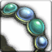 | 464 | [[wiki/items/464-bandolier-ring\|Bandolier Ring]] | complete | 0 |
| 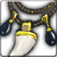 | 465 | [[wiki/items/465-barrier-necklace\|Barrier Necklace]] | complete | 0 |
|  | 466 | [[wiki/items/466-barrier-belt\|Barrier Belt]] | complete | 0 |
|  | 467 | [[wiki/items/467-barrier-bracelet\|Barrier Bracelet]] | complete | 0 |
|  | 468 | [[wiki/items/468-barrier-ring\|Barrier Ring]] | complete | 0 |
| 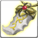 | 469 | [[wiki/items/469-necklace-of-courage\|Necklace of Courage]] | complete | 0 |
|  | 470 | [[wiki/items/470-belt-of-courage\|Belt of Courage]] | complete | 0 |
|  | 471 | [[wiki/items/471-bracelet-of-courage\|Bracelet of Courage]] | complete | 0 |
|  | 472 | [[wiki/items/472-ring-of-courage\|Ring of Courage]] | complete | 0 |
| 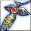 | 473 | [[wiki/items/473-necklace-of-rise\|Necklace of Rise]] | complete | 0 |
|  | 474 | [[wiki/items/474-belt-of-rise\|Belt of Rise]] | complete | 0 |
| 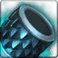 | 475 | [[wiki/items/475-bracelet-of-rise\|Bracelet of Rise]] | complete | 0 |
|  | 476 | [[wiki/items/476-ring-of-rise\|Ring of Rise]] | complete | 0 |
|  | 477 | [[wiki/items/477-helmet-of-life\|Helmet of Life]] | complete | 0 |
|  | 478 | [[wiki/items/478-armor-of-life\|Armor of Life]] | complete | 0 |
|  | 479 | [[wiki/items/479-gloves-of-life\|Gloves of Life]] | complete | 0 |
|  | 480 | [[wiki/items/480-shoes-of-life\|Shoes of Life]] | complete | 0 |
|  | 481 | [[wiki/items/481-guardian-helmet\|Guardian Helmet]] | complete | 0 |
|  | 482 | [[wiki/items/482-guardian-armor\|Guardian Armor]] | complete | 0 |
|  | 483 | [[wiki/items/483-guardian-shoes\|Guardian Shoes]] | complete | 0 |
|  | 484 | [[wiki/items/484-guardian-gloves\|Guardian Gloves]] | complete | 0 |
|  | 485 | [[wiki/items/485-spirit-earring\|Spirit Earring]] | complete | 0 |
|  | 486 | [[wiki/items/486-spirit-robe\|Spirit Robe]] | complete | 0 |
|  | 487 | [[wiki/items/487-spirit-shoes\|Spirit Shoes]] | complete | 0 |
|  | 488 | [[wiki/items/488-spirit-gloves\|Spirit Gloves]] | complete | 0 |
| 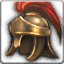 | 489 | [[wiki/items/489-helmet-of-honor\|Helmet of Honor]] | complete | 0 |
|  | 490 | [[wiki/items/490-armor-of-honor\|Armor of Honor]] | complete | 0 |
| 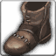 | 491 | [[wiki/items/491-shoes-of-honor\|Shoes of Honor]] | complete | 0 |
|  | 492 | [[wiki/items/492-gloves-of-honor\|Gloves of Honor]] | complete | 0 |
|  | 601 | [[wiki/items/601-blue-passion-fragments-d\|Blue Passion Fragments (D)]] | complete | 0 |
|  | 602 | [[wiki/items/602-blue-passion-piece-d\|Blue Passion Piece (D)]] | complete | 0 |
| 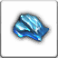 | 603 | [[wiki/items/603-blue-passion-fragments-c\|Blue Passion Fragments (C)]] | complete | 0 |
| 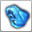 | 604 | [[wiki/items/604-blue-passion-piece-c\|Blue Passion Piece (C)]] | complete | 0 |
|  | 605 | [[wiki/items/605-blue-passion-fragments-b\|Blue Passion Fragments (B)]] | complete | 0 |
|  | 606 | [[wiki/items/606-blue-passion-piece-b\|Blue Passion Piece (B)]] | complete | 0 |
|  | 607 | [[wiki/items/607-blue-passion-fragments-a\|Blue Passion Fragments (A)]] | stub | 1 |
| 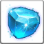 | 608 | [[wiki/items/608-blue-passion-piece-a\|Blue Passion Piece (A)]] | stub | 1 |
| 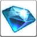 | 609 | [[wiki/items/609-blue-passion-fragments-s\|Blue Passion Fragments (S)]] | stub | 1 |
| 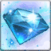 | 610 | [[wiki/items/610-blue-passion-piece-s\|Blue Passion Piece (S)]] | stub | 1 |
|  | 611 | [[wiki/items/611-red-passion-fragments-d\|Red Passion Fragments (D)]] | complete | 0 |
|  | 612 | [[wiki/items/612-red-passion-piece-d\|Red Passion Piece (D)]] | complete | 0 |
|  | 613 | [[wiki/items/613-red-passion-fragments-c\|Red Passion Fragments (C)]] | complete | 0 |
|  | 614 | [[wiki/items/614-red-passion-piece-c\|Red Passion Piece (C)]] | complete | 0 |
| 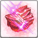 | 615 | [[wiki/items/615-red-passion-fragments-b\|Red Passion Fragments (B)]] | complete | 0 |
| 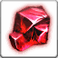 | 616 | [[wiki/items/616-red-passion-piece-b\|Red Passion Piece (B)]] | complete | 0 |
|  | 617 | [[wiki/items/617-red-passion-fragments-a\|Red Passion Fragments (A)]] | stub | 1 |
| 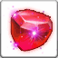 | 618 | [[wiki/items/618-red-passion-piece-a\|Red Passion Piece (A)]] | stub | 1 |
| 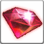 | 619 | [[wiki/items/619-red-passion-fragments-s\|Red Passion Fragments (S)]] | stub | 1 |
| 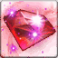 | 620 | [[wiki/items/620-red-passion-piece-s\|Red Passion Piece (S)]] | stub | 1 |
|  | 621 | [[wiki/items/621-orange-passion-fragments-d\|Orange Passion Fragments (D)]] | complete | 0 |
|  | 622 | [[wiki/items/622-orange-passion-piece-d\|Orange Passion Piece (D)]] | complete | 0 |
| 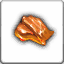 | 623 | [[wiki/items/623-orange-passion-fragments-c\|Orange Passion Fragments (C)]] | complete | 0 |
|  | 624 | [[wiki/items/624-orange-passion-piece-c\|Orange Passion Piece (C)]] | complete | 0 |
|  | 625 | [[wiki/items/625-orange-passion-fragments-b\|Orange Passion Fragments (B)]] | complete | 0 |
| 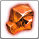 | 626 | [[wiki/items/626-orange-passion-piece-b\|Orange Passion Piece (B)]] | complete | 0 |
| 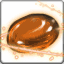 | 627 | [[wiki/items/627-orange-passion-fragments-a\|Orange Passion Fragments (A)]] | stub | 1 |
| 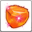 | 628 | [[wiki/items/628-orange-passion-piece-a\|Orange Passion Piece (A)]] | stub | 1 |
| 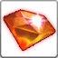 | 629 | [[wiki/items/629-orange-passion-fragments-s\|Orange Passion Fragments (S)]] | stub | 1 |
| 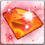 | 630 | [[wiki/items/630-orange-passion-piece-s\|Orange Passion Piece (S)]] | stub | 1 |
| 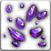 | 631 | [[wiki/items/631-violet-passion-fragments-d\|Violet Passion Fragments (D)]] | stub | 1 |
| 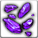 | 632 | [[wiki/items/632-violet-passion-piece-d\|Violet Passion Piece (D)]] | stub | 1 |
|  | 633 | [[wiki/items/633-violet-passion-fragments-c\|Violet Passion Fragments (C)]] | stub | 1 |
| 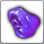 | 634 | [[wiki/items/634-violet-passion-piece-c\|Violet Passion Piece (C)]] | stub | 1 |
| 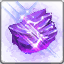 | 635 | [[wiki/items/635-violet-passion-fragments-b\|Violet Passion Fragments (B)]] | stub | 1 |
| 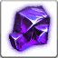 | 636 | [[wiki/items/636-violet-passion-piece-b\|Violet Passion Piece (B)]] | stub | 1 |
|  | 637 | [[wiki/items/637-violet-passion-fragments-a\|Violet Passion Fragments (A)]] | stub | 1 |
| 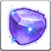 | 638 | [[wiki/items/638-violet-passion-piece-a\|Violet Passion Piece (A)]] | stub | 1 |
| 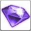 | 639 | [[wiki/items/639-violet-passion-fragments-s\|Violet Passion Fragments (S)]] | stub | 1 |
| 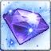 | 640 | [[wiki/items/640-violet-passion-piece-s\|Violet Passion Piece (S)]] | stub | 1 |
|  | 641 | [[wiki/items/641-rainbow-reinforcing-stone-weapon\|Rainbow Reinforcing Stone (Weapon)]] | complete | 0 |
| 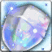 | 642 | [[wiki/items/642-rainbow-reinforcing-stone-gear\|Rainbow Reinforcing Stone (Gear)]] | complete | 0 |
|  | 643 | [[wiki/items/643-rainbow-reinforcing-stone-weapon\|Rainbow Reinforcing Stone (Weapon)]] | complete | 0 |
|  | 644 | [[wiki/items/644-rainbow-reinforcing-stone-gear\|Rainbow Reinforcing Stone (Gear)]] | complete | 0 |
|  | 645 | [[wiki/items/645-rainbow-reinforcing-stone-weapon\|Rainbow Reinforcing Stone (Weapon)]] | partial | 1 |
|  | 646 | [[wiki/items/646-rainbow-reinforcing-stone-gear\|Rainbow Reinforcing Stone (Gear)]] | partial | 1 |
|  | 671 | [[wiki/items/671-white-passion-fragments\|White Passion Fragments]] | stub | 1 |
| 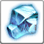 | 681 | [[wiki/items/681-black-passion-fragments\|Black Passion Fragments]] | stub | 1 |
|  | 688 | [[wiki/items/688-dimensional-energy\|Dimensional energy]] | complete | 0 |
|  | 689 | [[wiki/items/689-tier-1-time-energy\|Tier 1 : Time energy]] | complete | 0 |
|  | 690 | [[wiki/items/690-tier-2-time-energy\|Tier 2 : Time energy]] | complete | 0 |
| 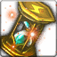 | 691 | [[wiki/items/691-tier-3-time-energy\|Tier 3 : Time energy]] | complete | 0 |
|  | 692 | [[wiki/items/692-gem-stone-blue\|Gem Stone : Blue]] | stub | 2 |
|  | 693 | [[wiki/items/693-gem-stone-blue\|Gem Stone : Blue]] | partial | 1 |
|  | 694 | [[wiki/items/694-gem-stone-yellow\|Gem Stone : Yellow]] | partial | 1 |
|  | 695 | [[wiki/items/695-gem-stone-red\|Gem Stone : Red]] | partial | 1 |
| 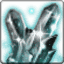 | 696 | [[wiki/items/696-gem-stone-black\|Gem stone : Black]] | partial | 1 |
|  | 700 | [[wiki/items/700-crystal-blue\|Crystal : Blue]] | complete | 0 |
|  | 701 | [[wiki/items/701-crystal-yellow\|Crystal : Yellow]] | complete | 0 |
|  | 702 | [[wiki/items/702-crystal-red\|Crystal : Red]] | complete | 0 |
|  | 703 | [[wiki/items/703-crystal-black\|Crystal : Black]] | complete | 0 |
|  | 704 | [[wiki/items/704-scroll-of-the-warrior-c\|Scroll of the Warrior (C)]] | complete | 0 |
|  | 705 | [[wiki/items/705-scroll-of-the-warrior-b\|Scroll of the Warrior (B)]] | complete | 0 |
|  | 706 | [[wiki/items/706-scroll-of-the-warrior-a\|Scroll of the Warrior (A)]] | complete | 0 |
|  | 707 | [[wiki/items/707-scroll-of-the-warrior-s\|Scroll of the Warrior (S)]] | complete | 0 |
|  | 708 | [[wiki/items/708-scroll-of-the-magician-c\|Scroll of the Magician (C)]] | complete | 0 |
|  | 709 | [[wiki/items/709-scroll-of-the-magician-b\|Scroll of the Magician (B)]] | complete | 0 |
|  | 710 | [[wiki/items/710-scroll-of-the-magician-a\|Scroll of the Magician (A)]] | complete | 0 |
|  | 711 | [[wiki/items/711-scroll-of-the-magician-s\|Scroll of the Magician (S)]] | complete | 0 |
|  | 712 | [[wiki/items/712-tome-of-attack-spd-c\|Tome of Attack SPD (C)]] | complete | 0 |
|  | 713 | [[wiki/items/713-tome-of-attack-spd-b\|Tome of Attack SPD (B)]] | complete | 0 |
|  | 714 | [[wiki/items/714-tome-of-attack-spd-a\|Tome of Attack SPD (A)]] | complete | 0 |
|  | 715 | [[wiki/items/715-tome-of-attack-spd-s\|Tome of Attack SPD (S)]] | complete | 0 |
|  | 716 | [[wiki/items/716-tome-of-cooldown-c\|Tome of Cooldown (C)]] | complete | 0 |
|  | 717 | [[wiki/items/717-tome-of-cooldown-b\|Tome of Cooldown (B)]] | complete | 0 |
|  | 718 | [[wiki/items/718-tome-of-cooldown-a\|Tome of Cooldown (A)]] | complete | 0 |
|  | 719 | [[wiki/items/719-tome-of-cooldown-s\|Tome of Cooldown (S)]] | complete | 0 |
|  | 720 | [[wiki/items/720-tome-of-patience-c\|Tome of Patience (C)]] | complete | 0 |
|  | 721 | [[wiki/items/721-tome-of-patience-b\|Tome of Patience (B)]] | complete | 0 |
|  | 722 | [[wiki/items/722-tome-of-patience-a\|Tome of Patience (A)]] | complete | 0 |
|  | 723 | [[wiki/items/723-tome-of-patience-s\|Tome of Patience (S)]] | complete | 0 |
|  | 724 | [[wiki/items/724-tome-of-critical-c\|Tome of Critical (C)]] | complete | 0 |
|  | 725 | [[wiki/items/725-tome-of-critical-b\|Tome of Critical (B)]] | complete | 0 |
|  | 726 | [[wiki/items/726-tome-of-critical-a\|Tome of Critical (A)]] | complete | 0 |
|  | 727 | [[wiki/items/727-tome-of-critical-s\|Tome of Critical (S)]] | complete | 0 |
|  | 728 | [[wiki/items/728-scroll-of-armor-pnt-c\|Scroll of Armor PNT (C)]] | partial | 1 |
|  | 729 | [[wiki/items/729-scroll-of-armor-pnt-b\|Scroll of Armor PNT (B)]] | partial | 1 |
|  | 730 | [[wiki/items/730-scroll-of-armor-pnt-a\|Scroll of Armor PNT (A)]] | partial | 1 |
|  | 731 | [[wiki/items/731-scroll-of-armor-pnt-s\|Scroll of Armor PNT (S)]] | partial | 1 |
|  | 732 | [[wiki/items/732-scroll-of-magic-pnt-c\|Scroll of Magic PNT (C)]] | partial | 1 |
|  | 733 | [[wiki/items/733-scroll-of-magic-pnt-b\|Scroll of Magic PNT (B)]] | partial | 1 |
| 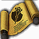 | 734 | [[wiki/items/734-scroll-of-magic-pnt-a\|Scroll of Magic PNT (A)]] | partial | 1 |
|  | 735 | [[wiki/items/735-scroll-of-magic-pnt-s\|Scroll of Magic PNT (S)]] | partial | 1 |
|  | 736 | [[wiki/items/736-elixir-of-health-c\|Elixir of Health (C)]] | complete | 0 |
| 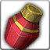 | 737 | [[wiki/items/737-elixir-of-health-b\|Elixir of Health (B)]] | complete | 0 |
| 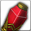 | 738 | [[wiki/items/738-elixir-of-health-a\|Elixir of Health (A)]] | complete | 0 |
|  | 739 | [[wiki/items/739-elixir-of-health-s\|Elixir of Health (S)]] | complete | 0 |
|  | 740 | [[wiki/items/740-flask-of-mana-c\|Flask of Mana (C)]] | complete | 0 |
|  | 741 | [[wiki/items/741-flask-of-mana-b\|Flask of Mana (B)]] | complete | 0 |
|  | 742 | [[wiki/items/742-flask-of-mana-a\|Flask of Mana (A)]] | complete | 0 |
|  | 743 | [[wiki/items/743-flask-of-mana-s\|Flask of Mana (S)]] | complete | 0 |
|  | 744 | [[wiki/items/744-elixir-of-vampirism-c\|Elixir of Vampirism (C)]] | complete | 0 |
| 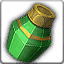 | 745 | [[wiki/items/745-elixir-of-vampirism-b\|Elixir of Vampirism (B)]] | complete | 0 |
| 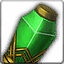 | 746 | [[wiki/items/746-elixir-of-vampirism-a\|Elixir of Vampirism (A)]] | complete | 0 |
| 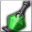 | 747 | [[wiki/items/747-elixir-of-vampirism-s\|Elixir of Vampirism (S)]] | complete | 0 |
|  | 748 | [[wiki/items/748-flask-of-devour-c\|Flask of Devour (C)]] | complete | 0 |
|  | 749 | [[wiki/items/749-flask-of-devour-b\|Flask of Devour (B)]] | complete | 0 |
|  | 750 | [[wiki/items/750-flask-of-devour-a\|Flask of Devour (A)]] | complete | 0 |
|  | 751 | [[wiki/items/751-flask-of-devour-s\|Flask of Devour (S)]] | complete | 0 |
|  | 752 | [[wiki/items/752-elixir-of-tenacity-c\|Elixir of Tenacity (C)]] | complete | 0 |
|  | 753 | [[wiki/items/753-elixir-of-tenacity-b\|Elixir of Tenacity (B)]] | complete | 0 |
| 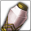 | 754 | [[wiki/items/754-elixir-of-tenacity-a\|Elixir of Tenacity (A)]] | complete | 0 |
| 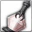 | 755 | [[wiki/items/755-elixir-of-tenacity-s\|Elixir of Tenacity (S)]] | complete | 0 |
|  | 756 | [[wiki/items/756-flask-of-tenacity-c\|Flask of Tenacity (C)]] | complete | 0 |
|  | 757 | [[wiki/items/757-flask-of-tenacity-b\|Flask of Tenacity (B)]] | complete | 0 |
|  | 758 | [[wiki/items/758-flask-of-tenacity-a\|Flask of Tenacity (A)]] | complete | 0 |
|  | 759 | [[wiki/items/759-flask-of-tenacity-s\|Flask of Tenacity (S)]] | complete | 0 |
|  | 760 | [[wiki/items/760-scroll-of-transform-golem\|Scroll of Transform : (Golem)]] | complete | 0 |
| 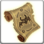 | 761 | [[wiki/items/761-scroll-of-transform-demon\|Scroll of Transform : (Demon)]] | complete | 0 |
| 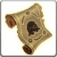 | 762 | [[wiki/items/762-scroll-of-transform-slime\|Scroll of Transform : (Slime)]] | complete | 0 |
|  | 763 | [[wiki/items/763-scroll-of-transform-jack\|Scroll of Transform : (Jack)]] | complete | 0 |
|  | 764 | [[wiki/items/764-drop-chance-potion\|Drop Chance Potion]] | complete | 0 |
|  | 770 | [[wiki/items/770-crystal-green\|Crystal : Green]] | stub | 1 |
|  | 771 | [[wiki/items/771-crystal-purple\|Crystal : Purple]] | stub | 1 |
|  | 772 | [[wiki/items/772-crystal-indigo\|Crystal : Indigo]] | stub | 1 |
|  | 773 | [[wiki/items/773-crystal-scarlet\|Crystal : Scarlet]] | stub | 1 |
|  | 780 | [[wiki/items/780-moon-crystal\|Moon Crystal]] | complete | 0 |
|  | 781 | [[wiki/items/781-archium-crystal\|Archium Crystal]] | stub | 1 |
|  | 801 | [[wiki/items/801-rune-of-flame\|Rune of Flame]] | stub | 1 |
|  | 802 | [[wiki/items/802-garnet\|Garnet]] | complete | 0 |
|  | 803 | [[wiki/items/803-garnet-powder\|Garnet powder]] | complete | 0 |
|  | 804 | [[wiki/items/804-blue-bloodstone\|Blue bloodstone]] | complete | 0 |
|  | 805 | [[wiki/items/805-bloodstone-powder\|Bloodstone powder]] | complete | 0 |
|  | 806 | [[wiki/items/806-emerald\|Emerald]] | complete | 0 |
|  | 807 | [[wiki/items/807-emerald-powder\|Emerald powder]] | complete | 0 |
|  | 808 | [[wiki/items/808-moonstone\|Moonstone]] | complete | 0 |
|  | 809 | [[wiki/items/809-moonstone-powder\|Moonstone powder]] | complete | 0 |
|  | 810 | [[wiki/items/810-diamond\|Diamond]] | complete | 0 |
|  | 811 | [[wiki/items/811-diamond-powder\|Diamond powder]] | complete | 0 |
|  | 812 | [[wiki/items/812-red-bloodstone\|Red bloodstone]] | complete | 0 |
|  | 813 | [[wiki/items/813-red-bloodstone-powder\|Red bloodstone powder]] | complete | 0 |
|  | 814 | [[wiki/items/814-topaz\|Topaz]] | complete | 0 |
|  | 815 | [[wiki/items/815-topaz-powder\|Topaz powder]] | complete | 0 |
|  | 816 | [[wiki/items/816-onyx\|Onyx]] | complete | 0 |
|  | 817 | [[wiki/items/817-onyx-powder\|Onyx powder]] | complete | 0 |
|  | 818 | [[wiki/items/818-lavender\|Lavender]] | complete | 0 |
|  | 819 | [[wiki/items/819-lavender-powder\|Lavender powder]] | complete | 0 |
|  | 820 | [[wiki/items/820-peppermint\|Peppermint]] | complete | 0 |
|  | 821 | [[wiki/items/821-peppermint-powder\|Peppermint powder]] | complete | 0 |
|  | 822 | [[wiki/items/822-rosemary\|Rosemary]] | complete | 0 |
|  | 823 | [[wiki/items/823-rosemary-powder\|Rosemary powder]] | complete | 0 |
|  | 824 | [[wiki/items/824-jasmine\|Jasmine]] | complete | 0 |
|  | 825 | [[wiki/items/825-jasmine-powder\|Jasmine powder]] | complete | 0 |
|  | 826 | [[wiki/items/826-borage\|Borage]] | complete | 0 |
|  | 827 | [[wiki/items/827-borage-powder\|Borage powder]] | complete | 0 |
|  | 828 | [[wiki/items/828-spartium\|Spartium]] | complete | 0 |
|  | 829 | [[wiki/items/829-spartium-powder\|Spartium powder]] | complete | 0 |
|  | 830 | [[wiki/items/830-empty-scroll-c\|Empty Scroll (C)]] | complete | 0 |
|  | 831 | [[wiki/items/831-empty-scroll-b\|Empty Scroll (B)]] | complete | 0 |
|  | 832 | [[wiki/items/832-empty-scroll-a\|Empty Scroll (A)]] | complete | 0 |
|  | 833 | [[wiki/items/833-empty-scroll-s\|Empty Scroll (S)]] | complete | 0 |
|  | 834 | [[wiki/items/834-empty-flask-c\|Empty Flask (C)]] | complete | 0 |
|  | 835 | [[wiki/items/835-empty-flask-b\|Empty Flask (B)]] | complete | 0 |
|  | 836 | [[wiki/items/836-empty-flask-a\|Empty Flask (A)]] | complete | 0 |
|  | 837 | [[wiki/items/837-empty-flask-s\|Empty Flask (S)]] | complete | 0 |
|  | 838 | [[wiki/items/838-ointment-of-spirit\|Ointment of Spirit]] | complete | 0 |
|  | 839 | [[wiki/items/839-wild-herb\|Wild herb]] | complete | 0 |
|  | 840 | [[wiki/items/840-soft-leather\|Soft leather]] | complete | 0 |
|  | 841 | [[wiki/items/841-clown-mushroom\|Clown mushroom]] | complete | 0 |
|  | 842 | [[wiki/items/842-burned-sulphur\|Burned sulphur]] | complete | 0 |
|  | 843 | [[wiki/items/843-highland-wool\|Highland wool]] | stub | 1 |
|  | 844 | [[wiki/items/844-dried-flower\|Dried flower]] | complete | 0 |
|  | 845 | [[wiki/items/845-snow-flower\|Snow flower]] | stub | 1 |
|  | 846 | [[wiki/items/846-worked-oil\|Worked oil]] | complete | 0 |
|  | 847 | [[wiki/items/847-frozen-tear\|Frozen tear]] | stub | 1 |
|  | 848 | [[wiki/items/848-medical-herb-water\|Medical herb water]] | complete | 0 |
|  | 849 | [[wiki/items/849-burning-water\|Burning water]] | complete | 0 |
|  | 850 | [[wiki/items/850-refined-oil\|Refined oil]] | complete | 0 |
|  | 851 | [[wiki/items/851-grassland-seed\|Grassland seed]] | stub | 1 |
|  | 854 | [[wiki/items/854-shining-passion\|Shining Passion]] | complete | 0 |
|  | 855 | [[wiki/items/855-mysterious-passion\|Mysterious Passion]] | complete | 0 |
|  | 856 | [[wiki/items/856-brilliant-passion\|Brilliant Passion]] | complete | 0 |
|  | 857 | [[wiki/items/857-amplifying-passion\|Amplifying Passion]] | complete | 0 |
|  | 858 | [[wiki/items/858-mysterious-core-stone\|Mysterious core stone]] | complete | 0 |
|  | 859 | [[wiki/items/859-brilliant-core-stone\|Brilliant core stone]] | complete | 0 |
|  | 860 | [[wiki/items/860-amplifying-core-stone\|Amplifying core stone]] | complete | 0 |
|  | 861 | [[wiki/items/861-worked-red-bloodstone\|Worked Red bloodstone]] | complete | 0 |
|  | 862 | [[wiki/items/862-worked-moonstone\|Worked Moonstone]] | complete | 0 |
|  | 863 | [[wiki/items/863-worked-blue-bloodstone\|Worked Blue bloodstone]] | complete | 0 |
|  | 864 | [[wiki/items/864-worked-topaz\|Worked Topaz]] | complete | 0 |
|  | 865 | [[wiki/items/865-worked-onyx\|Worked Onyx]] | complete | 0 |
|  | 866 | [[wiki/items/866-worked-garnet\|Worked Garnet]] | complete | 0 |
|  | 867 | [[wiki/items/867-worked-diamond\|Worked Diamond]] | complete | 0 |
|  | 868 | [[wiki/items/868-worked-emerald\|Worked Emerald]] | complete | 0 |
|  | 869 | [[wiki/items/869-extracted-lavender\|Extracted Lavender]] | complete | 0 |
|  | 870 | [[wiki/items/870-extracted-peppermint\|Extracted Peppermint]] | complete | 0 |
|  | 871 | [[wiki/items/871-extracted-rosemary\|Extracted Rosemary]] | complete | 0 |
|  | 872 | [[wiki/items/872-extracted-jasmine\|Extracted Jasmine]] | complete | 0 |
|  | 873 | [[wiki/items/873-extracted-borage\|Extracted Borage]] | complete | 0 |
|  | 874 | [[wiki/items/874-extracted-spartium\|Extracted Spartium]] | complete | 0 |
|  | 879 | [[wiki/items/879-tp-charge-bead\|TP Charge bead]] | stub | 1 |
|  | 880 | [[wiki/items/880-potion-of-brisk-a\|Potion of Brisk (A)]] | complete | 0 |
|  | 881 | [[wiki/items/881-potion-of-brisk-b\|Potion of Brisk (B)]] | complete | 0 |
|  | 882 | [[wiki/items/882-potion-of-brisk-c\|Potion of Brisk (C)]] | complete | 0 |
|  | 883 | [[wiki/items/883-potion-of-health-d\|Potion of Health (D)]] | complete | 0 |
|  | 884 | [[wiki/items/884-potion-of-mana-d\|Potion of Mana (D)]] | complete | 0 |
|  | 885 | [[wiki/items/885-potion-of-health-c\|Potion of Health (C)]] | complete | 0 |
|  | 886 | [[wiki/items/886-potion-of-health-b\|Potion of Health (B)]] | complete | 0 |
|  | 887 | [[wiki/items/887-potion-of-health-a\|Potion of Health (A)]] | complete | 0 |
|  | 888 | [[wiki/items/888-potion-of-health-s\|Potion of Health (S)]] | complete | 0 |
|  | 889 | [[wiki/items/889-potion-of-mana-c\|Potion of Mana (C)]] | complete | 0 |
|  | 890 | [[wiki/items/890-potion-of-mana-b\|Potion of Mana (B)]] | complete | 0 |
|  | 891 | [[wiki/items/891-potion-of-mana-a\|Potion of Mana (A)]] | complete | 0 |
|  | 892 | [[wiki/items/892-potion-of-mana-s\|Potion of Mana (S)]] | complete | 0 |
|  | 893 | [[wiki/items/893-health-mana-potion-d\|Health Mana Potion (D)]] | stub | 1 |
|  | 894 | [[wiki/items/894-health-mana-potion-c\|Health Mana Potion (C)]] | complete | 0 |
|  | 895 | [[wiki/items/895-health-mana-potion-b\|Health Mana Potion (B)]] | complete | 0 |
|  | 896 | [[wiki/items/896-health-mana-potion-a\|Health Mana Potion (A)]] | complete | 0 |
|  | 897 | [[wiki/items/897-health-mana-potion-s\|Health Mana Potion (S)]] | complete | 0 |
|  | 898 | [[wiki/items/898-passive-test-1\|Passive Test 1]] | stub | 1 |
|  | 899 | [[wiki/items/899-use-test-2\|Use Test 2]] | stub | 1 |
|  | 900 | [[wiki/items/900-test-item-1\|Test Item 1]] | stub | 1 |
|  | 901 | [[wiki/items/901-return\|Return]] | stub | 1 |
|  | 902 | [[wiki/items/902-teleport\|Teleport]] | stub | 1 |
|  | 903 | [[wiki/items/903-deadly-fire\|Deadly Fire]] | stub | 1 |
|  | 904 | [[wiki/items/904-scan\|Scan]] | stub | 1 |
|  | 905 | [[wiki/items/905-blessing-of-shaia\|Blessing of Shaia]] | complete | 0 |
|  | 906 | [[wiki/items/906-scroll-return\|Scroll : Return]] | complete | 0 |
|  | 908 | [[wiki/items/908-scroll-castle\|Scroll : Castle]] | complete | 0 |
|  | 909 | [[wiki/items/909-scroll-gaia\|Scroll : Gaia]] | complete | 0 |
|  | 910 | [[wiki/items/910-battle-arena-scroll\|Battle Arena Scroll]] | stub | 1 |
|  | 911 | [[wiki/items/911-scroll-castle\|Scroll : Castle]] | stub | 1 |
|  | 912 | [[wiki/items/912-scroll-gaia\|Scroll : Gaia]] | complete | 0 |
|  | 913 | [[wiki/items/913-teleport-scroll-premium\|Teleport Scroll (Premium)]] | complete | 0 |
|  | 921 | [[wiki/items/921-warehouse-summon-scroll\|Warehouse Summon Scroll]] | complete | 0 |
|  | 922 | [[wiki/items/922-merchant-summon-scroll\|Merchant Summon Scroll]] | complete | 0 |
|  | 923 | [[wiki/items/923-mail-box-summon-scroll\|Mail box Summon Scroll]] | complete | 0 |
|  | 945 | [[wiki/items/945-auto-decomposition-hammer-d\|Auto decomposition hammer (D)]] | complete | 0 |
|  | 946 | [[wiki/items/946-auto-decomposition-hammer-c\|Auto decomposition hammer (C)]] | complete | 0 |
|  | 947 | [[wiki/items/947-auto-decomposition-hammer-b\|Auto decomposition hammer (B)]] | complete | 0 |
|  | 948 | [[wiki/items/948-auto-decomposition-hammer\|Auto decomposition hammer]] | complete | 0 |
|  | 949 | [[wiki/items/949-auto-decomposition-hammer-a\|Auto decomposition hammer (A)]] | complete | 0 |
|  | 956 | [[wiki/items/956-blessing-of-shaia\|Blessing of Shaia]] | stub | 1 |
|  | 999 | [[wiki/items/999-medal-mithril\|Medal : Mithril]] | complete | 0 |
|  | 1000 | [[wiki/items/1000-medal-bronze\|Medal : Bronze]] | complete | 0 |
|  | 1001 | [[wiki/items/1001-medal-silver\|Medal : Silver]] | complete | 0 |
|  | 1002 | [[wiki/items/1002-medal-gold\|Medal : Gold]] | complete | 0 |
|  | 1003 | [[wiki/items/1003-gold\|Gold]] | stub | 1 |
|  | 1004 | [[wiki/items/1004-fame\|Fame]] | stub | 1 |
|  | 1005 | [[wiki/items/1005-exp\|Exp]] | stub | 1 |
|  | 1006 | [[wiki/items/1006-yellow-jewel\|Yellow Jewel]] | complete | 0 |
|  | 1007 | [[wiki/items/1007-medal-arena\|Medal : Arena]] | complete | 0 |
|  | 1008 | [[wiki/items/1008-legion-fame\|Legion Fame]] | stub | 1 |
|  | 1009 | [[wiki/items/1009\|Item 1009]] | stub | 1 |
|  | 1010 | [[wiki/items/1010-yellow-jewel-5000\|Yellow Jewel (5000)]] | complete | 0 |
|  | 1011 | [[wiki/items/1011-yellow-jewel-10000\|Yellow Jewel (10000)]] | complete | 0 |
|  | 1012 | [[wiki/items/1012-shaia-stone\|Shaia Stone]] | complete | 0 |
|  | 1013 | [[wiki/items/1013-yellow-jewel-100\|Yellow Jewel (100)]] | complete | 0 |
|  | 1014 | [[wiki/items/1014-yellow-jewel-200\|Yellow Jewel (200)]] | complete | 0 |
|  | 1015 | [[wiki/items/1015-yellow-jewel-1000\|Yellow Jewel (1000)]] | complete | 0 |
|  | 1016 | [[wiki/items/1016-yellow-jewel-5000\|Yellow Jewel (5000)]] | stub | 1 |
|  | 1017 | [[wiki/items/1017-yellow-jewel-10000\|Yellow Jewel (10000)]] | stub | 1 |
|  | 1018 | [[wiki/items/1018-yellow-jewel-20000\|Yellow Jewel (20000)]] | stub | 1 |
|  | 1021 | [[wiki/items/1021-gold\|Gold]] | complete | 0 |
|  | 1023 | [[wiki/items/1023-spirit-of-gaia-box\|Spirit of Gaia Box]] | complete | 0 |
|  | 1024 | [[wiki/items/1024-help-of-gaia-box\|Help of Gaia Box]] | complete | 0 |
|  | 1025 | [[wiki/items/1025-impact-of-gaia-box\|Impact of Gaia Box]] | complete | 0 |
|  | 1026 | [[wiki/items/1026-ruler-of-gaia-box\|Ruler of Gaia Box]] | complete | 0 |
|  | 1027 | [[wiki/items/1027-phase-of-gaia-box\|Phase of Gaia Box]] | complete | 0 |
|  | 1028 | [[wiki/items/1028-lords-of-the-land-box\|Lords of the Land Box]] | complete | 0 |
|  | 1030 | [[wiki/items/1030-box-of-the-victorious-vi\|Box of the Victorious VI]] | complete | 0 |
|  | 1031 | [[wiki/items/1031-box-of-the-victorious-v\|Box of the Victorious V]] | complete | 0 |
|  | 1032 | [[wiki/items/1032-box-of-the-victorious-iv\|Box of the Victorious IV]] | complete | 0 |
|  | 1033 | [[wiki/items/1033-box-of-the-victorious-iii\|Box of the Victorious III]] | complete | 0 |
|  | 1034 | [[wiki/items/1034-box-of-the-victorious-ii\|Box of the Victorious II]] | complete | 0 |
|  | 1035 | [[wiki/items/1035-box-of-the-victorious-i\|Box of the Victorious I]] | complete | 0 |
|  | 1040 | [[wiki/items/1040-box-of-the-participant-vi\|Box of the Participant VI]] | complete | 0 |
|  | 1041 | [[wiki/items/1041-box-of-the-participant-v\|Box of the Participant V]] | complete | 0 |
|  | 1042 | [[wiki/items/1042-box-of-the-participant-iv\|Box of the Participant IV]] | complete | 0 |
|  | 1043 | [[wiki/items/1043-box-of-the-participant-iii\|Box of the Participant III]] | complete | 0 |
|  | 1044 | [[wiki/items/1044-box-of-the-participant-ii\|Box of the Participant II]] | complete | 0 |
|  | 1045 | [[wiki/items/1045-box-of-the-participant-i\|Box of the Participant I]] | complete | 0 |
|  | 1050 | [[wiki/items/1050-box-of-the-arena-help\|Box of the Arena Help]] | stub | 1 |
|  | 1051 | [[wiki/items/1051-bronze-medal-reward-box\|(Bronze) Medal Reward Box]] | complete | 0 |
|  | 1052 | [[wiki/items/1052-silver-medal-reward-box\|(Silver) Medal Reward Box]] | complete | 0 |
|  | 1053 | [[wiki/items/1053-gold-medal-reward-box\|(Gold) Medal Reward Box]] | complete | 0 |
|  | 1054 | [[wiki/items/1054-mithril-medal-reward-box\|(Mithril) Medal Reward Box]] | complete | 0 |
|  | 1055 | [[wiki/items/1055-diamond-medal-rewar-box\|(Diamond) Medal Rewar Box]] | complete | 0 |
|  | 1056 | [[wiki/items/1056-halloween-rewar-box\|Halloween Rewar Box]] | complete | 0 |
|  | 1057 | [[wiki/items/1057-random-box-of-dye\|Random box of dye]] | complete | 0 |
|  | 1058 | [[wiki/items/1058-random-box-of-dye\|Random box of dye]] | complete | 0 |
|  | 1059 | [[wiki/items/1059-random-box-of-dye\|Random box of dye]] | complete | 0 |
|  | 1100 | [[wiki/items/1100-reinforcing-adjuvants\|Reinforcing adjuvants]] | complete | 0 |
|  | 1104 | [[wiki/items/1104\|Item 1104]] | stub | 1 |
|  | 1105 | [[wiki/items/1105-pyrotechnics\|Pyrotechnics]] | complete | 0 |
|  | 1201 | [[wiki/items/1201-d-rank-quest\|D Rank Quest]] | complete | 0 |
|  | 1202 | [[wiki/items/1202-d-rank-quest\|D Rank Quest]] | complete | 0 |
|  | 1203 | [[wiki/items/1203-d-rank-quest\|D Rank Quest]] | complete | 0 |
|  | 1204 | [[wiki/items/1204-d-rank-quest\|D Rank Quest]] | complete | 0 |
|  | 1251 | [[wiki/items/1251-c-rank-quest\|C Rank Quest]] | complete | 0 |
|  | 1252 | [[wiki/items/1252-c-rank-quest\|C Rank Quest]] | complete | 0 |
|  | 1253 | [[wiki/items/1253-c-rank-quest\|C Rank Quest]] | complete | 0 |
|  | 1254 | [[wiki/items/1254-c-rank-quest\|C Rank Quest]] | complete | 0 |
|  | 1255 | [[wiki/items/1255-c-rank-quest\|C Rank Quest]] | complete | 0 |
|  | 1301 | [[wiki/items/1301-b-rank-quest\|B Rank Quest]] | complete | 0 |
|  | 1302 | [[wiki/items/1302-b-rank-quest\|B Rank Quest]] | complete | 0 |
|  | 1401 | [[wiki/items/1401-siege-minion\|Siege Minion]] | stub | 1 |
|  | 1402 | [[wiki/items/1402-i-ll-be-back\|I'll be back!]] | complete | 0 |
|  | 1403 | [[wiki/items/1403-recovery-shot\|Recovery Shot]] | complete | 0 |
|  | 1404 | [[wiki/items/1404-fire-support\|Fire Support]] | complete | 0 |
|  | 1405 | [[wiki/items/1405-blind\|Blind]] | complete | 0 |
|  | 1406 | [[wiki/items/1406-create-a-portal\|Create a Portal]] | complete | 0 |
|  | 1407 | [[wiki/items/1407-freeze\|Freeze]] | complete | 0 |
|  | 1408 | [[wiki/items/1408-highly-concentrated-bomb\|Highly Concentrated Bomb]] | complete | 0 |
|  | 1409 | [[wiki/items/1409-reinforce-nexus\|Reinforce Nexus]] | complete | 0 |
|  | 1410 | [[wiki/items/1410-amplification-ether\|Amplification Ether]] | complete | 0 |
|  | 1411 | [[wiki/items/1411-magic-no-entrance\|Magic : No entrance]] | complete | 0 |
|  | 1412 | [[wiki/items/1412-twisted-dimension\|Twisted Dimension]] | complete | 0 |
|  | 1413 | [[wiki/items/1413-battlefield-summoned\|Battlefield summoned]] | complete | 0 |
|  | 1414 | [[wiki/items/1414-powerful-remote-bomb\|Powerful Remote Bomb]] | complete | 0 |
|  | 1415 | [[wiki/items/1415-powerful-nexus-remote-bomb\|Powerful Nexus Remote Bomb]] | complete | 0 |
|  | 1501 | [[wiki/items/1501-recovery-shot\|Recovery Shot]] | stub | 1 |
|  | 1502 | [[wiki/items/1502-fire-support\|Fire Support]] | stub | 1 |
|  | 1503 | [[wiki/items/1503-battlefield-summoned\|Battlefield summoned]] | stub | 1 |
|  | 1504 | [[wiki/items/1504-powerful-nexus-remote-bomb\|Powerful Nexus Remote Bomb]] | stub | 1 |
|  | 1600 | [[wiki/items/1600-fragment-of-grabie\|Fragment of Grabie]] | stub | 1 |
|  | 1601 | [[wiki/items/1601-fragment-of-innus\|Fragment of Innus]] | stub | 1 |
|  | 1602 | [[wiki/items/1602-fragment-of-ru\|Fragment of Ru]] | stub | 1 |
|  | 1603 | [[wiki/items/1603-fragment-of-frey\|Fragment of Frey]] | stub | 1 |
|  | 1604 | [[wiki/items/1604-fragment-of-ausdi\|Fragment of Ausdi]] | stub | 1 |
|  | 1605 | [[wiki/items/1605-fragment-of-transformed-grabie\|Fragment of Transformed Grabie]] | stub | 1 |
|  | 1606 | [[wiki/items/1606-secret-of-the-fortress\|Secret of the Fortress]] | stub | 1 |
|  | 1607 | [[wiki/items/1607-reinforcing-the-guardian\|Reinforcing the Guardian]] | stub | 1 |
|  | 1608 | [[wiki/items/1608\|Item 1608]] | stub | 1 |
|  | 1618 | [[wiki/items/1618-growth-s-knowledge\|Growth's Knowledge]] | stub | 1 |
|  | 1619 | [[wiki/items/1619-increased-luck\|Increased Luck]] | stub | 1 |
|  | 1620 | [[wiki/items/1620-scared-area\|Scared Area]] | stub | 1 |
|  | 1621 | [[wiki/items/1621-dimension-movement\|Dimension Movement]] | stub | 1 |
|  | 1801 | [[wiki/items/1801-life-saviour-premium\|Life saviour (Premium)]] | complete | 0 |
|  | 1802 | [[wiki/items/1802-life-saviour\|Life saviour]] | complete | 0 |
|  | 1900 | [[wiki/items/1900-faded-passion-fragments\|Faded Passion fragments]] | complete | 0 |
|  | 1901 | [[wiki/items/1901-faded-passion-piece\|Faded Passion Piece]] | complete | 0 |
|  | 1902 | [[wiki/items/1902-faded-passion-pattern\|Faded Passion Pattern]] | complete | 0 |
|  | 1903 | [[wiki/items/1903-dark-blue-faded-passion-fragments\|Dark blue Faded Passion fragments]] | stub | 1 |
|  | 1904 | [[wiki/items/1904-dark-blue-faded-passion-piece\|Dark blue Faded Passion Piece]] | stub | 1 |
|  | 1905 | [[wiki/items/1905-dark-blue-faded-passion-pattern\|Dark blue Faded Passion Pattern]] | complete | 0 |
|  | 1906 | [[wiki/items/1906-dark-red-faded-passion-fragments\|Dark Red Faded Passion fragments]] | stub | 1 |
|  | 1907 | [[wiki/items/1907-dark-red-faded-passion-piece\|Dark Red Faded Passion Piece]] | stub | 1 |
|  | 1908 | [[wiki/items/1908-dark-red-faded-passion-pattern\|Dark Red Faded Passion Pattern]] | complete | 0 |
|  | 1914 | [[wiki/items/1914-parchment-red\|Parchment : Red]] | stub | 1 |
|  | 1915 | [[wiki/items/1915-parchment-scarlet\|Parchment : Scarlet]] | stub | 1 |
|  | 1916 | [[wiki/items/1916-parchment-yellow\|Parchment : Yellow]] | stub | 1 |
|  | 1917 | [[wiki/items/1917-parchment-green\|Parchment : Green]] | stub | 1 |
|  | 1918 | [[wiki/items/1918-parchment-blue\|Parchment : Blue]] | stub | 1 |
|  | 1919 | [[wiki/items/1919-parchment-navy\|Parchment : Navy]] | stub | 1 |
|  | 1920 | [[wiki/items/1920-parchment-purple\|Parchment : Purple]] | stub | 1 |
|  | 1921 | [[wiki/items/1921-parchment-black\|Parchment : Black]] | stub | 1 |
|  | 1930 | [[wiki/items/1930-essence-of-darkness\|essence of Darkness]] | complete | 0 |
|  | 1931 | [[wiki/items/1931-essence-of-wind\|Essence of Wind]] | complete | 0 |
|  | 1932 | [[wiki/items/1932-essence-of-fire\|Essence of Fire]] | complete | 0 |
|  | 1933 | [[wiki/items/1933-essence-of-water\|Essence of Water]] | complete | 0 |
|  | 1934 | [[wiki/items/1934-essence-of-earth\|Essence of Earth]] | complete | 0 |
|  | 1935 | [[wiki/items/1935-essence-of-light\|Essence of Light]] | complete | 0 |
|  | 1999 | [[wiki/items/1999-costume-remover\|Costume Remover]] | complete | 0 |
|  | 2000 | [[wiki/items/2000-haple-set\|Haple Set]] | complete | 0 |
|  | 2001 | [[wiki/items/2001-haple-set\|Haple Set]] | complete | 0 |
|  | 2002 | [[wiki/items/2002-haple-set\|Haple Set]] | complete | 0 |
|  | 2003 | [[wiki/items/2003-working-on-that\|Working on that!]] | stub | 2 |
|  | 2004 | [[wiki/items/2004-succubus\|Succubus]] | stub | 2 |
|  | 2005 | [[wiki/items/2005-succubus\|Succubus]] | stub | 2 |
|  | 2006 | [[wiki/items/2006-summer-vacation-set\|Summer Vacation Set]] | complete | 0 |
|  | 2007 | [[wiki/items/2007-summer-vacation-set\|Summer Vacation Set]] | complete | 0 |
|  | 2008 | [[wiki/items/2008-summer-vacation-set\|Summer Vacation Set]] | complete | 0 |
|  | 2009 | [[wiki/items/2009-working-on-that\|Working on that!]] | stub | 2 |
|  | 2010 | [[wiki/items/2010-fury-set\|Fury Set]] | complete | 0 |
|  | 2011 | [[wiki/items/2011-working-on-that\|Working on that!]] | stub | 2 |
|  | 2012 | [[wiki/items/2012-succubus\|Succubus]] | stub | 2 |
|  | 2013 | [[wiki/items/2013-succubus\|Succubus]] | stub | 2 |
|  | 2014 | [[wiki/items/2014-succubus\|Succubus]] | stub | 2 |
|  | 2015 | [[wiki/items/2015-crown-set\|Crown Set]] | complete | 0 |
|  | 2016 | [[wiki/items/2016-crown-set\|Crown Set]] | complete | 0 |
|  | 2017 | [[wiki/items/2017-crown-set\|Crown Set]] | complete | 0 |
|  | 2018 | [[wiki/items/2018-helios-set\|Helios Set]] | complete | 0 |
|  | 2019 | [[wiki/items/2019-helios-set\|Helios Set]] | complete | 0 |
|  | 2020 | [[wiki/items/2020-helios-set\|Helios Set]] | complete | 0 |
|  | 2021 | [[wiki/items/2021-oracle-set\|Oracle Set]] | complete | 0 |
|  | 2022 | [[wiki/items/2022-oracle-set\|Oracle Set]] | complete | 0 |
|  | 2023 | [[wiki/items/2023-oracle-set\|Oracle Set]] | complete | 0 |
|  | 2024 | [[wiki/items/2024-dragon-slayer-set\|Dragon Slayer Set]] | complete | 0 |
|  | 2025 | [[wiki/items/2025-dragon-slayer-set\|Dragon Slayer Set]] | complete | 0 |
|  | 2026 | [[wiki/items/2026-dragon-slayer-set\|Dragon Slayer Set]] | complete | 0 |
|  | 2027 | [[wiki/items/2027-twisted-wind-set\|Twisted Wind Set]] | complete | 0 |
|  | 2028 | [[wiki/items/2028-twisted-wind-set\|Twisted Wind Set]] | complete | 0 |
|  | 2029 | [[wiki/items/2029-twisted-wind-set\|Twisted Wind Set]] | complete | 0 |
|  | 2030 | [[wiki/items/2030-military-set\|Military Set]] | complete | 0 |
|  | 2031 | [[wiki/items/2031-military-set\|Military Set]] | complete | 0 |
|  | 2032 | [[wiki/items/2032-military-set\|Military Set]] | complete | 0 |
|  | 2033 | [[wiki/items/2033-athletics-set\|Athletics Set]] | complete | 0 |
|  | 2034 | [[wiki/items/2034-athletics-set\|Athletics Set]] | complete | 0 |
|  | 2035 | [[wiki/items/2035-athletics-set\|Athletics Set]] | complete | 0 |
|  | 2036 | [[wiki/items/2036-maid-set\|Maid Set]] | complete | 0 |
|  | 2037 | [[wiki/items/2037-maid-set\|Maid Set]] | complete | 0 |
|  | 2038 | [[wiki/items/2038-maid-set\|Maid Set]] | complete | 0 |
|  | 2039 | [[wiki/items/2039-military-set\|Military Set]] | complete | 0 |
|  | 2040 | [[wiki/items/2040-goosebumps-set\|Goosebumps Set]] | complete | 0 |
|  | 2041 | [[wiki/items/2041-goosebumps-set\|Goosebumps Set]] | complete | 0 |
|  | 2042 | [[wiki/items/2042-goosebumps-set\|Goosebumps Set]] | complete | 0 |
|  | 2043 | [[wiki/items/2043-halloween-set\|Halloween Set]] | partial | 1 |
|  | 2044 | [[wiki/items/2044-halloween-set\|Halloween Set]] | partial | 1 |
|  | 2045 | [[wiki/items/2045-halloween-set\|Halloween Set]] | partial | 1 |
|  | 2046 | [[wiki/items/2046-christmas-set\|Christmas Set]] | complete | 0 |
|  | 2047 | [[wiki/items/2047-christmas-set\|Christmas Set]] | complete | 0 |
|  | 2048 | [[wiki/items/2048-christmas-set\|Christmas Set]] | complete | 0 |
|  | 2049 | [[wiki/items/2049-ninja-set\|Ninja Set]] | complete | 0 |
|  | 2050 | [[wiki/items/2050-ninja-set\|Ninja Set]] | complete | 0 |
|  | 2051 | [[wiki/items/2051-ninja-set\|Ninja Set]] | complete | 0 |
|  | 2052 | [[wiki/items/2052-developer-set\|Developer Set]] | stub | 2 |
|  | 2053 | [[wiki/items/2053-developer-set\|Developer Set]] | stub | 2 |
|  | 2054 | [[wiki/items/2054-developer-set\|Developer Set]] | stub | 2 |
|  | 2073 | [[wiki/items/2073-bear-family-set\|Bear family Set]] | complete | 0 |
|  | 2074 | [[wiki/items/2074-bear-family-set\|Bear family Set]] | complete | 0 |
|  | 2075 | [[wiki/items/2075-bear-family-set\|Bear family Set]] | complete | 0 |
|  | 2076 | [[wiki/items/2076-pirate-set\|Pirate Set]] | complete | 0 |
|  | 2077 | [[wiki/items/2077-pirate-set\|Pirate Set]] | complete | 0 |
|  | 2078 | [[wiki/items/2078-pirate-set\|Pirate Set]] | complete | 0 |
|  | 2079 | [[wiki/items/2079-haple-set\|Haple Set]] | complete | 0 |
|  | 2080 | [[wiki/items/2080-haple-set\|Haple Set]] | complete | 0 |
|  | 2081 | [[wiki/items/2081-haple-set\|Haple Set]] | complete | 0 |
|  | 2082 | [[wiki/items/2082-oracle-set\|Oracle Set]] | complete | 0 |
|  | 2083 | [[wiki/items/2083-oracle-set\|Oracle Set]] | complete | 0 |
|  | 2084 | [[wiki/items/2084-oracle-set\|Oracle Set]] | complete | 0 |
|  | 2085 | [[wiki/items/2085-christmas-set\|Christmas Set]] | partial | 1 |
|  | 2086 | [[wiki/items/2086-christmas-set\|Christmas Set]] | partial | 1 |
|  | 2087 | [[wiki/items/2087-christmas-set\|Christmas Set]] | partial | 1 |
|  | 2300 | [[wiki/items/2300-pink-hair-dye\|Pink Hair Dye]] | complete | 0 |
|  | 2301 | [[wiki/items/2301-red-hair-dye\|Red Hair Dye]] | complete | 0 |
|  | 2302 | [[wiki/items/2302-orange-hair-dye\|Orange Hair Dye]] | complete | 0 |
|  | 2303 | [[wiki/items/2303-yellow-hair-dye\|Yellow Hair Dye]] | complete | 0 |
|  | 2304 | [[wiki/items/2304-blue-hair-dye\|Blue Hair Dye]] | complete | 0 |
|  | 2305 | [[wiki/items/2305-white-hair-dye\|White Hair Dye]] | complete | 0 |
|  | 2306 | [[wiki/items/2306-green-hair-dye\|Green Hair Dye]] | complete | 0 |
|  | 2307 | [[wiki/items/2307-brown-hair-dye\|Brown Hair Dye]] | complete | 0 |
|  | 2308 | [[wiki/items/2308-black-hair-dye\|Black Hair Dye]] | complete | 0 |
|  | 2309 | [[wiki/items/2309-purple-hair-dye\|Purple Hair Dye]] | complete | 0 |
|  | 2400 | [[wiki/items/2400-premium-pink-dye\|Premium Pink Dye]] | complete | 0 |
|  | 2401 | [[wiki/items/2401-premium-red-dye\|Premium Red Dye]] | complete | 0 |
|  | 2402 | [[wiki/items/2402-premium-orange-dye\|Premium Orange Dye]] | complete | 0 |
|  | 2403 | [[wiki/items/2403-premium-yellow-dye\|Premium Yellow Dye]] | complete | 0 |
|  | 2404 | [[wiki/items/2404-premium-blue-dye\|Premium Blue Dye]] | complete | 0 |
|  | 2405 | [[wiki/items/2405-premium-white-dye\|Premium White Dye]] | complete | 0 |
|  | 2406 | [[wiki/items/2406-premium-green-dye\|Premium Green Dye]] | complete | 0 |
|  | 2407 | [[wiki/items/2407-premium-brown-dye\|Premium Brown Dye]] | complete | 0 |
|  | 2408 | [[wiki/items/2408-premium-black-dye\|Premium Black Dye]] | complete | 0 |
|  | 2409 | [[wiki/items/2409-premium-purple-dye\|Premium Purple Dye]] | complete | 0 |
|  | 2500 | [[wiki/items/2500-pink-dye\|Pink Dye]] | complete | 0 |
|  | 2501 | [[wiki/items/2501-red-dye\|Red Dye]] | complete | 0 |
|  | 2502 | [[wiki/items/2502-orange-dye\|Orange Dye]] | complete | 0 |
|  | 2503 | [[wiki/items/2503-yellow-dye\|Yellow Dye]] | complete | 0 |
|  | 2504 | [[wiki/items/2504-blue-dye\|Blue Dye]] | complete | 0 |
|  | 2505 | [[wiki/items/2505-white-dye\|White Dye]] | complete | 0 |
|  | 2506 | [[wiki/items/2506-green-dye\|Green Dye]] | complete | 0 |
|  | 2507 | [[wiki/items/2507-brown-dye\|Brown Dye]] | complete | 0 |
|  | 2508 | [[wiki/items/2508-black-dye\|Black Dye]] | complete | 0 |
|  | 2510 | [[wiki/items/2510-purple-dye\|Purple Dye]] | complete | 0 |
|  | 2512 | [[wiki/items/2512-special-dye\|Special Dye]] | stub | 1 |
|  | 2548 | [[wiki/items/2548-broken-innocence\|Broken Innocence]] | complete | 0 |
|  | 2549 | [[wiki/items/2549-jack-s-pumpkin\|Jack's Pumpkin]] | complete | 0 |
|  | 2550 | [[wiki/items/2550-slime-mucus\|Slime Mucus]] | complete | 0 |
|  | 2551 | [[wiki/items/2551-snake-leather\|Snake Leather]] | complete | 0 |
|  | 2552 | [[wiki/items/2552-bee-needle\|Bee Needle]] | complete | 0 |
|  | 2553 | [[wiki/items/2553-black-chepa-fur\|Black Chepa Fur]] | complete | 0 |
|  | 2554 | [[wiki/items/2554-whiter-chepa-fur\|Whiter Chepa Fur]] | complete | 0 |
|  | 2555 | [[wiki/items/2555-skeleton-bone\|Skeleton bone]] | complete | 0 |
|  | 2556 | [[wiki/items/2556-skeleton-archer-bone\|Skeleton Archer bone]] | stub | 1 |
|  | 2557 | [[wiki/items/2557-elite-skeleton-bone\|Elite Skeleton bone]] | complete | 0 |
|  | 2558 | [[wiki/items/2558-elite-skeleton-archer-item\|Elite Skeleton Archer Item]] | stub | 1 |
|  | 2559 | [[wiki/items/2559-black-skeleton-warrior-bone\|Black Skeleton Warrior bone]] | stub | 1 |
|  | 2560 | [[wiki/items/2560-black-skeleton-archer-bone\|Black Skeleton Archer bone]] | stub | 1 |
|  | 2561 | [[wiki/items/2561-black-elite-skeleton-warrior-item\|Black Elite Skeleton Warrior Item]] | stub | 1 |
|  | 2562 | [[wiki/items/2562-black-elite-skeleton-archer-item\|Black Elite Skeleton Archer Item]] | stub | 1 |
|  | 2563 | [[wiki/items/2563-hawker-letter\|Hawker letter]] | complete | 0 |
|  | 2564 | [[wiki/items/2564-letter-to-oracle-of-knowledge\|Letter to Oracle of Knowledge]] | complete | 0 |
|  | 2565 | [[wiki/items/2565-secret-document\|Secret document]] | complete | 0 |
|  | 2566 | [[wiki/items/2566-crystal-ball\|Crystal Ball]] | complete | 0 |
|  | 2567 | [[wiki/items/2567-urgent-letter\|Urgent Letter]] | complete | 0 |
|  | 2568 | [[wiki/items/2568-essence-of-darkness\|essence of Darkness]] | complete | 0 |
|  | 2569 | [[wiki/items/2569-decomposition-ring\|Decomposition Ring]] | stub | 2 |
|  | 2570 | [[wiki/items/2570-vestiges-of-devildom\|Vestiges of devildom]] | stub | 1 |
|  | 2571 | [[wiki/items/2571-weak-skeleton-bone\|Weak Skeleton bone]] | complete | 0 |
|  | 2572 | [[wiki/items/2572-weak-elite-skeleton-bone\|Weak Elite Skeleton bone]] | complete | 0 |
|  | 2573 | [[wiki/items/2573-toy-ring\|Toy Ring]] | complete | 0 |
|  | 2574 | [[wiki/items/2574-unknown-crystal\|Unknown Crystal]] | complete | 0 |
|  | 2575 | [[wiki/items/2575-demon-crystals\|Demon Crystals]] | stub | 1 |
|  | 2576 | [[wiki/items/2576-elite-fisher-s-scales\|Elite Fisher's Scales]] | complete | 0 |
|  | 2577 | [[wiki/items/2577-fisher-s-scales\|Fisher's Scales]] | complete | 0 |
|  | 2578 | [[wiki/items/2578-lizard-spear\|Lizard spear]] | complete | 0 |
|  | 2579 | [[wiki/items/2579-lizard-knife\|Lizard knife]] | complete | 0 |
|  | 2580 | [[wiki/items/2580-red-demon-hunter-tooth\|Red Demon Hunter Tooth]] | complete | 0 |
|  | 2581 | [[wiki/items/2581-red-demon-hunter-horn\|Red Demon Hunter Horn]] | complete | 0 |
|  | 2582 | [[wiki/items/2582-innocence-piece\|Innocence Piece]] | complete | 0 |
|  | 2583 | [[wiki/items/2583-half-innocence\|Half-innocence]] | stub | 1 |
|  | 2584 | [[wiki/items/2584-innocence-looking-for-shape\|Innocence looking for shape]] | stub | 1 |
|  | 2585 | [[wiki/items/2585-the-death-head-s-pipe\|The Death Head's Pipe]] | complete | 0 |
|  | 2586 | [[wiki/items/2586-the-dark-knight-s-pipe\|The Dark Knight's Pipe]] | complete | 0 |
|  | 2587 | [[wiki/items/2587-the-tempest-fisher-s-pipe\|The Tempest Fisher's Pipe]] | complete | 0 |
|  | 2588 | [[wiki/items/2588-the-slayer-komodo-s-pipe\|The Slayer Komodo's Pipe]] | complete | 0 |
|  | 2589 | [[wiki/items/2589-the-chepa-sorcerer-s-pipe\|The Chepa Sorcerer's Pipe]] | complete | 0 |
|  | 2590 | [[wiki/items/2590-tsunami-lake-flower\|Tsunami Lake Flower]] | complete | 0 |
|  | 2591 | [[wiki/items/2591-swamp-mushroom\|Swamp Mushroom]] | complete | 0 |
|  | 2592 | [[wiki/items/2592-piece-guardian\|Piece : Guardian]] | stub | 1 |
|  | 2593 | [[wiki/items/2593-empty-flask-a\|Empty Flask (A)]] | stub | 1 |
|  | 2594 | [[wiki/items/2594-crystal-red\|Crystal : Red]] | stub | 1 |
|  | 2595 | [[wiki/items/2595-peppermint-powder\|Peppermint powder]] | stub | 1 |
|  | 2596 | [[wiki/items/2596-empty-scroll-a\|Empty Scroll (A)]] | stub | 1 |
|  | 2597 | [[wiki/items/2597-burning-water\|Burning water]] | stub | 1 |
|  | 2598 | [[wiki/items/2598-potion-of-health-quest\|Potion of Health (Quest)]] | complete | 0 |
|  | 2599 | [[wiki/items/2599-tome-of-cooldown-quest\|Tome of Cooldown (Quest)]] | complete | 0 |
|  | 2653 | [[wiki/items/2653-black-chepa-fur\|Black Chepa Fur]] | complete | 0 |
|  | 2654 | [[wiki/items/2654-whiter-chepa-fur\|Whiter Chepa Fur]] | complete | 0 |
|  | 2655 | [[wiki/items/2655-skeleton-bone\|Skeleton bone]] | complete | 0 |
|  | 2657 | [[wiki/items/2657-elite-skeleton-bone\|Elite Skeleton bone]] | complete | 0 |
|  | 2673 | [[wiki/items/2673-toy-ring\|Toy Ring]] | complete | 0 |
|  | 2674 | [[wiki/items/2674-unknown-crystal\|Unknown Crystal]] | complete | 0 |
|  | 2675 | [[wiki/items/2675-demon-crystals\|Demon Crystals]] | stub | 1 |
|  | 2676 | [[wiki/items/2676-elite-fisher-s-scales\|Elite Fisher's Scales]] | complete | 0 |
|  | 2677 | [[wiki/items/2677-fisher-s-scales\|Fisher's Scales]] | complete | 0 |
|  | 2678 | [[wiki/items/2678-lizard-spear\|Lizard spear]] | complete | 0 |
|  | 2679 | [[wiki/items/2679-lizard-knife\|Lizard knife]] | complete | 0 |
|  | 2680 | [[wiki/items/2680-red-demon-hunter-tooth\|Red Demon Hunter Tooth]] | complete | 0 |
|  | 2681 | [[wiki/items/2681-red-demon-hunter-horn\|Red Demon Hunter Horn]] | complete | 0 |
|  | 2701 | [[wiki/items/2701-deathhead-horn\|DeathHead Horn]] | complete | 0 |
|  | 2702 | [[wiki/items/2702-skull-horn\|Skull Horn]] | complete | 0 |
|  | 2703 | [[wiki/items/2703-fin-of-fisher\|Fin of Fisher]] | complete | 0 |
|  | 2704 | [[wiki/items/2704-horn-of-komodo\|Horn of Komodo]] | complete | 0 |
|  | 2705 | [[wiki/items/2705-bone-of-spector\|Bone of Spector]] | complete | 0 |
|  | 2706 | [[wiki/items/2706-horn-of-garon\|Horn of Garon]] | complete | 0 |
|  | 2707 | [[wiki/items/2707-horn-of-leviathan\|Horn of Leviathan]] | complete | 0 |
|  | 2708 | [[wiki/items/2708-horn-of-akasha\|Horn of Akasha]] | complete | 0 |
|  | 2709 | [[wiki/items/2709-drop-of-chepa-sorcerer\|Drop of Chepa Sorcerer]] | complete | 0 |
|  | 2751 | [[wiki/items/2751-the-death-head-s-sealed-weapon\|The Death Head's Sealed Weapon]] | complete | 0 |
|  | 2752 | [[wiki/items/2752-the-dark-knight-s-sealed-weapon\|The Dark Knight.'s Sealed Weapon]] | complete | 0 |
|  | 2753 | [[wiki/items/2753-the-tempest-fisher-s-sealed-weapon\|The Tempest Fisher's Sealed Weapon]] | complete | 0 |
|  | 2754 | [[wiki/items/2754-the-slayer-komodo-s-sealed-weapon\|The Slayer Komodo's Sealed Weapon]] | complete | 0 |
|  | 2755 | [[wiki/items/2755-the-wizard-spector-s-sealed-weapon\|The Wizard Spector's Sealed Weapon]] | complete | 0 |
|  | 2756 | [[wiki/items/2756-the-war-hammer-garon-s-sealed-weapon\|The War hammer Garon's Sealed Weapon]] | complete | 0 |
|  | 2757 | [[wiki/items/2757-the-devil-commander-leviathan-s-sealed-weapon\|The Devil commander Leviathan's Sealed Weapon]] | complete | 0 |
|  | 2758 | [[wiki/items/2758-the-arch-devil-akasha-s-sealed-weapon\|The Arch devil Akasha's Sealed Weapon]] | complete | 0 |
|  | 2759 | [[wiki/items/2759-the-chepa-sorcerer-s-sealed-weapon\|The Chepa Sorcerer's Sealed Weapon]] | complete | 0 |
|  | 2901 | [[wiki/items/2901-strong-resistance\|Strong Resistance]] | stub | 1 |
|  | 2902 | [[wiki/items/2902-invalidity\|Invalidity]] | stub | 1 |
|  | 2903 | [[wiki/items/2903-teleport\|Teleport]] | stub | 1 |
|  | 2904 | [[wiki/items/2904-amplification\|Amplification]] | stub | 1 |
|  | 2905 | [[wiki/items/2905-invincible\|Invincible]] | stub | 1 |
|  | 2906 | [[wiki/items/2906-celerity\|Celerity]] | stub | 1 |
|  | 2907 | [[wiki/items/2907-ghost\|Ghost]] | stub | 1 |
|  | 2908 | [[wiki/items/2908-purifying\|Purifying]] | stub | 1 |
|  | 2909 | [[wiki/items/2909-flare\|Flare]] | complete | 0 |
|  | 2910 | [[wiki/items/2910-ward\|Ward]] | complete | 0 |
|  | 2911 | [[wiki/items/2911-pinkward\|Pinkward]] | complete | 0 |
|  | 2912 | [[wiki/items/2912-booby-trap\|Booby trap.]] | stub | 1 |
|  | 2951 | [[wiki/items/2951\|Item 2951]] | stub | 1 |
|  | 2952 | [[wiki/items/2952\|Item 2952]] | stub | 1 |
|  | 2953 | [[wiki/items/2953\|Item 2953]] | stub | 1 |
|  | 2954 | [[wiki/items/2954\|Item 2954]] | stub | 1 |
|  | 2955 | [[wiki/items/2955\|Item 2955]] | stub | 1 |
|  | 2956 | [[wiki/items/2956\|Item 2956]] | stub | 1 |
|  | 2957 | [[wiki/items/2957\|Item 2957]] | stub | 1 |
|  | 2958 | [[wiki/items/2958\|Item 2958]] | stub | 1 |
|  | 3001 | [[wiki/items/3001-death-head-s-helmet\|Death Head's Helmet]] | complete | 0 |
|  | 3002 | [[wiki/items/3002-death-head-s-armor\|Death Head's Armor]] | complete | 0 |
|  | 3003 | [[wiki/items/3003-death-head-s-gloves\|Death Head's Gloves]] | complete | 0 |
|  | 3004 | [[wiki/items/3004-death-head-s-shoes\|Death Head's Shoes]] | complete | 0 |
|  | 3005 | [[wiki/items/3005-death-head-s-necklace\|Death Head's Necklace]] | complete | 0 |
|  | 3006 | [[wiki/items/3006-death-head-s-belt\|Death Head's Belt]] | complete | 0 |
|  | 3007 | [[wiki/items/3007-death-head-s-bracelet\|Death Head's Bracelet]] | complete | 0 |
|  | 3008 | [[wiki/items/3008-death-head-s-ring\|Death Head's Ring]] | complete | 0 |
|  | 3011 | [[wiki/items/3011-skull-s-helmet\|Skull's Helmet]] | complete | 0 |
|  | 3012 | [[wiki/items/3012-skull-s-armor\|Skull's Armor]] | complete | 0 |
|  | 3013 | [[wiki/items/3013-skull-s-gloves\|Skull's Gloves]] | complete | 0 |
|  | 3014 | [[wiki/items/3014-skull-s-shoes\|Skull's Shoes]] | complete | 0 |
|  | 3015 | [[wiki/items/3015-skull-s-necklace\|Skull's Necklace]] | complete | 0 |
|  | 3016 | [[wiki/items/3016-skull-s-belt\|Skull's Belt]] | complete | 0 |
|  | 3017 | [[wiki/items/3017-skull-s-bracelet\|Skull's Bracelet]] | complete | 0 |
|  | 3018 | [[wiki/items/3018-skull-s-ring\|Skull's Ring]] | complete | 0 |
|  | 3021 | [[wiki/items/3021-fisher-s-helmet\|Fisher's Helmet]] | complete | 0 |
|  | 3022 | [[wiki/items/3022-fisher-s-armor\|Fisher's Armor]] | complete | 0 |
|  | 3023 | [[wiki/items/3023-fisher-s-gloves\|Fisher's Gloves]] | complete | 0 |
|  | 3024 | [[wiki/items/3024-fisher-s-shoes\|Fisher's Shoes]] | complete | 0 |
|  | 3025 | [[wiki/items/3025-fisher-s-necklace\|Fisher's Necklace]] | complete | 0 |
|  | 3026 | [[wiki/items/3026-fisher-s-belt\|Fisher's Belt]] | complete | 0 |
|  | 3027 | [[wiki/items/3027-fisher-s-bracelet\|Fisher's Bracelet]] | complete | 0 |
|  | 3028 | [[wiki/items/3028-fisher-s-ring\|Fisher's Ring]] | complete | 0 |
|  | 3031 | [[wiki/items/3031-komodo-s-helmet\|Komodo's Helmet]] | complete | 0 |
|  | 3032 | [[wiki/items/3032-komodo-s-armor\|Komodo's Armor]] | complete | 0 |
|  | 3033 | [[wiki/items/3033-komodo-s-gloves\|Komodo's Gloves]] | complete | 0 |
|  | 3034 | [[wiki/items/3034-komodo-s-shoes\|Komodo's Shoes]] | complete | 0 |
|  | 3035 | [[wiki/items/3035-komodo-s-necklace\|Komodo's Necklace]] | complete | 0 |
|  | 3036 | [[wiki/items/3036-komodo-s-belt\|Komodo's Belt]] | complete | 0 |
|  | 3037 | [[wiki/items/3037-komodo-s-bracelet\|Komodo's Bracelet]] | complete | 0 |
|  | 3038 | [[wiki/items/3038-komodo-s-ring\|Komodo's Ring]] | complete | 0 |
|  | 3041 | [[wiki/items/3041-spector-s-earring\|Spector's Earring]] | complete | 0 |
|  | 3042 | [[wiki/items/3042-spector-s-armor\|Spector's Armor]] | complete | 0 |
|  | 3043 | [[wiki/items/3043-spector-s-gloves\|Spector's Gloves]] | complete | 0 |
|  | 3044 | [[wiki/items/3044-spector-s-shoes\|Spector's Shoes]] | complete | 0 |
|  | 3045 | [[wiki/items/3045-spector-s-necklace\|Spector's Necklace]] | complete | 0 |
|  | 3046 | [[wiki/items/3046-spector-s-belt\|Spector's Belt]] | complete | 0 |
|  | 3047 | [[wiki/items/3047-spector-s-bracelet\|Spector's Bracelet]] | complete | 0 |
|  | 3048 | [[wiki/items/3048-spector-s-ring\|Spector's Ring]] | complete | 0 |
|  | 3051 | [[wiki/items/3051-garon-s-helmet\|Garon's Helmet]] | complete | 0 |
|  | 3052 | [[wiki/items/3052-garon-s-armor\|Garon's Armor]] | complete | 0 |
|  | 3053 | [[wiki/items/3053-garon-s-gloves\|Garon's Gloves]] | complete | 0 |
|  | 3054 | [[wiki/items/3054-garon-s-shoes\|Garon's Shoes]] | complete | 0 |
|  | 3055 | [[wiki/items/3055-garon-s-orb\|Garon's Orb]] | complete | 0 |
|  | 3056 | [[wiki/items/3056-garon-s-belt\|Garon's Belt]] | complete | 0 |
|  | 3057 | [[wiki/items/3057-garon-s-bracelet\|Garon's Bracelet]] | complete | 0 |
|  | 3058 | [[wiki/items/3058-garon-s-ring\|Garon's Ring]] | complete | 0 |
|  | 3061 | [[wiki/items/3061-leviathan-s-helmet\|Leviathan's Helmet]] | complete | 0 |
|  | 3062 | [[wiki/items/3062-leviathan-s-armor\|Leviathan's Armor]] | complete | 0 |
|  | 3063 | [[wiki/items/3063-leviathan-s-gloves\|Leviathan's Gloves]] | complete | 0 |
|  | 3064 | [[wiki/items/3064-leviathan-s-shoes\|Leviathan's Shoes]] | complete | 0 |
|  | 3065 | [[wiki/items/3065-leviathan-s-necklace\|Leviathan's Necklace]] | complete | 0 |
|  | 3066 | [[wiki/items/3066-leviathan-s-belt\|Leviathan's Belt]] | complete | 0 |
|  | 3067 | [[wiki/items/3067-leviathan-s-bracelet\|Leviathan's Bracelet]] | complete | 0 |
|  | 3068 | [[wiki/items/3068-leviathan-s-ring\|Leviathan's Ring]] | complete | 0 |
|  | 3501 | [[wiki/items/3501-fame-knight-helmet\|Fame knight Helmet]] | complete | 0 |
|  | 3502 | [[wiki/items/3502-fame-knight-armor\|Fame knight Armor]] | complete | 0 |
|  | 3503 | [[wiki/items/3503-fame-knight-gloves\|Fame knight Gloves]] | complete | 0 |
|  | 3504 | [[wiki/items/3504-fame-knight-shoes\|Fame knight Shoes]] | complete | 0 |
|  | 3505 | [[wiki/items/3505-fame-knight-necklace\|Fame knight Necklace]] | complete | 0 |
|  | 3506 | [[wiki/items/3506-fame-knight-belt\|Fame knight Belt]] | complete | 0 |
|  | 3507 | [[wiki/items/3507-fame-knight-bracelet\|Fame knight Bracelet]] | complete | 0 |
|  | 3508 | [[wiki/items/3508-fame-knight-ring\|Fame knight Ring]] | complete | 0 |
|  | 3511 | [[wiki/items/3511-fame-warrior-helmet\|Fame warrior Helmet]] | complete | 0 |
|  | 3512 | [[wiki/items/3512-fame-warrior-armor\|Fame warrior Armor]] | complete | 0 |
|  | 3513 | [[wiki/items/3513-fame-warrior-gloves\|Fame warrior Gloves]] | complete | 0 |
|  | 3514 | [[wiki/items/3514-fame-warrior-shoes\|Fame warrior Shoes]] | complete | 0 |
|  | 3515 | [[wiki/items/3515-fame-warrior-necklace\|Fame warrior Necklace]] | complete | 0 |
|  | 3516 | [[wiki/items/3516-fame-warrior-belt\|Fame warrior Belt]] | complete | 0 |
|  | 3517 | [[wiki/items/3517-fame-warrior-bracelet\|Fame warrior Bracelet]] | complete | 0 |
|  | 3518 | [[wiki/items/3518-fame-warrior-ring\|Fame warrior Ring]] | complete | 0 |
|  | 7002 | [[wiki/items/7002-attack-rune\|Attack Rune]] | complete | 0 |
|  | 7003 | [[wiki/items/7003-attack-rune\|Attack Rune]] | complete | 0 |
|  | 7004 | [[wiki/items/7004-attack-rune\|Attack Rune]] | complete | 0 |
|  | 7005 | [[wiki/items/7005-attack-rune\|Attack Rune]] | complete | 0 |
|  | 7006 | [[wiki/items/7006-attack-rune\|Attack Rune]] | complete | 0 |
|  | 7007 | [[wiki/items/7007-attack-rune\|Attack Rune]] | complete | 0 |
|  | 7008 | [[wiki/items/7008-attack-rune\|Attack Rune]] | complete | 0 |
|  | 7009 | [[wiki/items/7009-attack-rune\|Attack Rune]] | complete | 0 |
|  | 7010 | [[wiki/items/7010-attack-rune\|Attack Rune]] | complete | 0 |
|  | 7011 | [[wiki/items/7011-attack-rune\|Attack Rune]] | complete | 0 |
|  | 7012 | [[wiki/items/7012-ability-power-rune\|Ability Power Rune]] | complete | 0 |
|  | 7013 | [[wiki/items/7013-ability-power-rune\|Ability Power Rune]] | complete | 0 |
|  | 7014 | [[wiki/items/7014-ability-power-rune\|Ability Power Rune]] | complete | 0 |
|  | 7015 | [[wiki/items/7015-ability-power-rune\|Ability Power Rune]] | complete | 0 |
|  | 7016 | [[wiki/items/7016-ability-power-rune\|Ability Power Rune]] | complete | 0 |
|  | 7017 | [[wiki/items/7017-ability-power-rune\|Ability Power Rune]] | complete | 0 |
|  | 7018 | [[wiki/items/7018-ability-power-rune\|Ability Power Rune]] | complete | 0 |
|  | 7019 | [[wiki/items/7019-ability-power-rune\|Ability Power Rune]] | complete | 0 |
|  | 7020 | [[wiki/items/7020-ability-power-rune\|Ability Power Rune]] | complete | 0 |
|  | 7021 | [[wiki/items/7021-ability-power-rune\|Ability Power Rune]] | complete | 0 |
|  | 7022 | [[wiki/items/7022-armor-rune\|Armor Rune]] | complete | 0 |
|  | 7023 | [[wiki/items/7023-armor-rune\|Armor Rune]] | complete | 0 |
|  | 7024 | [[wiki/items/7024-armor-rune\|Armor Rune]] | complete | 0 |
|  | 7025 | [[wiki/items/7025-armor-rune\|Armor Rune]] | complete | 0 |
|  | 7026 | [[wiki/items/7026-armor-rune\|Armor Rune]] | complete | 0 |
|  | 7027 | [[wiki/items/7027-armor-rune\|Armor Rune]] | complete | 0 |
|  | 7028 | [[wiki/items/7028-armor-rune\|Armor Rune]] | complete | 0 |
|  | 7029 | [[wiki/items/7029-armor-rune\|Armor Rune]] | complete | 0 |
|  | 7030 | [[wiki/items/7030-armor-rune\|Armor Rune]] | complete | 0 |
|  | 7031 | [[wiki/items/7031-armor-rune\|Armor Rune]] | complete | 0 |
|  | 7032 | [[wiki/items/7032-magic-resist-rune\|Magic Resist Rune]] | complete | 0 |
|  | 7033 | [[wiki/items/7033-magic-resist-rune\|Magic Resist Rune]] | complete | 0 |
|  | 7034 | [[wiki/items/7034-magic-resist-rune\|Magic Resist Rune]] | complete | 0 |
|  | 7035 | [[wiki/items/7035-magic-resist-rune\|Magic Resist Rune]] | complete | 0 |
|  | 7036 | [[wiki/items/7036-magic-resist-rune\|Magic Resist Rune]] | complete | 0 |
|  | 7037 | [[wiki/items/7037-magic-resist-rune\|Magic Resist Rune]] | complete | 0 |
|  | 7038 | [[wiki/items/7038-magic-resist-rune\|Magic Resist Rune]] | complete | 0 |
|  | 7039 | [[wiki/items/7039-magic-resist-rune\|Magic Resist Rune]] | complete | 0 |
|  | 7040 | [[wiki/items/7040-magic-resist-rune\|Magic Resist Rune]] | complete | 0 |
|  | 7041 | [[wiki/items/7041-magic-resist-rune\|Magic Resist Rune]] | complete | 0 |
|  | 7042 | [[wiki/items/7042-health-rune\|Health Rune]] | complete | 0 |
|  | 7043 | [[wiki/items/7043-health-rune\|Health Rune]] | complete | 0 |
|  | 7044 | [[wiki/items/7044-health-rune\|Health Rune]] | complete | 0 |
|  | 7045 | [[wiki/items/7045-health-rune\|Health Rune]] | complete | 0 |
|  | 7046 | [[wiki/items/7046-health-rune\|Health Rune]] | complete | 0 |
|  | 7047 | [[wiki/items/7047-health-rune\|Health Rune]] | complete | 0 |
|  | 7048 | [[wiki/items/7048-health-rune\|Health Rune]] | complete | 0 |
|  | 7049 | [[wiki/items/7049-health-rune\|Health Rune]] | complete | 0 |
|  | 7050 | [[wiki/items/7050-health-rune\|Health Rune]] | complete | 0 |
|  | 7051 | [[wiki/items/7051-health-rune\|Health Rune]] | complete | 0 |
|  | 7052 | [[wiki/items/7052-mana-rune\|Mana Rune]] | complete | 0 |
|  | 7053 | [[wiki/items/7053-mana-rune\|Mana Rune]] | complete | 0 |
|  | 7054 | [[wiki/items/7054-mana-rune\|Mana Rune]] | complete | 0 |
|  | 7055 | [[wiki/items/7055-mana-rune\|Mana Rune]] | complete | 0 |
|  | 7056 | [[wiki/items/7056-mana-rune\|Mana Rune]] | complete | 0 |
|  | 7057 | [[wiki/items/7057-mana-rune\|Mana Rune]] | complete | 0 |
|  | 7058 | [[wiki/items/7058-mana-rune\|Mana Rune]] | complete | 0 |
|  | 7059 | [[wiki/items/7059-mana-rune\|Mana Rune]] | complete | 0 |
|  | 7060 | [[wiki/items/7060-mana-rune\|Mana Rune]] | complete | 0 |
|  | 7061 | [[wiki/items/7061-mana-rune\|Mana Rune]] | complete | 0 |
|  | 7062 | [[wiki/items/7062-health-regeneration-rune\|Health Regeneration Rune]] | complete | 0 |
|  | 7063 | [[wiki/items/7063-health-regeneration-rune\|Health Regeneration Rune]] | complete | 0 |
|  | 7064 | [[wiki/items/7064-health-regeneration-rune\|Health Regeneration Rune]] | complete | 0 |
|  | 7065 | [[wiki/items/7065-health-regeneration-rune\|Health Regeneration Rune]] | complete | 0 |
|  | 7066 | [[wiki/items/7066-health-regeneration-rune\|Health Regeneration Rune]] | complete | 0 |
|  | 7067 | [[wiki/items/7067-health-regeneration-rune\|Health Regeneration Rune]] | complete | 0 |
|  | 7068 | [[wiki/items/7068-health-regeneration-rune\|Health Regeneration Rune]] | complete | 0 |
|  | 7069 | [[wiki/items/7069-health-regeneration-rune\|Health Regeneration Rune]] | complete | 0 |
|  | 7070 | [[wiki/items/7070-health-regeneration-rune\|Health Regeneration Rune]] | complete | 0 |
|  | 7071 | [[wiki/items/7071-health-regeneration-rune\|Health Regeneration Rune]] | complete | 0 |
|  | 7072 | [[wiki/items/7072-mana-regeneration-rune\|Mana Regeneration Rune]] | complete | 0 |
|  | 7073 | [[wiki/items/7073-mana-regeneration-rune\|Mana Regeneration Rune]] | complete | 0 |
|  | 7074 | [[wiki/items/7074-mana-regeneration-rune\|Mana Regeneration Rune]] | complete | 0 |
|  | 7075 | [[wiki/items/7075-mana-regeneration-rune\|Mana Regeneration Rune]] | complete | 0 |
|  | 7076 | [[wiki/items/7076-mana-regeneration-rune\|Mana Regeneration Rune]] | complete | 0 |
|  | 7077 | [[wiki/items/7077-mana-regeneration-rune\|Mana Regeneration Rune]] | complete | 0 |
|  | 7078 | [[wiki/items/7078-mana-regeneration-rune\|Mana Regeneration Rune]] | complete | 0 |
|  | 7079 | [[wiki/items/7079-mana-regeneration-rune\|Mana Regeneration Rune]] | complete | 0 |
|  | 7080 | [[wiki/items/7080-mana-regeneration-rune\|Mana Regeneration Rune]] | complete | 0 |
|  | 7081 | [[wiki/items/7081-mana-regeneration-rune\|Mana Regeneration Rune]] | complete | 0 |
|  | 7082 | [[wiki/items/7082-armor-penetration-rune\|Armor Penetration Rune]] | complete | 0 |
|  | 7083 | [[wiki/items/7083-armor-penetration-rune\|Armor Penetration Rune]] | complete | 0 |
|  | 7084 | [[wiki/items/7084-armor-penetration-rune\|Armor Penetration Rune]] | complete | 0 |
|  | 7085 | [[wiki/items/7085-armor-penetration-rune\|Armor Penetration Rune]] | complete | 0 |
|  | 7086 | [[wiki/items/7086-armor-penetration-rune\|Armor Penetration Rune]] | complete | 0 |
|  | 7087 | [[wiki/items/7087-armor-penetration-rune\|Armor Penetration Rune]] | complete | 0 |
|  | 7088 | [[wiki/items/7088-armor-penetration-rune\|Armor Penetration Rune]] | complete | 0 |
|  | 7089 | [[wiki/items/7089-armor-penetration-rune\|Armor Penetration Rune]] | complete | 0 |
|  | 7090 | [[wiki/items/7090-armor-penetration-rune\|Armor Penetration Rune]] | complete | 0 |
|  | 7091 | [[wiki/items/7091-armor-penetration-rune\|Armor Penetration Rune]] | complete | 0 |
|  | 7092 | [[wiki/items/7092-magic-resist-penetration-rune\|Magic resist Penetration Rune]] | complete | 0 |
|  | 7093 | [[wiki/items/7093-magic-resist-penetration-rune\|Magic resist Penetration Rune]] | complete | 0 |
|  | 7094 | [[wiki/items/7094-magic-resist-penetration-rune\|Magic resist Penetration Rune]] | complete | 0 |
|  | 7095 | [[wiki/items/7095-magic-resist-penetration-rune\|Magic resist Penetration Rune]] | complete | 0 |
|  | 7096 | [[wiki/items/7096-magic-resist-penetration-rune\|Magic resist Penetration Rune]] | complete | 0 |
|  | 7097 | [[wiki/items/7097-magic-resist-penetration-rune\|Magic resist Penetration Rune]] | complete | 0 |
|  | 7098 | [[wiki/items/7098-magic-resist-penetration-rune\|Magic resist Penetration Rune]] | complete | 0 |
|  | 7099 | [[wiki/items/7099-magic-resist-penetration-rune\|Magic resist Penetration Rune]] | complete | 0 |
|  | 7100 | [[wiki/items/7100-magic-resist-penetration-rune\|Magic resist Penetration Rune]] | complete | 0 |
|  | 7101 | [[wiki/items/7101-magic-resist-penetration-rune\|Magic resist Penetration Rune]] | complete | 0 |
|  | 7102 | [[wiki/items/7102-armor-penetration-rune\|Armor Penetration(%) Rune]] | complete | 0 |
|  | 7103 | [[wiki/items/7103-armor-penetration-rune\|Armor Penetration(%) Rune]] | complete | 0 |
|  | 7104 | [[wiki/items/7104-armor-penetration-rune\|Armor Penetration(%) Rune]] | complete | 0 |
|  | 7105 | [[wiki/items/7105-armor-penetration-rune\|Armor Penetration(%) Rune]] | complete | 0 |
|  | 7106 | [[wiki/items/7106-armor-penetration-rune\|Armor Penetration(%) Rune]] | complete | 0 |
|  | 7107 | [[wiki/items/7107-armor-penetration-rune\|Armor Penetration(%) Rune]] | complete | 0 |
|  | 7108 | [[wiki/items/7108-armor-penetration-rune\|Armor Penetration(%) Rune]] | complete | 0 |
|  | 7109 | [[wiki/items/7109-armor-penetration-rune\|Armor Penetration(%) Rune]] | complete | 0 |
|  | 7110 | [[wiki/items/7110-armor-penetration-rune\|Armor Penetration(%) Rune]] | complete | 0 |
|  | 7111 | [[wiki/items/7111-armor-penetration-rune\|Armor Penetration(%) Rune]] | complete | 0 |
|  | 7112 | [[wiki/items/7112-magic-resist-penetration-rune\|Magic resist Penetration(%) Rune]] | complete | 0 |
|  | 7113 | [[wiki/items/7113-magic-resist-penetration-rune\|Magic resist Penetration(%) Rune]] | complete | 0 |
|  | 7114 | [[wiki/items/7114-magic-resist-penetration-rune\|Magic resist Penetration(%) Rune]] | complete | 0 |
|  | 7115 | [[wiki/items/7115-magic-resist-penetration-rune\|Magic resist Penetration(%) Rune]] | complete | 0 |
|  | 7116 | [[wiki/items/7116-magic-resist-penetration-rune\|Magic resist Penetration(%) Rune]] | complete | 0 |
|  | 7117 | [[wiki/items/7117-magic-resist-penetration-rune\|Magic resist Penetration(%) Rune]] | complete | 0 |
|  | 7118 | [[wiki/items/7118-magic-resist-penetration-rune\|Magic resist Penetration(%) Rune]] | complete | 0 |
|  | 7119 | [[wiki/items/7119-magic-resist-penetration-rune\|Magic resist Penetration(%) Rune]] | complete | 0 |
|  | 7120 | [[wiki/items/7120-magic-resist-penetration-rune\|Magic resist Penetration(%) Rune]] | complete | 0 |
|  | 7121 | [[wiki/items/7121-magic-resist-penetration-rune\|Magic resist Penetration(%) Rune]] | complete | 0 |
|  | 7122 | [[wiki/items/7122-life-steal-rune\|Life Steal Rune]] | complete | 0 |
|  | 7123 | [[wiki/items/7123-life-steal-rune\|Life Steal Rune]] | complete | 0 |
|  | 7124 | [[wiki/items/7124-life-steal-rune\|Life Steal Rune]] | complete | 0 |
|  | 7125 | [[wiki/items/7125-life-steal-rune\|Life Steal Rune]] | complete | 0 |
|  | 7126 | [[wiki/items/7126-life-steal-rune\|Life Steal Rune]] | complete | 0 |
|  | 7127 | [[wiki/items/7127-life-steal-rune\|Life Steal Rune]] | complete | 0 |
|  | 7128 | [[wiki/items/7128-life-steal-rune\|Life Steal Rune]] | complete | 0 |
|  | 7129 | [[wiki/items/7129-life-steal-rune\|Life Steal Rune]] | complete | 0 |
|  | 7130 | [[wiki/items/7130-life-steal-rune\|Life Steal Rune]] | complete | 0 |
|  | 7131 | [[wiki/items/7131-life-steal-rune\|Life Steal Rune]] | complete | 0 |
|  | 7132 | [[wiki/items/7132-spell-vamp-rune\|Spell Vamp Rune]] | complete | 0 |
|  | 7133 | [[wiki/items/7133-spell-vamp-rune\|Spell Vamp Rune]] | complete | 0 |
|  | 7134 | [[wiki/items/7134-spell-vamp-rune\|Spell Vamp Rune]] | complete | 0 |
|  | 7135 | [[wiki/items/7135-spell-vamp-rune\|Spell Vamp Rune]] | complete | 0 |
|  | 7136 | [[wiki/items/7136-spell-vamp-rune\|Spell Vamp Rune]] | complete | 0 |
|  | 7137 | [[wiki/items/7137-spell-vamp-rune\|Spell Vamp Rune]] | complete | 0 |
|  | 7138 | [[wiki/items/7138-spell-vamp-rune\|Spell Vamp Rune]] | complete | 0 |
|  | 7139 | [[wiki/items/7139-spell-vamp-rune\|Spell Vamp Rune]] | complete | 0 |
|  | 7140 | [[wiki/items/7140-spell-vamp-rune\|Spell Vamp Rune]] | complete | 0 |
|  | 7141 | [[wiki/items/7141-spell-vamp-rune\|Spell Vamp Rune]] | complete | 0 |
|  | 7142 | [[wiki/items/7142-pvp-attack-rune\|PvP Attack Rune]] | complete | 0 |
|  | 7143 | [[wiki/items/7143-pvp-attack-rune\|PvP Attack Rune]] | complete | 0 |
|  | 7144 | [[wiki/items/7144-pvp-attack-rune\|PvP Attack Rune]] | complete | 0 |
|  | 7145 | [[wiki/items/7145-pvp-attack-rune\|PvP Attack Rune]] | complete | 0 |
|  | 7146 | [[wiki/items/7146-pvp-attack-rune\|PvP Attack Rune]] | complete | 0 |
|  | 7147 | [[wiki/items/7147-pvp-attack-rune\|PvP Attack Rune]] | complete | 0 |
|  | 7148 | [[wiki/items/7148-pvp-attack-rune\|PvP Attack Rune]] | complete | 0 |
|  | 7149 | [[wiki/items/7149-pvp-attack-rune\|PvP Attack Rune]] | complete | 0 |
|  | 7150 | [[wiki/items/7150-pvp-attack-rune\|PvP Attack Rune]] | complete | 0 |
|  | 7151 | [[wiki/items/7151-pvp-attack-rune\|PvP Attack Rune]] | complete | 0 |
|  | 7152 | [[wiki/items/7152-pvp-armor-rune\|PvP Armor Rune]] | complete | 0 |
|  | 7153 | [[wiki/items/7153-pvp-armor-rune\|PvP Armor Rune]] | complete | 0 |
|  | 7154 | [[wiki/items/7154-pvp-armor-rune\|PvP Armor Rune]] | complete | 0 |
|  | 7155 | [[wiki/items/7155-pvp-armor-rune\|PvP Armor Rune]] | complete | 0 |
|  | 7156 | [[wiki/items/7156-pvp-armor-rune\|PvP Armor Rune]] | complete | 0 |
|  | 7157 | [[wiki/items/7157-pvp-armor-rune\|PvP Armor Rune]] | complete | 0 |
|  | 7158 | [[wiki/items/7158-pvp-armor-rune\|PvP Armor Rune]] | complete | 0 |
|  | 7159 | [[wiki/items/7159-pvp-armor-rune\|PvP Armor Rune]] | complete | 0 |
|  | 7160 | [[wiki/items/7160-pvp-armor-rune\|PvP Armor Rune]] | complete | 0 |
|  | 7161 | [[wiki/items/7161-pvp-armor-rune\|PvP Armor Rune]] | complete | 0 |
|  | 7162 | [[wiki/items/7162-movement-rune\|Movement(%) Rune]] | complete | 0 |
|  | 7163 | [[wiki/items/7163-movement-rune\|Movement(%) Rune]] | complete | 0 |
|  | 7164 | [[wiki/items/7164-movement-rune\|Movement(%) Rune]] | complete | 0 |
|  | 7165 | [[wiki/items/7165-movement-rune\|Movement(%) Rune]] | complete | 0 |
|  | 7166 | [[wiki/items/7166-movement-rune\|Movement(%) Rune]] | complete | 0 |
|  | 7167 | [[wiki/items/7167-movement-rune\|Movement(%) Rune]] | complete | 0 |
|  | 7168 | [[wiki/items/7168-movement-rune\|Movement(%) Rune]] | complete | 0 |
|  | 7169 | [[wiki/items/7169-movement-rune\|Movement(%) Rune]] | complete | 0 |
|  | 7170 | [[wiki/items/7170-movement-rune\|Movement(%) Rune]] | complete | 0 |
|  | 7171 | [[wiki/items/7171-movement-rune\|Movement(%) Rune]] | complete | 0 |
|  | 7172 | [[wiki/items/7172-attack-speed-rune\|Attack Speed(%) Rune]] | complete | 0 |
|  | 7173 | [[wiki/items/7173-attack-speed-rune\|Attack Speed(%) Rune]] | complete | 0 |
|  | 7174 | [[wiki/items/7174-attack-speed-rune\|Attack Speed(%) Rune]] | complete | 0 |
|  | 7175 | [[wiki/items/7175-attack-speed-rune\|Attack Speed(%) Rune]] | complete | 0 |
|  | 7176 | [[wiki/items/7176-attack-speed-rune\|Attack Speed(%) Rune]] | complete | 0 |
|  | 7177 | [[wiki/items/7177-attack-speed-rune\|Attack Speed(%) Rune]] | complete | 0 |
|  | 7178 | [[wiki/items/7178-attack-speed-rune\|Attack Speed(%) Rune]] | complete | 0 |
|  | 7179 | [[wiki/items/7179-attack-speed-rune\|Attack Speed(%) Rune]] | complete | 0 |
|  | 7180 | [[wiki/items/7180-attack-speed-rune\|Attack Speed(%) Rune]] | complete | 0 |
|  | 7181 | [[wiki/items/7181-attack-speed-rune\|Attack Speed(%) Rune]] | complete | 0 |
|  | 7182 | [[wiki/items/7182-cooldown-reduction-rune\|Cooldown Reduction Rune]] | complete | 0 |
|  | 7183 | [[wiki/items/7183-cooldown-reduction-rune\|Cooldown Reduction Rune]] | complete | 0 |
|  | 7184 | [[wiki/items/7184-cooldown-reduction-rune\|Cooldown Reduction Rune]] | complete | 0 |
|  | 7185 | [[wiki/items/7185-cooldown-reduction-rune\|Cooldown Reduction Rune]] | complete | 0 |
|  | 7186 | [[wiki/items/7186-cooldown-reduction-rune\|Cooldown Reduction Rune]] | complete | 0 |
|  | 7187 | [[wiki/items/7187-cooldown-reduction-rune\|Cooldown Reduction Rune]] | complete | 0 |
|  | 7188 | [[wiki/items/7188-cooldown-reduction-rune\|Cooldown Reduction Rune]] | complete | 0 |
|  | 7189 | [[wiki/items/7189-cooldown-reduction-rune\|Cooldown Reduction Rune]] | complete | 0 |
|  | 7190 | [[wiki/items/7190-cooldown-reduction-rune\|Cooldown Reduction Rune]] | complete | 0 |
|  | 7191 | [[wiki/items/7191-cooldown-reduction-rune\|Cooldown Reduction Rune]] | complete | 0 |
|  | 7192 | [[wiki/items/7192-critical-strike-deal-rune\|Critical Strike Deal Rune]] | complete | 0 |
|  | 7193 | [[wiki/items/7193-critical-strike-deal-rune\|Critical Strike Deal Rune]] | complete | 0 |
|  | 7194 | [[wiki/items/7194-critical-strike-deal-rune\|Critical Strike Deal Rune]] | complete | 0 |
|  | 7195 | [[wiki/items/7195-critical-strike-deal-rune\|Critical Strike Deal Rune]] | complete | 0 |
|  | 7196 | [[wiki/items/7196-critical-strike-deal-rune\|Critical Strike Deal Rune]] | complete | 0 |
|  | 7197 | [[wiki/items/7197-critical-strike-deal-rune\|Critical Strike Deal Rune]] | complete | 0 |
|  | 7198 | [[wiki/items/7198-critical-strike-deal-rune\|Critical Strike Deal Rune]] | complete | 0 |
|  | 7199 | [[wiki/items/7199-critical-strike-deal-rune\|Critical Strike Deal Rune]] | complete | 0 |
|  | 7200 | [[wiki/items/7200-critical-strike-deal-rune\|Critical Strike Deal Rune]] | complete | 0 |
|  | 7201 | [[wiki/items/7201-critical-strike-deal-rune\|Critical Strike Deal Rune]] | complete | 0 |
|  | 7202 | [[wiki/items/7202-critical-strike-rune\|Critical Strike (%) Rune]] | complete | 0 |
|  | 7203 | [[wiki/items/7203-critical-strike-rune\|Critical Strike (%) Rune]] | complete | 0 |
|  | 7204 | [[wiki/items/7204-critical-strike-rune\|Critical Strike (%) Rune]] | complete | 0 |
|  | 7205 | [[wiki/items/7205-critical-strike-rune\|Critical Strike (%) Rune]] | complete | 0 |
|  | 7206 | [[wiki/items/7206-critical-strike-rune\|Critical Strike (%) Rune]] | complete | 0 |
|  | 7207 | [[wiki/items/7207-critical-strike-rune\|Critical Strike (%) Rune]] | complete | 0 |
|  | 7208 | [[wiki/items/7208-critical-strike-rune\|Critical Strike (%) Rune]] | complete | 0 |
|  | 7209 | [[wiki/items/7209-critical-strike-rune\|Critical Strike (%) Rune]] | complete | 0 |
|  | 7210 | [[wiki/items/7210-critical-strike-rune\|Critical Strike (%) Rune]] | complete | 0 |
|  | 7211 | [[wiki/items/7211-critical-strike-rune\|Critical Strike (%) Rune]] | complete | 0 |
|  | 7212 | [[wiki/items/7212-attack-rune\|Attack Rune]] | stub | 1 |
|  | 7213 | [[wiki/items/7213-attack-rune\|Attack Rune]] | stub | 1 |
|  | 7214 | [[wiki/items/7214-attack-rune\|Attack Rune]] | stub | 1 |
|  | 7215 | [[wiki/items/7215-attack-rune\|Attack Rune]] | stub | 1 |
|  | 7216 | [[wiki/items/7216-attack-rune\|Attack Rune]] | stub | 1 |
|  | 7217 | [[wiki/items/7217-attack-rune\|Attack Rune]] | stub | 1 |
|  | 7218 | [[wiki/items/7218-ability-power-rune\|Ability Power Rune]] | stub | 1 |
|  | 7219 | [[wiki/items/7219-ability-power-rune\|Ability Power Rune]] | stub | 1 |
|  | 7220 | [[wiki/items/7220-ability-power-rune\|Ability Power Rune]] | stub | 1 |
|  | 7221 | [[wiki/items/7221-ability-power-rune\|Ability Power Rune]] | stub | 1 |
|  | 7222 | [[wiki/items/7222-ability-power-rune\|Ability Power Rune]] | stub | 1 |
|  | 7223 | [[wiki/items/7223-ability-power-rune\|Ability Power Rune]] | stub | 1 |
|  | 7224 | [[wiki/items/7224-armor-rune\|Armor Rune]] | stub | 1 |
|  | 7225 | [[wiki/items/7225-armor-rune\|Armor Rune]] | stub | 1 |
|  | 7226 | [[wiki/items/7226-armor-rune\|Armor Rune]] | stub | 1 |
|  | 7227 | [[wiki/items/7227-armor-rune\|Armor Rune]] | stub | 1 |
|  | 7228 | [[wiki/items/7228-armor-rune\|Armor Rune]] | stub | 1 |
|  | 7229 | [[wiki/items/7229-armor-rune\|Armor Rune]] | stub | 1 |
|  | 7230 | [[wiki/items/7230-magic-resist-rune\|Magic Resist Rune]] | stub | 1 |
|  | 7231 | [[wiki/items/7231-magic-resist-rune\|Magic Resist Rune]] | stub | 1 |
|  | 7232 | [[wiki/items/7232-magic-resist-rune\|Magic Resist Rune]] | stub | 1 |
|  | 7233 | [[wiki/items/7233-magic-resist-rune\|Magic Resist Rune]] | stub | 1 |
|  | 7234 | [[wiki/items/7234-magic-resist-rune\|Magic Resist Rune]] | stub | 1 |
|  | 7235 | [[wiki/items/7235-magic-resist-rune\|Magic Resist Rune]] | stub | 1 |
|  | 7236 | [[wiki/items/7236-health-rune\|Health Rune]] | stub | 1 |
|  | 7237 | [[wiki/items/7237-health-rune\|Health Rune]] | stub | 1 |
|  | 7238 | [[wiki/items/7238-health-rune\|Health Rune]] | stub | 1 |
|  | 7239 | [[wiki/items/7239-health-rune\|Health Rune]] | stub | 1 |
|  | 7240 | [[wiki/items/7240-health-rune\|Health Rune]] | stub | 1 |
|  | 7241 | [[wiki/items/7241-health-rune\|Health Rune]] | stub | 1 |
|  | 7242 | [[wiki/items/7242-mana-rune\|Mana Rune]] | stub | 1 |
|  | 7243 | [[wiki/items/7243-mana-rune\|Mana Rune]] | stub | 1 |
|  | 7244 | [[wiki/items/7244-mana-rune\|Mana Rune]] | stub | 1 |
|  | 7245 | [[wiki/items/7245-mana-rune\|Mana Rune]] | stub | 1 |
|  | 7246 | [[wiki/items/7246-mana-rune\|Mana Rune]] | stub | 1 |
|  | 7247 | [[wiki/items/7247-mana-rune\|Mana Rune]] | stub | 1 |
|  | 7248 | [[wiki/items/7248-health-regeneration-rune\|Health Regeneration Rune]] | stub | 1 |
|  | 7249 | [[wiki/items/7249-health-regeneration-rune\|Health Regeneration Rune]] | stub | 1 |
|  | 7250 | [[wiki/items/7250-health-regeneration-rune\|Health Regeneration Rune]] | stub | 1 |
|  | 7251 | [[wiki/items/7251-health-regeneration-rune\|Health Regeneration Rune]] | stub | 1 |
|  | 7252 | [[wiki/items/7252-health-regeneration-rune\|Health Regeneration Rune]] | stub | 1 |
|  | 7253 | [[wiki/items/7253-health-regeneration-rune\|Health Regeneration Rune]] | stub | 1 |
|  | 7254 | [[wiki/items/7254-mana-regeneration-rune\|Mana Regeneration Rune]] | stub | 1 |
|  | 7255 | [[wiki/items/7255-mana-regeneration-rune\|Mana Regeneration Rune]] | stub | 1 |
|  | 7256 | [[wiki/items/7256-mana-regeneration-rune\|Mana Regeneration Rune]] | stub | 1 |
|  | 7257 | [[wiki/items/7257-mana-regeneration-rune\|Mana Regeneration Rune]] | stub | 1 |
|  | 7258 | [[wiki/items/7258-mana-regeneration-rune\|Mana Regeneration Rune]] | stub | 1 |
|  | 7259 | [[wiki/items/7259-mana-regeneration-rune\|Mana Regeneration Rune]] | stub | 1 |
|  | 7260 | [[wiki/items/7260-armor-penetration-rune\|Armor Penetration Rune]] | stub | 1 |
|  | 7261 | [[wiki/items/7261-armor-penetration-rune\|Armor Penetration Rune]] | stub | 1 |
|  | 7262 | [[wiki/items/7262-armor-penetration-rune\|Armor Penetration Rune]] | stub | 1 |
|  | 7263 | [[wiki/items/7263-armor-penetration-rune\|Armor Penetration Rune]] | stub | 1 |
|  | 7264 | [[wiki/items/7264-armor-penetration-rune\|Armor Penetration Rune]] | stub | 1 |
|  | 7265 | [[wiki/items/7265-armor-penetration-rune\|Armor Penetration Rune]] | stub | 1 |
|  | 7266 | [[wiki/items/7266-magic-resist-penetration-rune\|Magic resist Penetration Rune]] | stub | 1 |
|  | 7267 | [[wiki/items/7267-magic-resist-penetration-rune\|Magic resist Penetration Rune]] | stub | 1 |
|  | 7268 | [[wiki/items/7268-magic-resist-penetration-rune\|Magic resist Penetration Rune]] | stub | 1 |
|  | 7269 | [[wiki/items/7269-magic-resist-penetration-rune\|Magic resist Penetration Rune]] | stub | 1 |
|  | 7270 | [[wiki/items/7270-magic-resist-penetration-rune\|Magic resist Penetration Rune]] | stub | 1 |
|  | 7271 | [[wiki/items/7271-magic-resist-penetration-rune\|Magic resist Penetration Rune]] | stub | 1 |
|  | 7272 | [[wiki/items/7272-armor-penetration-rune\|Armor Penetration(%) Rune]] | stub | 1 |
|  | 7273 | [[wiki/items/7273-armor-penetration-rune\|Armor Penetration(%) Rune]] | stub | 1 |
|  | 7274 | [[wiki/items/7274-armor-penetration-rune\|Armor Penetration(%) Rune]] | stub | 1 |
|  | 7275 | [[wiki/items/7275-armor-penetration-rune\|Armor Penetration(%) Rune]] | stub | 1 |
|  | 7276 | [[wiki/items/7276-armor-penetration-rune\|Armor Penetration(%) Rune]] | stub | 1 |
|  | 7277 | [[wiki/items/7277-armor-penetration-rune\|Armor Penetration(%) Rune]] | stub | 1 |
|  | 7278 | [[wiki/items/7278-magic-resist-penetration-rune\|Magic resist Penetration(%) Rune]] | stub | 1 |
|  | 7279 | [[wiki/items/7279-magic-resist-penetration-rune\|Magic resist Penetration(%) Rune]] | stub | 1 |
|  | 7280 | [[wiki/items/7280-magic-resist-penetration-rune\|Magic resist Penetration(%) Rune]] | stub | 1 |
|  | 7281 | [[wiki/items/7281-magic-resist-penetration-rune\|Magic resist Penetration(%) Rune]] | stub | 1 |
|  | 7282 | [[wiki/items/7282-magic-resist-penetration-rune\|Magic resist Penetration(%) Rune]] | stub | 1 |
|  | 7283 | [[wiki/items/7283-magic-resist-penetration-rune\|Magic resist Penetration(%) Rune]] | stub | 1 |
|  | 7284 | [[wiki/items/7284-life-steal-rune\|Life Steal Rune]] | stub | 1 |
|  | 7285 | [[wiki/items/7285-life-steal-rune\|Life Steal Rune]] | stub | 1 |
|  | 7286 | [[wiki/items/7286-life-steal-rune\|Life Steal Rune]] | stub | 1 |
|  | 7287 | [[wiki/items/7287-life-steal-rune\|Life Steal Rune]] | stub | 1 |
|  | 7288 | [[wiki/items/7288-life-steal-rune\|Life Steal Rune]] | stub | 1 |
|  | 7289 | [[wiki/items/7289-life-steal-rune\|Life Steal Rune]] | stub | 1 |
|  | 7290 | [[wiki/items/7290-spell-vamp-rune\|Spell Vamp Rune]] | stub | 1 |
|  | 7291 | [[wiki/items/7291-spell-vamp-rune\|Spell Vamp Rune]] | stub | 1 |
|  | 7292 | [[wiki/items/7292-spell-vamp-rune\|Spell Vamp Rune]] | stub | 1 |
|  | 7293 | [[wiki/items/7293-spell-vamp-rune\|Spell Vamp Rune]] | stub | 1 |
|  | 7294 | [[wiki/items/7294-spell-vamp-rune\|Spell Vamp Rune]] | stub | 1 |
|  | 7295 | [[wiki/items/7295-spell-vamp-rune\|Spell Vamp Rune]] | stub | 1 |
|  | 7296 | [[wiki/items/7296-pvp-attack-rune\|PvP Attack Rune]] | stub | 1 |
|  | 7297 | [[wiki/items/7297-pvp-attack-rune\|PvP Attack Rune]] | stub | 1 |
|  | 7298 | [[wiki/items/7298-pvp-attack-rune\|PvP Attack Rune]] | stub | 1 |
|  | 7299 | [[wiki/items/7299-pvp-attack-rune\|PvP Attack Rune]] | stub | 1 |
|  | 7300 | [[wiki/items/7300-pvp-attack-rune\|PvP Attack Rune]] | stub | 1 |
|  | 7301 | [[wiki/items/7301-pvp-attack-rune\|PvP Attack Rune]] | stub | 1 |
|  | 7302 | [[wiki/items/7302-pvp-armor-rune\|PvP Armor Rune]] | stub | 1 |
|  | 7303 | [[wiki/items/7303-pvp-armor-rune\|PvP Armor Rune]] | stub | 1 |
|  | 7304 | [[wiki/items/7304-pvp-armor-rune\|PvP Armor Rune]] | stub | 1 |
|  | 7305 | [[wiki/items/7305-pvp-armor-rune\|PvP Armor Rune]] | stub | 1 |
|  | 7306 | [[wiki/items/7306-pvp-armor-rune\|PvP Armor Rune]] | stub | 1 |
|  | 7307 | [[wiki/items/7307-pvp-armor-rune\|PvP Armor Rune]] | stub | 1 |
|  | 7308 | [[wiki/items/7308-movement-rune\|Movement(%) Rune]] | stub | 1 |
|  | 7309 | [[wiki/items/7309-movement-rune\|Movement(%) Rune]] | stub | 1 |
|  | 7310 | [[wiki/items/7310-movement-rune\|Movement(%) Rune]] | stub | 1 |
|  | 7311 | [[wiki/items/7311-movement-rune\|Movement(%) Rune]] | stub | 1 |
|  | 7312 | [[wiki/items/7312-movement-rune\|Movement(%) Rune]] | stub | 1 |
|  | 7313 | [[wiki/items/7313-movement-rune\|Movement(%) Rune]] | stub | 1 |
|  | 7314 | [[wiki/items/7314-attack-speed-rune\|Attack Speed(%) Rune]] | stub | 1 |
|  | 7315 | [[wiki/items/7315-attack-speed-rune\|Attack Speed(%) Rune]] | stub | 1 |
|  | 7316 | [[wiki/items/7316-attack-speed-rune\|Attack Speed(%) Rune]] | stub | 1 |
|  | 7317 | [[wiki/items/7317-attack-speed-rune\|Attack Speed(%) Rune]] | stub | 1 |
|  | 7318 | [[wiki/items/7318-attack-speed-rune\|Attack Speed(%) Rune]] | stub | 1 |
|  | 7319 | [[wiki/items/7319-attack-speed-rune\|Attack Speed(%) Rune]] | stub | 1 |
|  | 7320 | [[wiki/items/7320-cooldown-reduction-rune\|Cooldown Reduction Rune]] | stub | 1 |
|  | 7321 | [[wiki/items/7321-cooldown-reduction-rune\|Cooldown Reduction Rune]] | stub | 1 |
|  | 7322 | [[wiki/items/7322-cooldown-reduction-rune\|Cooldown Reduction Rune]] | stub | 1 |
|  | 7323 | [[wiki/items/7323-cooldown-reduction-rune\|Cooldown Reduction Rune]] | stub | 1 |
|  | 7324 | [[wiki/items/7324-cooldown-reduction-rune\|Cooldown Reduction Rune]] | stub | 1 |
|  | 7325 | [[wiki/items/7325-cooldown-reduction-rune\|Cooldown Reduction Rune]] | stub | 1 |
|  | 7326 | [[wiki/items/7326-critical-strike-deal-rune\|Critical Strike Deal Rune]] | stub | 1 |
|  | 7327 | [[wiki/items/7327-critical-strike-deal-rune\|Critical Strike Deal Rune]] | stub | 1 |
|  | 7328 | [[wiki/items/7328-critical-strike-deal-rune\|Critical Strike Deal Rune]] | stub | 1 |
|  | 7329 | [[wiki/items/7329-critical-strike-deal-rune\|Critical Strike Deal Rune]] | stub | 1 |
|  | 7330 | [[wiki/items/7330-critical-strike-deal-rune\|Critical Strike Deal Rune]] | stub | 1 |
|  | 7331 | [[wiki/items/7331-critical-strike-deal-rune\|Critical Strike Deal Rune]] | stub | 1 |
|  | 7332 | [[wiki/items/7332-critical-strike-rune\|Critical Strike (%) Rune]] | stub | 1 |
|  | 7333 | [[wiki/items/7333-critical-strike-rune\|Critical Strike (%) Rune]] | stub | 1 |
|  | 7334 | [[wiki/items/7334-critical-strike-rune\|Critical Strike (%) Rune]] | stub | 1 |
|  | 7335 | [[wiki/items/7335-critical-strike-rune\|Critical Strike (%) Rune]] | stub | 1 |
|  | 7336 | [[wiki/items/7336-critical-strike-rune\|Critical Strike (%) Rune]] | stub | 1 |
|  | 7337 | [[wiki/items/7337-critical-strike-rune\|Critical Strike (%) Rune]] | stub | 1 |
|  | 8000 | [[wiki/items/8000-dark-knight-skull\|Dark knight Skull]] | complete | 0 |
|  | 8001 | [[wiki/items/8001-guardian\|Guardian]] | complete | 0 |
|  | 8002 | [[wiki/items/8002-amaterasu\|Amaterasu]] | complete | 0 |
|  | 8003 | [[wiki/items/8003-sarasvati\|Sarasvati]] | complete | 0 |
|  | 8004 | [[wiki/items/8004-artamos\|Artamos]] | complete | 0 |
|  | 8005 | [[wiki/items/8005-morion\|Morion]] | complete | 0 |
|  | 8006 | [[wiki/items/8006-king-deathhead\|King Deathhead]] | complete | 0 |
|  | 8007 | [[wiki/items/8007-tempest-fisher\|Tempest Fisher]] | complete | 0 |
|  | 8500 | [[wiki/items/8500-crystal-dark-knight-skull\|Crystal : Dark knight Skull]] | complete | 0 |
|  | 8501 | [[wiki/items/8501-crystal-guardian\|Crystal : Guardian]] | complete | 0 |
|  | 8502 | [[wiki/items/8502-crystal-amaterasu\|Crystal : Amaterasu]] | complete | 0 |
|  | 8503 | [[wiki/items/8503-crystal-sarasvati\|Crystal : Sarasvati]] | complete | 0 |
|  | 8504 | [[wiki/items/8504-crystal-artamos\|Crystal : Artamos]] | complete | 0 |
|  | 8505 | [[wiki/items/8505-crystal-morion\|Crystal : Morion]] | complete | 0 |
|  | 8506 | [[wiki/items/8506-crystal-king-deathhead\|Crystal : King Deathhead]] | complete | 0 |
|  | 8507 | [[wiki/items/8507-crystal-tempest-fisher\|Crystal : Tempest Fisher]] | complete | 0 |
|  | 9000 | [[wiki/items/9000-piece-dark-knight-skull\|Piece : Dark knight Skull]] | complete | 0 |
|  | 9001 | [[wiki/items/9001-piece-guardian\|Piece : Guardian]] | complete | 0 |
|  | 9002 | [[wiki/items/9002-piece-amaterasu\|Piece : Amaterasu]] | complete | 0 |
|  | 9003 | [[wiki/items/9003-piece-sarasvati\|Piece : Sarasvati]] | complete | 0 |
|  | 9004 | [[wiki/items/9004-piece-artamos\|Piece : Artamos]] | complete | 0 |
|  | 9005 | [[wiki/items/9005-piece-morion\|Piece : Morion]] | complete | 0 |
|  | 9006 | [[wiki/items/9006-piece-king-deathhead\|Piece : King Deathhead]] | complete | 0 |
|  | 9007 | [[wiki/items/9007-piece-tempest-fisher\|Piece : Tempest Fisher]] | complete | 0 |
|  | 10000 | [[wiki/items/10000-magical-storm-wand\|Magical Storm Wand]] | complete | 0 |
|  | 10001 | [[wiki/items/10001-magical-thunder-wand\|Magical Thunder Wand]] | complete | 0 |
|  | 10002 | [[wiki/items/10002-magical-life-wand\|Magical Life Wand]] | complete | 0 |
|  | 10003 | [[wiki/items/10003-magical-cystal-wand\|Magical Cystal Wand]] | complete | 0 |
|  | 10004 | [[wiki/items/10004-tempest-s-magical-wand\|Tempest's magical wand]] | complete | 0 |
|  | 10005 | [[wiki/items/10005-magical-blade-shield-flame\|Magical Blade Shield : Flame]] | complete | 0 |
|  | 10006 | [[wiki/items/10006-e-swordshd-02\|E-SwordShd-02]] | stub | 1 |
|  | 10007 | [[wiki/items/10007-e-swordshd-03\|E-SwordShd-03]] | stub | 1 |
|  | 10008 | [[wiki/items/10008-e-swordshd-04\|E-SwordShd-04]] | stub | 1 |
|  | 10009 | [[wiki/items/10009-e-swordshd-05\|E-SwordShd-05]] | stub | 1 |
|  | 10011 | [[wiki/items/10011-magical-adapted-dual-gun\|Magical adapted Dual Gun]] | complete | 0 |
|  | 10012 | [[wiki/items/10012-e-gun-03\|E-Gun-03]] | stub | 1 |
|  | 10013 | [[wiki/items/10013-e-gun-04\|E-Gun-04]] | stub | 1 |
|  | 10014 | [[wiki/items/10014-skeleton-king-s-magic-gun\|Skeleton king's Magic Gun]] | complete | 0 |
|  | 10015 | [[wiki/items/10015-magical-dash-blade\|Magical Dash Blade]] | complete | 0 |
|  | 10017 | [[wiki/items/10017-magical-wrath-blade\|Magical Wrath Blade]] | complete | 0 |
|  | 10018 | [[wiki/items/10018-e-knife-04\|E-Knife-04]] | stub | 1 |
|  | 10019 | [[wiki/items/10019-e-knife-05\|E-Knife-05]] | stub | 1 |
|  | 10020 | [[wiki/items/10020-magical-devil-wand\|Magical Devil Wand]] | complete | 0 |
|  | 11000 | [[wiki/items/11000-magical-storm-wand\|Magical Storm Wand]] | complete | 0 |
|  | 11001 | [[wiki/items/11001-magical-thunder-wand\|Magical Thunder Wand]] | complete | 0 |
|  | 11002 | [[wiki/items/11002-magical-life-wand\|Magical Life Wand]] | complete | 0 |
|  | 11003 | [[wiki/items/11003-magical-cystal-wand\|Magical Cystal Wand]] | complete | 0 |
|  | 11011 | [[wiki/items/11011-magical-adapted-dual-gun\|Magical adapted Dual Gun]] | complete | 0 |
|  | 11015 | [[wiki/items/11015-magical-dash-blade\|Magical Dash Blade]] | complete | 0 |
|  | 11017 | [[wiki/items/11017-magical-wrath-blade\|Magical Wrath Blade]] | complete | 0 |
|  | 11020 | [[wiki/items/11020-magical-devil-wand\|Magical Devil Wand]] | complete | 0 |
|  | 15000 | [[wiki/items/15000-magical-shadow-bow\|Magical Shadow Bow]] | complete | 0 |
|  | 15001 | [[wiki/items/15001-magical-sniping-bow\|Magical Sniping Bow]] | complete | 0 |
|  | 15002 | [[wiki/items/15002-magical-vision-bow\|Magical Vision Bow]] | complete | 0 |
|  | 15004 | [[wiki/items/15004-magical-frost-bow\|Magical Frost Bow]] | complete | 0 |
|  | 15005 | [[wiki/items/15005-skeleton-king-s-vision-bow\|Skeleton king's Vision Bow]] | complete | 0 |
|  | 15006 | [[wiki/items/15006-magical-blood-dagger\|Magical Blood Dagger]] | complete | 0 |
|  | 15007 | [[wiki/items/15007-magical-judge-dagger\|Magical judge Dagger]] | complete | 0 |
|  | 15008 | [[wiki/items/15008-magical-hiding-dagger\|Magical hiding Dagger]] | complete | 0 |
|  | 15009 | [[wiki/items/15009-skeleton-king-s-magic-dagger\|Skeleton King's Magic Dagger]] | complete | 0 |
|  | 15010 | [[wiki/items/15010-m-polearm-01\|M-Polearm-01]] | stub | 1 |
|  | 15011 | [[wiki/items/15011-m-polearm-02\|M-Polearm-02]] | stub | 1 |
|  | 15012 | [[wiki/items/15012-m-polearm-03\|M-Polearm-03]] | stub | 1 |
|  | 15013 | [[wiki/items/15013-m-polearm-04\|M-Polearm-04]] | stub | 1 |
|  | 15014 | [[wiki/items/15014-m-polearm-05\|M-Polearm-05]] | stub | 1 |
|  | 15015 | [[wiki/items/15015-m-sword-01\|M-Sword-01]] | stub | 1 |
|  | 15016 | [[wiki/items/15016-m-sword-02\|M-Sword-02]] | stub | 1 |
|  | 15017 | [[wiki/items/15017-m-sword-03\|M-Sword-03]] | stub | 1 |
|  | 15018 | [[wiki/items/15018-m-sword-04\|M-Sword-04]] | stub | 1 |
|  | 15019 | [[wiki/items/15019-m-sword-05\|M-Sword-05]] | stub | 1 |
|  | 16000 | [[wiki/items/16000-magical-shadow-bow\|Magical Shadow Bow]] | complete | 0 |
|  | 16001 | [[wiki/items/16001-magical-sniping-bow\|Magical Sniping Bow]] | complete | 0 |
|  | 16002 | [[wiki/items/16002-magical-vision-bow\|Magical Vision Bow]] | complete | 0 |
|  | 16004 | [[wiki/items/16004-magical-frost-bow\|Magical Frost Bow]] | complete | 0 |
|  | 16006 | [[wiki/items/16006-magical-blood-dagger\|Magical Blood Dagger]] | complete | 0 |
|  | 16007 | [[wiki/items/16007-magical-judge-dagger\|Magical judge Dagger]] | complete | 0 |
|  | 16008 | [[wiki/items/16008-magical-hiding-dagger\|Magical hiding Dagger]] | complete | 0 |
|  | 20001 | [[wiki/items/20001-magical-demolition-hammer\|Magical Demolition Hammer]] | complete | 0 |
|  | 20002 | [[wiki/items/20002-magical-dash-hammer\|Magical Dash Hammer]] | complete | 0 |
|  | 20003 | [[wiki/items/20003-magical-crush-hammer\|Magical Crush Hammer]] | complete | 0 |
|  | 20004 | [[wiki/items/20004-skeleton-king-s-magic-hammer\|Skeleton King's Magic Hammer]] | complete | 0 |
|  | 20005 | [[wiki/items/20005-d-knuckler-01\|D-KnuckleR-01]] | stub | 1 |
|  | 20006 | [[wiki/items/20006-d-knuckler-02\|D-KnuckleR-02]] | stub | 1 |
|  | 20007 | [[wiki/items/20007-d-knuckler-03\|D-KnuckleR-03]] | stub | 1 |
|  | 20008 | [[wiki/items/20008-d-knuckler-04\|D-KnuckleR-04]] | stub | 1 |
|  | 20009 | [[wiki/items/20009-d-knuckler-05\|D-KnuckleR-05]] | stub | 1 |
|  | 20011 | [[wiki/items/20011-magical-blast-cannon\|Magical Blast Cannon]] | complete | 0 |
|  | 20012 | [[wiki/items/20012-d-cannon-03\|D-Cannon-03]] | stub | 1 |
|  | 20013 | [[wiki/items/20013-d-cannon-04\|D-Cannon-04]] | stub | 1 |
|  | 20014 | [[wiki/items/20014-skeleton-king-s-magic-cannon\|Skeleton King's Magic Cannon]] | complete | 0 |
|  | 20015 | [[wiki/items/20015-magical-protect-mace\|Magical Protect Mace]] | complete | 0 |
|  | 20016 | [[wiki/items/20016-d-maceshd-02\|D-MaceShd-02]] | stub | 1 |
|  | 20017 | [[wiki/items/20017-d-maceshd-03\|D-MaceShd-03]] | stub | 1 |
|  | 20018 | [[wiki/items/20018-d-maceshd-04\|D-MaceShd-04]] | stub | 1 |
|  | 20019 | [[wiki/items/20019-d-maceshd-05\|D-MaceShd-05]] | stub | 1 |
|  | 20020 | [[wiki/items/20020-magical-protect-hammer\|Magical Protect Hammer]] | complete | 0 |
|  | 20021 | [[wiki/items/20021-magical-protect-cannon\|Magical Protect Cannon]] | complete | 0 |
|  | 21001 | [[wiki/items/21001-magical-demolition-hammer\|Magical Demolition Hammer]] | complete | 0 |
|  | 21002 | [[wiki/items/21002-magical-dash-hammer\|Magical Dash Hammer]] | complete | 0 |
|  | 21003 | [[wiki/items/21003-magical-crush-hammer\|Magical Crush Hammer]] | complete | 0 |
|  | 21011 | [[wiki/items/21011-magical-blast-cannon\|Magical Blast Cannon]] | complete | 0 |
|  | 21015 | [[wiki/items/21015-magical-protect-mace\|Magical Protect Mace]] | complete | 0 |
|  | 21020 | [[wiki/items/21020-magical-protect-hammer\|Magical Protect Hammer]] | complete | 0 |
|  | 21021 | [[wiki/items/21021-magical-protect-cannon\|Magical Protect Cannon]] | complete | 0 |
|  | 30002 | [[wiki/items/30002-magical-life-wand\|Magical Life Wand]] | complete | 0 |
|  | 30020 | [[wiki/items/30020-magical-devil-wand\|Magical Devil Wand]] | stub | 1 |
|  | 35002 | [[wiki/items/35002-magical-vision-bow\|Magical Vision Bow]] | complete | 0 |
|  | 35009 | [[wiki/items/35009-skeleton-king-s-magic-dagger\|Skeleton King's Magic Dagger]] | complete | 0 |
|  | 40003 | [[wiki/items/40003-magical-crush-hammer\|Magical Crush Hammer]] | stub | 1 |
|  | 40014 | [[wiki/items/40014-skeleton-king-s-magic-cannon\|Skeleton King's Magic Cannon]] | complete | 0 |
|  | 50000 | [[wiki/items/50000-teleport\|Teleport]] | stub | 1 |
|  | 50001 | [[wiki/items/50001-teleport\|Teleport]] | stub | 1 |
|  | 50002 | [[wiki/items/50002-pyrotechnics\|Pyrotechnics]] | stub | 1 |
|  | 64999 | [[wiki/items/64999-magical-protect-cannon\|Magical Protect Cannon]] | stub | 1 |

*Game content © GAMESinFLAMES / Joyimpact; reproduced for preservation and reference.*
