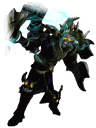

<!-- generated:start -->
<!-- generated-keys: title=0a1de0 type=9bbc46 id=967d1c sources=051a9b name_key=5ed825 category=c1dfd9 class_mask=356a19 model=41f448 model_name=3e25a6 model_path=7ec7a7 scale=aa8f28 radius=356a19 projectile=43d6ee sounds=bfd9b2 hero=bd307a boss_of=0ae2ea dungeon_rewards=121ccb spawn_fields=0ae2ea -->
|  |  |
|---|---|
|  |  |
| **Unit id** | `849` |
| **Category** | boss (inferred: every dungeon boss and quest bosses such as Tow Chief) (`category@8a` = 6) |
| **Class mask** | 1 (monster) |
| **Model** | ObjectList `346` MOB_DemonLord_01_0_1_0_00_00 (`character/npc/monster/mob_demon/mob_demonlord_02.mo`) |
| **Scale** | 1.5 (second scale / radius 1) |
| **Projectile?** | `u32@bc` = 853 (archers carry one; meaning *inferred*) |
| **Hero transform** | Akasha |
| **Boss of** | [[wiki/dungeons/129-lv-8-thorn-s-hell\|(Lv 8) Thorn's Hell]] |

### Server stats

None of these is in the client; they were server data. Fill them in the front matter with a source (`drops: [{"item": id, "rate": %, "count": [min, max]}]`, `spawns: [{"field": id, "x": .., "z": .., "count": n, "respawn_s": s}]`).

| field | value |
|---|---|
| hp | **missing** |
| level | **missing** |
| attack | **missing** |
| armor | **missing** |
| magic_resist | **missing** |
| move_speed | **missing** |
| attack_speed | **missing** |
| attack_range | **missing** |
| kill_exp | **missing** |
| kill_gold | **missing** |
| drops | **missing** |
| spawns | **missing** |

### Where it appears

Fields the client ties it to (quest objective maps, dungeon boss tables). Positions and counts are not in the client: add them as `spawns`.

- [[wiki/dungeons/129-lv-8-thorn-s-hell|(Lv 8) Thorn's Hell]] — boss ([[gameplay/dungeon-drops]], [[gameplay/maps-and-dungeons]])

### Dungeon rewards (advertised)

What the dungeon's entry window shows (`DungeonAdmission`). It is a list of possible rewards of the whole dungeon, not this boss's drop table, and has no rates.

- [[wiki/dungeons/129-lv-8-thorn-s-hell|(Lv 8) Thorn's Hell]]: [[wiki/items/602-blue-passion-piece-d|Blue Passion Piece (D)]], [[wiki/items/603-blue-passion-fragments-c|Blue Passion Fragments (C)]], [[wiki/items/693-gem-stone-blue|Gem Stone : Blue]], [[wiki/items/694-gem-stone-yellow|Gem Stone : Yellow]], [[wiki/items/695-gem-stone-red|Gem Stone : Red]], [[wiki/items/1932-essence-of-fire|Essence of Fire]], [[wiki/items/2708-horn-of-akasha|Horn of Akasha]], [[wiki/items/2758-the-arch-devil-akasha-s-sealed-weapon|The Arch devil Akasha's Sealed Weapon]]

### Sounds

UnitDB's seven `{a, id}` pairs (+0xcc..+0x100). docs/spec/monsters.md reads the ids as skills, but they are `sound.csv` ids (*client*); `a` is unknown.

| slot | a | sound id | file |
|---|---|---|---|
| 1 | 0 | 4070051 | `Unit/UE4070051.wav` |
| 2 | 0 | 4070051 | `Unit/UE4070051.wav` |
| 3 | 977 | 4070050 | `Unit/UE4070050.wav` |
| 4 | 977 | 4070050 | `Unit/UE4070050.wav` |
| 5 | 0 | 4070050 | `Unit/UE4070050.wav` |
| 6 | 0 | 4070052 | `Unit/UE4070052.wav` |

### Seen in

- [[gameplay/crush-mechanics|Crush Online mechanics from the forum]] § 9. Dungeons, bosses, farming: Client check: units 672 King Deathhead, 673 Dark Knight Skull, 674 Tempest Fisher, 675 Slayer Komodo, 676 Great Summoner Spectre, 677 War Chief Garon, 849 Akas…
- [[gameplay/dungeon-drops|Dungeon drops (ores and herbs)]] § 1. Per dungeon level: 8 · Thorns Hell → 129 "[Lv 8] Thorn's Hell" · Akasha/Reviathan → Akasha 849 · Emerald 806, Rosemary 822, Jasmine 824 · 602, Blue Passion Frag [C] 603, 693, 694…
- [[gameplay/maps-and-dungeons|Maps and dungeons]] § 2. Border-area (normal/hard) dungeons: 8 · Thorn's Hell (*ThornsHell*) · 129 · Akasha (849) · T2 · Emerald ×4, Rosemary ×5, Jasmine ×3
- [[gameplay/crush-mechanics|Crush Online mechanics from the forum]] § 9. Dungeons, bosses, farming *(name match)*: 7 · Hell of Demon · Akasha / Leviathan · Diamond, Borage, Spartium
- [[gameplay/crush-mechanics|Crush Online mechanics from the forum]] § 9. Dungeons, bosses, farming *(name match)*: 8 · Thorns Hell · Akasha / Revenant · Emerald, Rosemary, Jasmine
- [[gameplay/crush-patch-notes|Crush Online patch notes 2016–17]] § 2016-12-15: Civil War ((t816); Steam 15 Dec) *(name match)*: Boundary-area boss summon · dungeon elites drop a scroll that summons one extra boss, once per boss: DeathHead, Chepa Sorcerer, Dark Knight, Tempest Fisher, Ko…
- [[gameplay/dungeon-drops|Dungeon drops (ores and herbs)]] § 1. Per dungeon level *(name match)*: 7 · Hell of Demon → 126 "[Lv 7] Demon Hell" · Akasha/Reviathan → Reviatan Shadow 678 / 740, Commander Reviatan 739, Reviatan 972 · Diamond 810, Borage 826, Spa…
- [[gameplay/dungeon-drops|Dungeon drops (ores and herbs)]] § 1. Per dungeon level *(name match)*: "Akasha/Reviathan" is listed for both Lv 7 and Lv 8 in the sheet. The client splits them: Demon Hell's rewards show the Leviathan horn and weapon, Thorn's Hell…
- [[gameplay/dungeon-drops|Dungeon drops (ores and herbs)]] § 2. Where the sheet disagrees with the client *(name match)*: Boss names · Deathhead, Death Knight, Akasha/Reviathan · King Deathhead, Dark Knight Skull, Reviatan (Lv 7) / Akasha (Lv 8) · client
- [[gameplay/maps-and-dungeons|Maps and dungeons]] § 2. Border-area (normal/hard) dungeons *(name match)*: Sources: dungeons guide (one section per dungeon), repeated in Turkish guide §Zindanlar; field and unit ids *client*. The older Crush Online guide Crush basics…

### Other client fields

Undecoded UnitDB columns with a value (`meaning@offset`, docs/spec/monsters.md).

| column | value |
|---|---|
| u8@91 | 15 |
| f32@c0 | 9 |
| f32@10c | 0.5 |
<!-- generated:end -->

## Notes

- Boss of [[wiki/dungeons/129-lv-8-thorn-s-hell|[Lv 8] Thorn's Hell (129)]] (guides + client ids, [[gameplay/maps-and-dungeons]] §2; [[gameplay/dungeon-drops]] §1). Crush Online name: Akasha/Reviathan (Crush Online sheet) or Akasha / Revenant (Crush basics guide); the client's rewards for this dungeon show Akasha's horn and sealed weapon ([[gameplay/dungeon-drops]] §1–2; [[gameplay/crush-mechanics]] §9).
- That dungeon drops T2 named-set gear, already reinforced at a random level (+0 to +11 seen) (image + guide, [[gameplay/maps-and-dungeons]] §2).
- The dungeons guide shows the Thorn's Hell boss as **three** figures (a multi-boss fight) (image, [[gameplay/maps-and-dungeons]] §2).

## Behaviour

- Drops: the dungeon entry panel advertises this dungeon's essence, horn and sealed weapon (client, front matter `dungeon_rewards`; no rates). Crush Online players said every boss (dungeon or world map) could drop every essence (player, [[gameplay/crush-mechanics]] §9). Warmonger patch 0920 raised boss-material drop rates from dungeon bosses and fort guardians (notes, [[gameplay/patch-history]] § Numbers pass (October 2026)).
- The forum says a dungeon boss only exists while the land is monster-invaded (forum, [[gameplay/warmonger-forum]] §3); in hard mode the boss waits at the end (guide, [[gameplay/maps-and-dungeons]] §2).
- Crush Online patch 2016-12-15 let dungeon elites drop a scroll that summoned one extra boss, once per boss (this boss is on the list); the client's summon items 2585–2589 do not include one for it (staff + client, [[gameplay/crush-patch-notes]] § 2016-12-15).

## Sources

- [[gameplay/dungeon-drops]] §1–2, [[gameplay/maps-and-dungeons]] §2, [[gameplay/crush-mechanics]] §9, [[gameplay/warmonger-forum]] §3, [[gameplay/crush-patch-notes]] § 2016-12-15, [[gameplay/patch-history]]

## Open questions

- HP, level, damage, exp and drop rates: no source gives them. [[gameplay/sources]] §9 lists boss videos (Commander Reviatan solo, Komodo 5-man) that could give HP against damage numbers.
- The guides do not say which of this boss's unit ids is the normal-mode, hard-mode or field version.

<!-- credit:start -->
---
*Game content © GAMESinFLAMES / Joyimpact; reproduced for preservation and reference.*
<!-- credit:end -->
