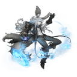

<!-- generated:start -->
<!-- generated-keys: title=a6d26e type=09842e id=899776 sources=b215c8 kind=7ae9cd field=6216f8 x=84da0c z=692643 gadget=77de68 shape=1b6453 name_key=9e666d model=f67462 scale=2afe7d quests=94f788 -->
|  |  |
|---|---|
|  |  |
| **Trigger id** | `11105` |
| **Kind** | talkable quest gadget |
| **Field** | [[wiki/fields/111-the-land-of-greed\|The land of Greed]] at (1216.22, 2753.61) |
| **Gadget number** | `3` (what quests refer to) |
| **Model** | ObjectList `187`, scale 1.3 |

### Quests

- **Gives:** [[wiki/quests/80-support-the-abyss-expedition|Support the Abyss expedition]], [[wiki/quests/81-support-the-abyss-expedition|Support the Abyss expedition]], [[wiki/quests/82-support-the-abyss-expedition|Support the Abyss expedition]]
- **Takes the turn-in of:** [[wiki/quests/17-support-the-abyss-expedition|Support the Abyss expedition]]

Speaks in `QuestTalk` rows 658, 737 (the dialogue is on the quest pages).

Same gadget in the other nations' copies: [[wiki/nodes/10803-scout-leader|Scout Leader (10803)]], [[wiki/nodes/10904-scout-leader|Scout Leader (10904)]].

### Seen in

- [[gameplay/npc-locations|NPC and point-of-interest locations]]
<!-- generated:end -->

## Notes

<!-- hand-written: add what you know, with a source -->

## Behaviour

<!-- hand-written: add what you know, with a source -->

## Sources

<!-- hand-written: add what you know, with a source -->

## Open questions

<!-- hand-written: add what you know, with a source -->

<!-- credit:start -->
---
*Game content © GAMESinFLAMES / Joyimpact; reproduced for preservation and reference.*
<!-- credit:end -->
