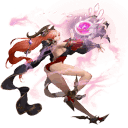

<!-- generated:start -->
<!-- generated-keys: title=8ad434 type=3664ce id=fa7557 sources=3c5122 name_key=8a975e category=e1822d class_mask=da4b92 model=cfa2ed scale=aa8f28 functions=3ee449 role=5dcbdc talk_key=19cfbb portrait=bad4e3 map=2be88c x=2be88c z=2be88c -->
|  |  |
|---|---|
|  |  |
| **Unit id** | `139` |
| **Role** | Auction House |
| **Category** | NPC (category 50) |
| **Menu** | Auction House (`17`) |
| **Model** | ObjectList `185`, scale 1.5 |
| **Portrait** | `ui/NPCProfile/NPC_Shares.dds` |

### Greeting

> Hello, I handle all auctions in Gaia.

### Seen in

- [[gameplay/maps-and-dungeons|Maps and dungeons]] (5. Fortress layout (town))
<!-- generated:end -->

## Notes

<!-- hand-written: add what you know, with a source -->

## Behaviour

<!-- hand-written: add what you know, with a source -->

## Sources

<!-- hand-written: add what you know, with a source -->

## Open questions

<!-- hand-written: add what you know, with a source -->

<!-- credit:start -->
---
*Game content © GAMESinFLAMES / Joyimpact; reproduced for preservation and reference.*
<!-- credit:end -->
