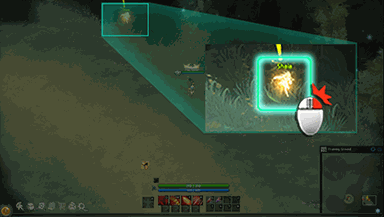

<!-- generated:start -->
<!-- generated-keys: title=935f88 type=eb5b2b id=0e55c1 sources=2b5fa0 name_key=c59b6a kind=7b5200 kind_name=ec7dd4 giver=847ad4 turn_in=2be88c bit=356a19 prev=97d170 next=249983 stages=30caa7 objectives=92303d rewards=97d170 help=77dcdc -->
|  |  |
|---|---|
|  |  |
| **Quest id** | `1501` |
| **Kind** | Advice (kind 12) |
| **Giver** | automatic |
| **Turn in** | **unknown** |
| **Completion bit** | 1 |

### Chain

- **After:** nothing (no prerequisite bit)
- **Next:** [[wiki/quests/2-the-slime-is-mine|The Slime is mine]]
- **Shares completion bit 1 with:** [[wiki/quests/1-on-to-a-promising-start|On to a promising start]] (completing one closes the others)

### Objectives

1. Talk to [[wiki/npcs/201-shaia|Shaia]] (dialogue 630) — tracker: “Move character” — on [[wiki/fields/89-training-ground|Training Ground]] (89)

### Rewards

None in the client.

### Dialogue

#### Objective 1 (QuestTalk 630)

Speaker: [[wiki/npcs/201-shaia|Shaia]]

> **Shaia:** Why are you always late?  
> **Shaia:** Gather a couple of Slime Mucus from the Slimes around here and hurry up. You are already late as it is.  
> **You:** Why should the best fighter in the world gather slime mucus?  
> **Shaia:** The best fighter in the world? Hahaha. At least you have a good sense of humour. You have a long way to go before you can call yourself that. Now stop fooling around and get going, Biologist Floyd needs them for her research.  
> **You:** But... but.... never mind. I'll get the job done! Don't you worry Shaia, the Slimes won't know what hit them!  
> *(accept / continue)*

### Tip window

> When you right-click on an NPC or on the ground, you can talk with the NPC and move the character.

Image `ui/HelpImage/Help_02.png`.

### Mentioned in

- [[gameplay/video-character-creation-and-tutorial|Video notes: character creation and tutorial (ZonderCoRe, June 2018)]]
<!-- generated:end -->

## Notes

<!-- hand-written: add what you know, with a source -->

## Behaviour

<!-- hand-written: add what you know, with a source -->

## Sources

<!-- hand-written: add what you know, with a source -->

## Open questions

<!-- hand-written: add what you know, with a source -->

<!-- credit:start -->
---
*Game content © GAMESinFLAMES / Joyimpact; reproduced for preservation and reference.*
<!-- credit:end -->
