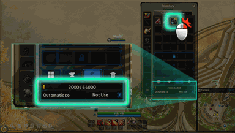

<!-- generated:start -->
<!-- generated-keys: title=7908b4 type=eb5b2b id=5e540d sources=0354a2 name_key=24571f kind=7b5200 kind_name=ec7dd4 giver=847ad4 turn_in=2be88c bit=bc33ea prev=97d170 next=97d170 stages=30caa7 objectives=ed2124 rewards=97d170 help=de54b5 -->
|  |  |
|---|---|
|  |  |
| **Quest id** | `1513` |
| **Kind** | Advice (kind 12) |
| **Giver** | automatic |
| **Turn in** | **unknown** |
| **Completion bit** | 27 |

### Chain

- **After:** nothing (no prerequisite bit)
- **Next:** nothing: no quest requires this quest's bit (chain end)
- **Shares completion bit 27 with:** [[wiki/quests/721-battle-preparations|Battle preparations]] (completing one closes the others)

### Objectives

1. client event: decomposition: [[wiki/items/692-gem-stone-blue|Gem Stone : Blue]] — tracker: “Possible to decompose from inventory when decomposition point is held” — on [[wiki/fields/120-fortress|Fortress]] (120)

### Rewards

None in the client.

### Tip window

> Use auto decomposition hammer item and auto decomposition point will be increase 
>  Achieve item will be decompose automatically for item's condition 
>
> Tip : If automatic condition is selected, the items that match the condition are automatically decomposed.

Image `ui/HelpImage/Help_23.png`.
<!-- generated:end -->

## Notes

<!-- hand-written: add what you know, with a source -->

## Behaviour

<!-- hand-written: add what you know, with a source -->

## Sources

<!-- hand-written: add what you know, with a source -->

## Open questions

<!-- hand-written: add what you know, with a source -->

<!-- credit:start -->
---
*Game content © GAMESinFLAMES / Joyimpact; reproduced for preservation and reference.*
<!-- credit:end -->
