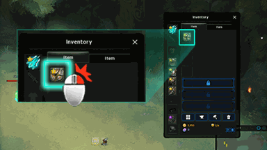

<!-- generated:start -->
<!-- generated-keys: title=86708b type=eb5b2b id=a7d304 sources=7a6d13 name_key=d0332d kind=7b5200 kind_name=ec7dd4 giver=847ad4 turn_in=2be88c bit=a72b20 prev=97d170 next=97d170 stages=30caa7 objectives=aa6b10 rewards=97d170 help=99a155 -->
|  |  |
|---|---|
|  |  |
| **Quest id** | `1531` |
| **Kind** | Advice (kind 12) |
| **Giver** | automatic |
| **Turn in** | **unknown** |
| **Completion bit** | 69 |

### Chain

- **After:** nothing (no prerequisite bit)
- **Next:** nothing: no quest requires this quest's bit (chain end)
- **Shares completion bit 69 with:** [[wiki/quests/710-equip-crystal-innocence|Equip Crystal : Innocence]] (completing one closes the others)

### Objectives

1. client event: equip (a = slot kind) (a = 3) — tracker: “Equip Crystal : Innocence from Inventory [I]”

### Rewards

None in the client.

### Tip window

> Equip Crystal : Innocence from Inventory [I]
> Press [K] to open the Hero window. 
> You can wear off your Hero from the Hero window.

Image `ui/HelpImage/Help_24.png`.
<!-- generated:end -->

## Notes

<!-- hand-written: add what you know, with a source -->

## Behaviour

<!-- hand-written: add what you know, with a source -->

## Sources

<!-- hand-written: add what you know, with a source -->

## Open questions

<!-- hand-written: add what you know, with a source -->

<!-- credit:start -->
---
*Game content © GAMESinFLAMES / Joyimpact; reproduced for preservation and reference.*
<!-- credit:end -->
