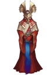

<!-- generated:start -->
<!-- generated-keys: title=a4656b type=eb5b2b id=92cfce sources=b32b8f name_key=a67b97 kind=b6589f kind_name=b3f808 giver=ad0cc6 turn_in=ad0cc6 bit=812ed4 requires_bit=8e63fd prev=8f80dd next=6ee44d stages=a80fa1 objectives=24b023 rewards=ee067c offer_talk=f4904f complete_talk=bf67a6 -->
|  |  |
|---|---|
|  |  |
| **Quest id** | `42` |
| **Kind** | Main (kind 0) |
| **Giver** | [[wiki/npcs/325-joel\|Joel]] |
| **Turn in** | [[wiki/npcs/325-joel\|Joel]] |
| **Completion bit** | 97 |
| **Requires bit** | 95 |

### Chain

- **After:** [[wiki/quests/41-innocence-s-recovery-operation|Innocence's recovery operation]]
- **Next:** [[wiki/quests/43-innocence-s-recovery-operation|Innocence's recovery operation]]

### Objectives

1. Report (tracker line; done by turning the quest in) — tracker: “Go to Joel: (Moving the Temple through the Oracle of the Protection)”

Stages (`flag1..5` = [1, 5, 5, 5, 5]): objectives unlock in steps; with the first unfinished objective *i*, objectives 1..flag*i* are active (contract/quests.yaml).

### Rewards

- **Basic reward:** [[wiki/items/20001-magical-demolition-hammer|Magical Demolition Hammer]] × 50

### Dialogue

#### Offer (QuestTalk 822)

Speaker: [[wiki/npcs/325-joel|Joel]]

> **Joel:** I have received a message that Noah's followers are gathering… I didn't know that the Scout Leaders were Noah's followers…They are more involved than I had ever thought possible…  
> **You:** Noah?  What is Noah's identity?  
> **Joel:** These groups include the Nordens, Proxy's Descendants and followers who lost the war. They are threats to the whole world.  
> **You:** I see... Thank you... Where is our scout?  
> **Joel:** Do you know about the Innocence?  
> *(accept / continue)*

#### Completion (QuestTalk 823)

Speaker: [[wiki/npcs/325-joel|Joel]]

> **You:** Innocence?? What is that?  
> **Joel:** Innocence is the power of Heroes. Using that power, you can become a true Hero.   However, I can already feel great power from you. I see that it's possible for you to use Innocence!!  
> *(accept / continue)*
<!-- generated:end -->

## Notes

<!-- hand-written: add what you know, with a source -->

## Behaviour

<!-- hand-written: add what you know, with a source -->

## Sources

<!-- hand-written: add what you know, with a source -->

## Open questions

<!-- hand-written: add what you know, with a source -->

<!-- credit:start -->
---
*Game content © GAMESinFLAMES / Joyimpact; reproduced for preservation and reference.*
<!-- credit:end -->
