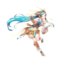

<!-- generated:start -->
<!-- generated-keys: title=2ab84f type=eb5b2b id=902ba3 sources=7b89f6 name_key=6b6dd8 kind=b6589f kind_name=b3f808 giver=444e6c turn_in=f8f324 offer_maps=6e2020 turn_in_maps=46bf0f bit=9a79be requires_bit=c1dfd9 prev=2eaa92 next=c4824e stages=30caa7 objectives=35f8b6 rewards=867c0c offer_talk=27cfac complete_talk=afc3bf -->
|  |  |
|---|---|
|  |  |
| **Quest id** | `7` |
| **Kind** | Main (kind 0) |
| **Giver** | [[wiki/npcs/201-shaia\|Shaia]] |
| **Turn in** | [[wiki/npcs/198-frei\|Frei]] |
| **Offered on** | Arslan: [[wiki/fields/89-training-ground\|Training Ground]] (89) · Erion: [[wiki/fields/93-training-ground\|Training Ground]] (93) · Armia: [[wiki/fields/97-training-ground\|Training Ground]] (97) |
| **Turned in on** | Arslan: [[wiki/fields/88-training-camp\|Training Camp]] (88) · Erion: [[wiki/fields/92-training-camp\|Training Camp]] (92) · Armia: [[wiki/fields/96-training-camp\|Training Camp]] (96) |
| **Completion bit** | 99 |
| **Requires bit** | 6 |

### Chain

- **After:** [[wiki/quests/6-the-1st-challenge-chepas-ahead|The 1st Challenge: Chepas ahead]], [[wiki/quests/45-the-1st-challenge-chepas-ahead|The 1st Challenge: Chepas ahead]]
- **Next:** [[wiki/quests/9-find-the-missing-scout|Find the missing Scout]], [[wiki/quests/101-all-sorts-of-fragile-bones|All sorts of Fragile bones]], [[wiki/quests/107-hunting-skeletons|Hunting Skeletons]]

### Objectives

1. Kill [[wiki/monsters/710-chepa-warrior-officer|Chepa Warrior Officer]] × 1 — tracker: “Hunt Chepa Warriors officer (0/1)”
2. Kill [[wiki/monsters/711-chepa-archer-officer|Chepa Archer Officer]] × 1 — tracker: “Hunt Chepa Archers officer (0/1)”
3. Report (tracker line; done by turning the quest in) — tracker: “Report back to Frei” — on Arslan: [[wiki/fields/88-training-camp|Training Camp]] (88) · Erion: [[wiki/fields/92-training-camp|Training Camp]] (92) · Armia: [[wiki/fields/96-training-camp|Training Camp]] (96)

### Rewards

- **Basic reward:** 10,010 exp (shown in game as 9,100); [[wiki/items/906-scroll-return|Scroll : Return]] × 10
- **Choose one:** [[wiki/items/400-spell-ring|Spell Ring]] *or* [[wiki/items/408-ring-of-life|Ring of Life]]

The reward panel shows quest exp lower than the table: kind 0 quests show the table value ÷ 1.1, kind 1 ÷ 1.2 ([[gameplay/video-early-quests|video notes]] §4). Which of the two the original server granted is not known.

### Dialogue

#### Offer (QuestTalk 685)

Speaker: [[wiki/npcs/201-shaia|Shaia]]

> **Shaia:** Already back? Did you finish Frei's missions?  
> **You:** Not yet, I'm having trouble finding the Chepa Leaders.  
> **Shaia:** The Chepa Leaders are in the north. I hope you pass the test. Good luck!  
> *(accept / continue)*

#### Completion (QuestTalk 638)

Speaker: [[wiki/npcs/198-frei|Frei]]

> **You:** I killed those Chepas like you asked me to. What's next?  
> **Frei:** Well done! There is one more test.  
> **Frei:** Prepare yourself! The real test lies ahead.  
> *(accept / continue)*

### Seen in

- [[gameplay/video-character-creation-and-tutorial|Video notes: character creation and tutorial (ZonderCoRe, June 2018)]]: step 15 at [12:35](https://www.youtube.com/watch?v=-DMnhYzYiC0&t=755s); step 16 at [15:30](https://www.youtube.com/watch?v=-DMnhYzYiC0&t=930s)
- [[gameplay/video-early-quests|Video notes: first session, levels 1+ (charmanmugen)]]: step 7 at [16:35](https://www.youtube.com/watch?v=s04CSN16w1s&t=997s)
- [[gameplay/video-tutorial-walkthrough|Video notes: tutorial walkthrough (Bravely Forward 2)]]: step 17 at [21:10](https://www.youtube.com/watch?v=CqCY2ULeVGw&t=1270s); step 19 at [23:35](https://www.youtube.com/watch?v=CqCY2ULeVGw&t=1415s)
<!-- generated:end -->

## Notes

<!-- hand-written: add what you know, with a source -->

## Behaviour

<!-- hand-written: add what you know, with a source -->

## Sources

<!-- hand-written: add what you know, with a source -->

## Open questions

<!-- hand-written: add what you know, with a source -->

<!-- credit:start -->
---
*Game content © GAMESinFLAMES / Joyimpact; reproduced for preservation and reference.*
<!-- credit:end -->
