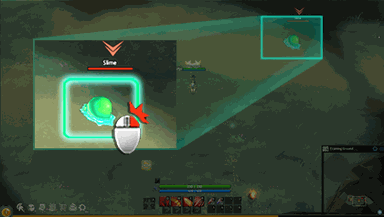

<!-- generated:start -->
<!-- generated-keys: title=aff359 type=eb5b2b id=d8e4bb sources=9c8a80 name_key=ba431e kind=da4b92 kind_name=875cc6 giver=847ad4 turn_in=847ad4 bit=b7103c automatic=5ffe53 prev=97d170 next=97d170 stages=30caa7 objectives=2177c8 rewards=f1841d help=fcaf5c -->
|  |  |
|---|---|
|  |  |
| **Quest id** | `700` |
| **Kind** | Guide (kind 2) |
| **Giver** | automatic |
| **Turn in** | automatic |
| **Completion bit** | 70 |
| **Automatic flag** | set (c14@11) |

### Chain

- **After:** nothing (no prerequisite bit)
- **Next:** nothing: no quest requires this quest's bit (chain end)
- **Shares completion bit 70 with:** [[wiki/quests/1502-basic-function-basic-attack|Basic function - Basic attack]] (completing one closes the others)

### Objectives

1. client event: attack / skill used — tracker: “Use a basic attack.”

### Rewards

- **Basic reward:** 200 exp

### Tip window

> You can attack slime with right mouse button click.

Image `ui/HelpImage/Help_09.png`.

### Seen in

- [[gameplay/video-character-creation-and-tutorial|Video notes: character creation and tutorial (ZonderCoRe, June 2018)]]: at [6:35](https://www.youtube.com/watch?v=-DMnhYzYiC0&t=395s); step 3 at [3:25](https://www.youtube.com/watch?v=-DMnhYzYiC0&t=205s)
- [[gameplay/video-early-quests|Video notes: first session, levels 1+ (charmanmugen)]]: step 1 at [4:55](https://www.youtube.com/watch?v=s04CSN16w1s&t=295s)
- [[gameplay/video-tutorial-walkthrough|Video notes: tutorial walkthrough (Bravely Forward 2)]]: step 3 at [4:00](https://www.youtube.com/watch?v=CqCY2ULeVGw&t=240s); step 4 at [4:55](https://www.youtube.com/watch?v=CqCY2ULeVGw&t=295s)
<!-- generated:end -->

## Notes

Starts with quest 2 after talking to Shaia: use a basic attack; the tip says to attack the slime with a right click; 200 exp ([4:00](https://www.youtube.com/watch?v=CqCY2ULeVGw&t=240s), [3:00](https://www.youtube.com/watch?v=-DMnhYzYiC0&t=180s)). Finishing it gives level 2 together with quest 1's 500 exp ([3:25](https://www.youtube.com/watch?v=-DMnhYzYiC0&t=205s)). *video*

## Behaviour

<!-- hand-written: add what you know, with a source -->

## Sources

Gameplay pages this page draws on:

## Open questions

<!-- hand-written: add what you know, with a source -->

<!-- credit:start -->
---
*Game content © GAMESinFLAMES / Joyimpact; reproduced for preservation and reference.*
<!-- credit:end -->
