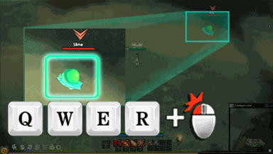

<!-- generated:start -->
<!-- generated-keys: title=0eb5df type=eb5b2b id=917098 sources=8a3298 name_key=bacdd1 kind=da4b92 kind_name=875cc6 giver=847ad4 turn_in=847ad4 bit=d02560 automatic=5ffe53 prev=97d170 next=97d170 stages=30caa7 objectives=beafd1 rewards=c5458a help=1ae02e -->
|  |  |
|---|---|
|  |  |
| **Quest id** | `701` |
| **Kind** | Guide (kind 2) |
| **Giver** | automatic |
| **Turn in** | automatic |
| **Completion bit** | 71 |
| **Automatic flag** | set (c14@11) |

### Chain

- **After:** nothing (no prerequisite bit)
- **Next:** nothing: no quest requires this quest's bit (chain end)
- **Shares completion bit 71 with:** [[wiki/quests/1503-basic-function-skill-use|Basic function - Skill Use]] (completing one closes the others)

### Objectives

1. client event: attack / skill used (a = 1) — tracker: “Use one of your Abilities”

### Rewards

- **Basic reward:** 300 exp

### Tip window

> You can use skill through press skill shortcut.

Image `ui/HelpImage/Help_10.png`.

### Seen in

- [[gameplay/video-character-creation-and-tutorial|Video notes: character creation and tutorial (ZonderCoRe, June 2018)]]: at [6:35](https://www.youtube.com/watch?v=-DMnhYzYiC0&t=395s); step 3 at [3:25](https://www.youtube.com/watch?v=-DMnhYzYiC0&t=205s); step 4 at [3:40](https://www.youtube.com/watch?v=-DMnhYzYiC0&t=220s)
- [[gameplay/video-tutorial-walkthrough|Video notes: tutorial walkthrough (Bravely Forward 2)]]: step 4 at [4:55](https://www.youtube.com/watch?v=CqCY2ULeVGw&t=295s)
<!-- generated:end -->

## Notes

Follows lesson 700: use one of your abilities; the tip shows the Q W E R keys; 300 exp ([4:55](https://www.youtube.com/watch?v=CqCY2ULeVGw&t=295s), [3:25](https://www.youtube.com/watch?v=-DMnhYzYiC0&t=205s)). *video*

## Behaviour

<!-- hand-written: add what you know, with a source -->

## Sources

Gameplay pages this page draws on:

## Open questions

<!-- hand-written: add what you know, with a source -->

<!-- credit:start -->
---
*Game content © GAMESinFLAMES / Joyimpact; reproduced for preservation and reference.*
<!-- credit:end -->
