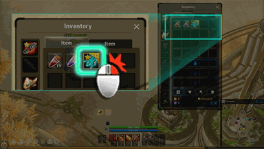
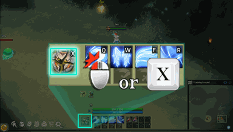
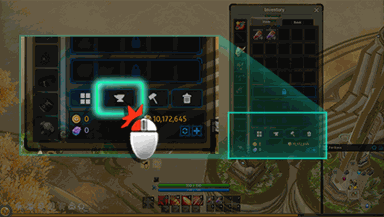
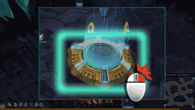
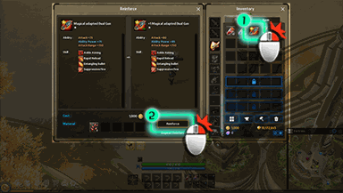
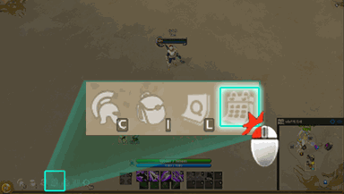
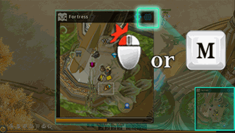
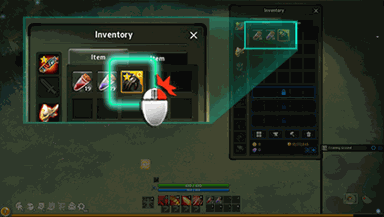
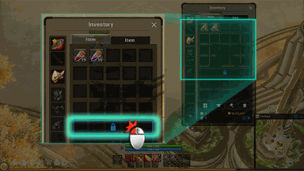

<!-- generated by wiki/gamewiki (index.py); do not edit -->

# Quests

Every quest in the client's `Quest.cdb`: the story chain, side quests, lessons (tutorial tips), repeatable, war, daily/weekly/monthly board quests and advice quests, with givers, objectives, rewards, chain and dialogue. The tutorial chain as played is described in [[gameplay/video-tutorial-walkthrough|Video notes: tutorial walkthrough]] and [[gameplay/video-character-creation-and-tutorial|Video notes: character creation and tutorial]].

291 pages: 144 complete, 77 partial, 70 stub. Back to the [[wiki/index|game wiki]].

| | id | name | status | missing |
|---|---|---|---|---|
|  | 1 | [[wiki/quests/1-on-to-a-promising-start\|On to a promising start]] | complete | 0 |
|  | 2 | [[wiki/quests/2-the-slime-is-mine\|The Slime is mine]] | complete | 0 |
|  | 3 | [[wiki/quests/3-the-task-at-hand\|The task at hand]] | complete | 0 |
|  | 4 | [[wiki/quests/4-go-to-shaia\|Go to Shaia]] | complete | 0 |
|  | 5 | [[wiki/quests/5-united-problem-solvers\|United Problem Solvers]] | complete | 0 |
|  | 6 | [[wiki/quests/6-the-1st-challenge-chepas-ahead\|The 1st Challenge: Chepas ahead]] | complete | 0 |
|  | 7 | [[wiki/quests/7-the-1st-challenge-chepas-ahead\|The 1st Challenge: Chepas ahead]] | complete | 0 |
|  | 9 | [[wiki/quests/9-find-the-missing-scout\|Find the missing Scout]] | complete | 0 |
|  | 10 | [[wiki/quests/10-find-the-secret-document\|Find the Secret Document]] | complete | 0 |
|  | 11 | [[wiki/quests/11-an-urgent-message\|An urgent message]] | complete | 0 |
|  | 12 | [[wiki/quests/12-an-urgent-message\|An urgent message]] | complete | 0 |
|  | 13 | [[wiki/quests/13-battle-preparations\|Battle preparations]] | complete | 0 |
|  | 14 | [[wiki/quests/14-battle-preparations\|Battle preparations]] | complete | 0 |
|  | 15 | [[wiki/quests/15-repel-the-skeleton-invasion\|Repel the Skeleton Invasion]] | complete | 0 |
|  | 16 | [[wiki/quests/16-farrell-s-request\|Farrell's Request]] | complete | 0 |
|  | 17 | [[wiki/quests/17-support-the-abyss-expedition\|Support the Abyss expedition]] | complete | 0 |
|  | 19 | [[wiki/quests/19-meeting-freya\|Meeting Freya]] | complete | 0 |
|  | 20 | [[wiki/quests/20-talk-to-freya\|Talk to Freya]] | partial | 1 |
|  | 21 | [[wiki/quests/21-group-ancient-ghosts\|(Group) Ancient Ghosts]] | complete | 0 |
|  | 22 | [[wiki/quests/22-repel-the-black-skeleton-invasion\|Repel the Black Skeleton Invasion]] | complete | 0 |
|  | 23 | [[wiki/quests/23-stepping-up-your-game\|Stepping up your game]] | stub | 1 |
|  | 24 | [[wiki/quests/24-stepping-up-your-game\|Stepping up your game]] | stub | 1 |
|  | 25 | [[wiki/quests/25-stepping-up-your-game\|Stepping up your game]] | stub | 1 |
|  | 26 | [[wiki/quests/26-border-area-normal-mode\|Border Area Normal Mode]] | complete | 0 |
|  | 28 | [[wiki/quests/28-what-does-wren-do\|What does Wren do?]] | complete | 0 |
|  | 29 | [[wiki/quests/29-kesley-s-disgrace\|Kesley's Disgrace]] | stub | 1 |
|  | 30 | [[wiki/quests/30-chepa-village\|Chepa Village]] | complete | 0 |
|  | 32 | [[wiki/quests/32-swamps-of-snake-warrior\|Swamps of Snake Warrior]] | complete | 0 |
|  | 33 | [[wiki/quests/33-ghost-fortress\|Ghost Fortress]] | complete | 0 |
|  | 34 | [[wiki/quests/34-tow-canyon\|Tow Canyon]] | complete | 0 |
|  | 35 | [[wiki/quests/35-demon-hell\|Demon Hell]] | complete | 0 |
|  | 36 | [[wiki/quests/36-thorn-s-hell\|Thorn's Hell]] | complete | 0 |
|  | 37 | [[wiki/quests/37-call-tempest\|Call Tempest]] | complete | 0 |
|  | 38 | [[wiki/quests/38-innocence-s-recovery-operation\|Innocence's recovery operation]] | complete | 0 |
|  | 39 | [[wiki/quests/39-innocence-s-recovery-operation\|Innocence's recovery operation]] | complete | 0 |
|  | 40 | [[wiki/quests/40-innocence-s-recovery-operation\|Innocence's recovery operation]] | stub | 1 |
|  | 41 | [[wiki/quests/41-innocence-s-recovery-operation\|Innocence's recovery operation]] | complete | 0 |
|  | 42 | [[wiki/quests/42-innocence-s-recovery-operation\|Innocence's recovery operation]] | complete | 0 |
|  | 43 | [[wiki/quests/43-innocence-s-recovery-operation\|Innocence's recovery operation]] | complete | 0 |
|  | 44 | [[wiki/quests/44-innocence-report\|Innocence report]] | stub | 1 |
|  | 45 | [[wiki/quests/45-the-1st-challenge-chepas-ahead\|The 1st Challenge: Chepas ahead]] | complete | 0 |
|  | 46 | [[wiki/quests/46-to-oracle-of-knowledge\|To Oracle of knowledge]] | complete | 0 |
|  | 47 | [[wiki/quests/47-create-potion\|Create Potion]] | complete | 0 |
|  | 48 | [[wiki/quests/48-doping-create\|Doping Create]] | complete | 0 |
|  | 49 | [[wiki/quests/49-war-objects\|War - Objects]] | stub | 1 |
|  | 50 | [[wiki/quests/50-war-winning-means\|War - Winning means]] | stub | 1 |
|  | 51 | [[wiki/quests/51-war-winning-means\|War - Winning means]] | complete | 0 |
|  | 53 | [[wiki/quests/53-safety-factor-management\|Safety factor Management]] | stub | 2 |
|  | 80 | [[wiki/quests/80-support-the-abyss-expedition\|Support the Abyss expedition]] | partial | 1 |
|  | 81 | [[wiki/quests/81-support-the-abyss-expedition\|Support the Abyss expedition]] | partial | 1 |
|  | 82 | [[wiki/quests/82-support-the-abyss-expedition\|Support the Abyss expedition]] | partial | 1 |
|  | 100 | [[wiki/quests/100-hunting-for-furs\|Hunting for Furs]] | complete | 0 |
|  | 101 | [[wiki/quests/101-all-sorts-of-fragile-bones\|All sorts of Fragile bones]] | complete | 0 |
|  | 102 | [[wiki/quests/102-wren-s-sister-wren\|Wren's sister Wren?]] | complete | 0 |
|  | 104 | [[wiki/quests/104-delivering-punishment\|Delivering Punishment]] | complete | 0 |
|  | 105 | [[wiki/quests/105-kesley-s-disgrace\|Kesley's Disgrace]] | stub | 1 |
|  | 106 | [[wiki/quests/106-talk-to-krister\|Talk to Krister]] | complete | 0 |
|  | 107 | [[wiki/quests/107-hunting-skeletons\|Hunting Skeletons]] | complete | 0 |
|  | 108 | [[wiki/quests/108-hunting-ghosts-spirit-avenue\|Hunting Ghosts (Spirit Avenue)]] | complete | 0 |
|  | 109 | [[wiki/quests/109-for-the-honor\|For the honor]] | stub | 1 |
|  | 110 | [[wiki/quests/110-gear-manufacturing\|Gear manufacturing]] | complete | 0 |
|  | 111 | [[wiki/quests/111-weapon-manufacturing\|Weapon manufacturing]] | stub | 1 |
|  | 112 | [[wiki/quests/112-weapon-manufacturing\|Weapon manufacturing]] | stub | 1 |
|  | 113 | [[wiki/quests/113-weapon-manufacturing\|Weapon manufacturing]] | stub | 1 |
|  | 114 | [[wiki/quests/114-weapon-tier-reinforce\|Weapon tier reinforce]] | stub | 1 |
|  | 117 | [[wiki/quests/117-lords-of-the-land\|Lords of the Land]] | complete | 0 |
|  | 119 | [[wiki/quests/119-monster-area-wars\|Monster area wars]] | stub | 1 |
|  | 120 | [[wiki/quests/120-enemy-territory\|Enemy territory]] | stub | 1 |
|  | 121 | [[wiki/quests/121-create-rune\|Create Rune]] | complete | 0 |
|  | 122 | [[wiki/quests/122-rune-equipment\|Rune Equipment.]] | complete | 0 |
|  | 123 | [[wiki/quests/123-rune-reinforcement\|Rune Reinforcement]] | stub | 1 |
|  | 501 | [[wiki/quests/501-return-player\|Return Player]] | stub | 2 |
|  | 691 | [[wiki/quests/691-items-ai-steering-item-use\|Items - AI Steering & Item Use]] | stub | 1 |
|  | 692 | [[wiki/quests/692-innocence-crystal\|Innocence Crystal]] | complete | 0 |
|  | 693 | [[wiki/quests/693-create-innocence-crystal\|Create Innocence Crystal]] | stub | 1 |
|  | 694 | [[wiki/quests/694-occupation-of-monster-area\|Occupation of Monster area]] | stub | 1 |
|  | 695 | [[wiki/quests/695-occupation-of-enemy-territory\|Occupation of Enemy territory]] | stub | 1 |
|  | 696 | [[wiki/quests/696-occupation-of-monster-invasion-area\|Occupation of Monster Invasion Area]] | partial | 1 |
|  | 697 | [[wiki/quests/697-create-rune\|Create Rune]] | complete | 0 |
|  | 698 | [[wiki/quests/698-rune-equipment\|Rune Equipment.]] | complete | 0 |
|  | 699 | [[wiki/quests/699-rune-reinforcement\|Rune Reinforcement]] | complete | 0 |
|  | 700 | [[wiki/quests/700-basic-combat-lesson-1\|Basic Combat Lesson 1]] | complete | 0 |
|  | 701 | [[wiki/quests/701-basic-combat-lesson-2\|Basic Combat Lesson 2]] | complete | 0 |
|  | 702 | [[wiki/quests/702-how-to-use-tp-skill\|How to use TP Skill]] | stub | 1 |
|  | 703 | [[wiki/quests/703-equip-innocence-s\|Equip Innocence's]] | complete | 0 |
|  | 704 | [[wiki/quests/704-equip-gear\|Equip Gear]] | complete | 0 |
|  | 705 | [[wiki/quests/705-legion-how-to-use-add-on\|Legion - How to use add-on]] | stub | 1 |
|  | 706 | [[wiki/quests/706-expand-your-inventory\|Expand your Inventory]] | complete | 0 |
|  | 707 | [[wiki/quests/707-how-to-use-innocence-s\|How to use Innocence's]] | stub | 1 |
|  | 708 | [[wiki/quests/708-a-new-weapon\|A new weapon]] | complete | 0 |
|  | 709 | [[wiki/quests/709-two-sets-of-weapons\|Two sets of weapons]] | complete | 0 |
|  | 710 | [[wiki/quests/710-equip-crystal-innocence\|Equip Crystal : Innocence]] | complete | 0 |
|  | 711 | [[wiki/quests/711-how-to-use-crystal-innocence\|How to use Crystal : Innocence]] | stub | 1 |
|  | 712 | [[wiki/quests/712-take-a-look-at-the-world-map\|Take a look at the World Map.]] | complete | 0 |
|  | 713 | [[wiki/quests/713-weapon-level-reinforcement\|Weapon Level (+) reinforcement]] | partial | 1 |
|  | 714 | [[wiki/quests/714-buy-time-energy\|Buy time energy]] | complete | 0 |
|  | 718 | [[wiki/quests/718-open-item-reinforcement-window\|Open item reinforcement window]] | complete | 0 |
|  | 719 | [[wiki/quests/719-go-to-the-fortress\|Go to the Fortress]] | complete | 0 |
|  | 720 | [[wiki/quests/720-gear-level-reinforcement\|Gear Level (+) reinforcement]] | partial | 1 |
|  | 721 | [[wiki/quests/721-battle-preparations\|Battle preparations]] | complete | 0 |
|  | 722 | [[wiki/quests/722-juicy-potions\|Juicy Potions]] | complete | 0 |
|  | 723 | [[wiki/quests/723-how-to-obtain-sp\|How to obtain SP]] | complete | 0 |
|  | 724 | [[wiki/quests/724-find-lost-item\|Find lost item]] | complete | 0 |
|  | 725 | [[wiki/quests/725-collecting-material\|Collecting material]] | complete | 0 |
|  | 726 | [[wiki/quests/726-gathering-plant-and-ore\|Gathering plant and ore]] | complete | 0 |
|  | 727 | [[wiki/quests/727-the-necessary-materials\|The necessary materials]] | complete | 0 |
|  | 728 | [[wiki/quests/728-gathering-plant-and-ore\|Gathering plant and ore]] | complete | 0 |
|  | 729 | [[wiki/quests/729-collecting-material\|Collecting material]] | complete | 0 |
|  | 730 | [[wiki/quests/730-gathering-plant-and-ore\|Gathering plant and ore]] | complete | 0 |
|  | 731 | [[wiki/quests/731-collecting-material\|Collecting material]] | complete | 0 |
|  | 732 | [[wiki/quests/732-fisher-s-scales\|Fisher's scales]] | complete | 0 |
|  | 733 | [[wiki/quests/733-weapon-appropriation\|Weapon appropriation]] | complete | 0 |
|  | 734 | [[wiki/quests/734-gathering-plant-and-ore\|Gathering plant and ore]] | complete | 0 |
|  | 735 | [[wiki/quests/735-collecting-material\|Collecting material]] | complete | 0 |
|  | 736 | [[wiki/quests/736-hunting-for-furs\|Hunting for Furs]] | complete | 0 |
|  | 737 | [[wiki/quests/737-ghost-fortress\|Ghost Fortress]] | complete | 0 |
|  | 738 | [[wiki/quests/738-collecting-material\|Collecting material]] | complete | 0 |
|  | 739 | [[wiki/quests/739-gathering-plant-and-ore\|Gathering plant and ore]] | complete | 0 |
|  | 740 | [[wiki/quests/740-tow-canyon\|Tow Canyon]] | complete | 0 |
|  | 741 | [[wiki/quests/741-collecting-material\|Collecting material]] | complete | 0 |
|  | 742 | [[wiki/quests/742-gathering-plant-and-ore\|Gathering plant and ore]] | complete | 0 |
|  | 743 | [[wiki/quests/743-demon-hell\|Demon Hell]] | complete | 0 |
|  | 744 | [[wiki/quests/744-acquire-materials\|Acquire materials]] | complete | 0 |
|  | 745 | [[wiki/quests/745-gathering-plant-and-ore\|Gathering plant and ore]] | complete | 0 |
|  | 746 | [[wiki/quests/746-devil-s-material\|Devil's material]] | complete | 0 |
|  | 747 | [[wiki/quests/747-acquire-materials\|Acquire materials]] | complete | 0 |
|  | 748 | [[wiki/quests/748-ore-and-plant-collection\|Ore and plant collection]] | complete | 0 |
|  | 749 | [[wiki/quests/749-kill-monster-of-the-land-of-greed\|Kill monster of The land of Greed]] | complete | 0 |
|  | 750 | [[wiki/quests/750-kill-monster-of-the-avenue-of-spirit\|Kill monster of The avenue of spirit]] | complete | 0 |
|  | 751 | [[wiki/quests/751-kill-monster-of-the-way-go-to-devildom\|Kill monster of The way go to devildom]] | complete | 0 |
|  | 752 | [[wiki/quests/752-join-create-legion\|Join & Create Legion]] | complete | 0 |
|  | 753 | [[wiki/quests/753-join-the-legion\|Join the Legion]] | partial | 1 |
|  | 754 | [[wiki/quests/754-battle-with-legion-members-no-1\|Battle with Legion members No. 1]] | stub | 1 |
|  | 755 | [[wiki/quests/755-battle-with-legion-members-no-2\|Battle with Legion members No. 2]] | partial | 1 |
|  | 756 | [[wiki/quests/756-group-border-area-hard-mode\|Group - Border Area Hard Mode]] | complete | 0 |
|  | 757 | [[wiki/quests/757-group-border-area-hard-mode\|Group - Border Area Hard Mode]] | complete | 0 |
|  | 758 | [[wiki/quests/758-group-border-area-hard-mode\|Group - Border Area Hard Mode]] | complete | 0 |
|  | 759 | [[wiki/quests/759-group-border-area-hard-mode\|Group - Border Area Hard Mode]] | complete | 0 |
|  | 760 | [[wiki/quests/760-group-border-area-hard-mode\|Group - Border Area Hard Mode]] | complete | 0 |
|  | 761 | [[wiki/quests/761-killed-boss-of-border-area-no-1\|killed boss of Border area No.1]] | complete | 0 |
|  | 762 | [[wiki/quests/762-killed-boss-of-border-area-no-2\|killed boss of Border area No.2]] | complete | 0 |
|  | 763 | [[wiki/quests/763-no2-lords-of-the-land\|No2. Lords of the Land]] | complete | 0 |
|  | 764 | [[wiki/quests/764-no3-lords-of-the-land\|No3. Lords of the Land]] | complete | 0 |
|  | 765 | [[wiki/quests/765-no4-lords-of-the-land\|No4. Lords of the Land]] | partial | 1 |
|  | 766 | [[wiki/quests/766-sell-ether\|Sell Ether]] | stub | 1 |
|  | 767 | [[wiki/quests/767-buy-ether\|Buy Ether]] | stub | 1 |
|  | 768 | [[wiki/quests/768-group-border-area-hard-mode\|Group - Border Area Hard Mode]] | partial | 1 |
|  | 769 | [[wiki/quests/769-group-border-area-hard-mode\|Group - Border Area Hard Mode]] | complete | 0 |
|  | 770 | [[wiki/quests/770-group-border-area-hard-mode\|Group - Border Area Hard Mode]] | complete | 0 |
|  | 771 | [[wiki/quests/771-group-border-area-hard-mode\|Group - Border Area Hard Mode]] | partial | 1 |
|  | 772 | [[wiki/quests/772-group-border-area-hard-mode\|Group - Border Area Hard Mode]] | complete | 0 |
|  | 773 | [[wiki/quests/773-group-border-area-hard-mode\|Group - Border Area Hard Mode]] | complete | 0 |
|  | 774 | [[wiki/quests/774-highly-concentrated-bomb-create\|Highly Concentrated Bomb Create]] | complete | 0 |
|  | 775 | [[wiki/quests/775-highly-concentrated-bomb-create\|Highly Concentrated Bomb Create]] | complete | 0 |
|  | 776 | [[wiki/quests/776-highly-concentrated-bomb-create\|Highly Concentrated Bomb Create]] | complete | 0 |
|  | 777 | [[wiki/quests/777-legion-core-equip\|Legion Core Equip]] | complete | 0 |
|  | 778 | [[wiki/quests/778-ghost-soldier\|Ghost soldier]] | stub | 1 |
|  | 779 | [[wiki/quests/779-request-of-dispatch-knight\|Request of dispatch knight]] | stub | 1 |
|  | 780 | [[wiki/quests/780-bring-the-demon-crystals\|Bring the Demon Crystals]] | stub | 1 |
|  | 781 | [[wiki/quests/781-tsunami-lake\|Tsunami Lake]] | complete | 0 |
|  | 782 | [[wiki/quests/782-tsunami-lake\|Tsunami Lake]] | complete | 0 |
|  | 783 | [[wiki/quests/783-swamps-of-the-snake-warrior\|Swamps of the Snake Warrior]] | complete | 0 |
|  | 784 | [[wiki/quests/784-swamps-of-the-snake-warrior\|Swamps of the Snake Warrior]] | complete | 0 |
|  | 785 | [[wiki/quests/785-the-strange-flowers-in-the-lake\|The strange flowers in the lake]] | complete | 0 |
|  | 786 | [[wiki/quests/786-mushrooms-in-the-komodo-area\|Mushrooms in the Komodo area]] | complete | 0 |
|  | 787 | [[wiki/quests/787-open-the-questboard\|Open The QuestBoard]] | complete | 0 |
|  | 800 | [[wiki/quests/800-rank-d-crafting\|Rank(D) Crafting]] | partial | 3 |
|  | 801 | [[wiki/quests/801-rank-d-crafting\|Rank(D) Crafting]] | partial | 2 |
|  | 802 | [[wiki/quests/802-rank-d-crafting\|Rank(D) Crafting]] | partial | 2 |
|  | 803 | [[wiki/quests/803-rank-d-crafting\|Rank(D) Crafting]] | partial | 1 |
|  | 811 | [[wiki/quests/811-rank-c-crafting\|Rank(C) Crafting]] | partial | 3 |
|  | 812 | [[wiki/quests/812-rank-c-crafting\|Rank(C) Crafting]] | partial | 3 |
|  | 813 | [[wiki/quests/813-rank-c-crafting\|Rank(C) Crafting]] | partial | 3 |
|  | 814 | [[wiki/quests/814-chepa-village-hunting\|Chepa Village : Hunting]] | partial | 3 |
|  | 815 | [[wiki/quests/815-chepa-village-hunting\|Chepa Village : Hunting]] | partial | 3 |
|  | 821 | [[wiki/quests/821-chepa-village-collecting-material\|Chepa Village : Collecting material]] | stub | 3 |
|  | 822 | [[wiki/quests/822-chepa-village-collecting-material\|Chepa Village : Collecting material]] | stub | 3 |
|  | 823 | [[wiki/quests/823-chepa-village-collecting-material\|Chepa Village : Collecting material]] | stub | 3 |
|  | 825 | [[wiki/quests/825\|Quest 825]] | complete | 0 |
|  | 826 | [[wiki/quests/826\|Quest 826]] | complete | 0 |
|  | 827 | [[wiki/quests/827\|Quest 827]] | complete | 0 |
|  | 828 | [[wiki/quests/828\|Quest 828]] | complete | 0 |
|  | 829 | [[wiki/quests/829\|Quest 829]] | complete | 0 |
|  | 830 | [[wiki/quests/830\|Quest 830]] | complete | 0 |
|  | 831 | [[wiki/quests/831\|Quest 831]] | complete | 0 |
|  | 832 | [[wiki/quests/832\|Quest 832]] | complete | 0 |
|  | 833 | [[wiki/quests/833\|Quest 833]] | complete | 0 |
|  | 834 | [[wiki/quests/834\|Quest 834]] | complete | 0 |
|  | 835 | [[wiki/quests/835\|Quest 835]] | complete | 0 |
|  | 836 | [[wiki/quests/836\|Quest 836]] | complete | 0 |
|  | 837 | [[wiki/quests/837\|Quest 837]] | complete | 0 |
|  | 838 | [[wiki/quests/838-npc-territory\|NPC territory]] | stub | 2 |
|  | 839 | [[wiki/quests/839-battle-arena\|Battle Arena]] | partial | 2 |
|  | 840 | [[wiki/quests/840-battle-with-legion-members\|Battle with legion members.]] | stub | 2 |
|  | 841 | [[wiki/quests/841-gather-resourses-at-connected-world\|Gather resourses at Connected World]] | stub | 1 |
|  | 842 | [[wiki/quests/842-enemy-territory\|Enemy territory]] | stub | 2 |
|  | 843 | [[wiki/quests/843-battle-arena\|Battle Arena]] | partial | 1 |
|  | 844 | [[wiki/quests/844-gather-resourses-at-connected-world\|Gather resourses at Connected World]] | stub | 1 |
|  | 845 | [[wiki/quests/845-gather-resourses-at-connected-world\|Gather resourses at Connected World]] | stub | 1 |
|  | 901 | [[wiki/quests/901-trick-or-treat\|Trick or Treat!!]] | complete | 0 |
|  | 902 | [[wiki/quests/902-trick-or-treat\|Trick or Treat!!]] | complete | 0 |
|  | 903 | [[wiki/quests/903-trick-or-treat\|Trick or Treat!!]] | complete | 0 |
|  | 950 | [[wiki/quests/950-daily-monster-hunt\|(Daily) Monster Hunt]] | complete | 0 |
|  | 951 | [[wiki/quests/951-daily-kill-player-and-bot\|(Daily) Kill Player and Bot]] | complete | 0 |
|  | 952 | [[wiki/quests/952-daily-win-in-battle\|(Daily) Win in Battle]] | partial | 2 |
|  | 953 | [[wiki/quests/953-daily-win-in-mock-battle\|(Daily) Win in Mock Battle]] | stub | 2 |
|  | 954 | [[wiki/quests/954-daily-monster-area-wars\|(Daily) Monster area wars]] | partial | 1 |
|  | 960 | [[wiki/quests/960-weekly-monster-hunt\|(Weekly) Monster Hunt]] | complete | 0 |
|  | 961 | [[wiki/quests/961-weekly-doping\|(Weekly) Doping]] | partial | 1 |
|  | 962 | [[wiki/quests/962-weekly-kill-player-and-bot\|(Weekly) Kill Player and Bot]] | complete | 0 |
|  | 963 | [[wiki/quests/963-weekly-win-in-battle\|(Weekly) Win in battle]] | partial | 2 |
|  | 964 | [[wiki/quests/964-weekly-win-in-mock-battle\|(Weekly) Win in Mock Battle]] | stub | 2 |
|  | 965 | [[wiki/quests/965-weekly-monster-area-wars\|(Weekly) Monster area wars]] | partial | 1 |
|  | 980 | [[wiki/quests/980-monthly-boss-hunt\|(Monthly) Boss Hunt]] | complete | 0 |
|  | 981 | [[wiki/quests/981-monthly-doping\|(Monthly) Doping]] | partial | 1 |
|  | 982 | [[wiki/quests/982-monthly-kill-player-and-bot\|(Monthly) Kill Player and Bot]] | complete | 0 |
|  | 983 | [[wiki/quests/983-monthly-monster-area-wars\|(Monthly) Monster area wars]] | partial | 1 |
|  | 984 | [[wiki/quests/984-monthly-win-in-battle\|(Monthly) Win in battle]] | partial | 2 |
|  | 985 | [[wiki/quests/985-monthly-win-in-mock-battle\|(Monthly) Win in Mock Battle]] | stub | 2 |
|  | 1001 | [[wiki/quests/1001-chepa-village-hunting\|Chepa Village : Hunting]] | partial | 1 |
|  | 1002 | [[wiki/quests/1002-chepa-village-collecting-material\|Chepa Village : Collecting material]] | partial | 1 |
|  | 1003 | [[wiki/quests/1003-chepa-village-boss-hunting\|Chepa Village : Boss Hunting]] | partial | 1 |
|  | 1006 | [[wiki/quests/1006-skull-temple-hunting\|Skull Temple : Hunting]] | partial | 1 |
|  | 1007 | [[wiki/quests/1007-skull-temple-collecting-material\|Skull Temple : Collecting material]] | partial | 1 |
|  | 1008 | [[wiki/quests/1008-skull-temple-boss-hunting\|Skull Temple : Boss Hunting]] | partial | 1 |
|  | 1011 | [[wiki/quests/1011-skull-cemetery-hunting\|Skull Cemetery : Hunting]] | partial | 1 |
|  | 1012 | [[wiki/quests/1012-skull-cemetery-collecting-material\|Skull Cemetery : Collecting material]] | partial | 1 |
|  | 1013 | [[wiki/quests/1013-skull-cemetery-boss-hunting\|Skull Cemetery : Boss Hunting]] | partial | 1 |
|  | 1016 | [[wiki/quests/1016-tsunami-lake-hunting\|Tsunami Lake : Hunting]] | partial | 1 |
|  | 1017 | [[wiki/quests/1017-tsunami-lake-collecting-material\|Tsunami Lake : Collecting material]] | partial | 1 |
|  | 1018 | [[wiki/quests/1018-tsunami-lake-boss-hunting\|Tsunami Lake : Boss Hunting]] | partial | 1 |
|  | 1021 | [[wiki/quests/1021-swamps-of-the-snake-warrior-hunting\|Swamps of the Snake Warrior : Hunting]] | partial | 1 |
|  | 1022 | [[wiki/quests/1022-swamps-of-the-snake-warrior-collecting-material\|Swamps of the Snake Warrior : Collecting material]] | partial | 1 |
|  | 1023 | [[wiki/quests/1023-swamps-of-the-snake-warrior-boss-hunting\|Swamps of the Snake Warrior : Boss Hunting]] | partial | 1 |
|  | 1026 | [[wiki/quests/1026-ghost-fortress-hunting\|Ghost Fortress : Hunting]] | partial | 1 |
|  | 1027 | [[wiki/quests/1027-ghost-fortress-hunting\|Ghost Fortress : Hunting]] | partial | 1 |
|  | 1028 | [[wiki/quests/1028-ghost-fortress-collecting-material\|Ghost Fortress : Collecting material]] | partial | 1 |
|  | 1029 | [[wiki/quests/1029-ghost-fortress-boss-hunting\|Ghost Fortress : Boss Hunting]] | partial | 1 |
|  | 1031 | [[wiki/quests/1031-tow-canyon-hunting\|Tow Canyon : Hunting]] | partial | 1 |
|  | 1032 | [[wiki/quests/1032-tow-canyon-hunting\|Tow Canyon : Hunting]] | partial | 1 |
|  | 1033 | [[wiki/quests/1033-tow-canyon-collecting-material\|Tow Canyon : Collecting material]] | partial | 1 |
|  | 1034 | [[wiki/quests/1034-tow-canyon-boss-hunting\|Tow Canyon : Boss Hunting]] | partial | 1 |
|  | 1036 | [[wiki/quests/1036-demon-hell-hunting\|Demon Hell : Hunting]] | partial | 1 |
|  | 1037 | [[wiki/quests/1037-demon-hell-hunting\|Demon Hell : Hunting]] | partial | 1 |
|  | 1038 | [[wiki/quests/1038-demon-hell-collecting-material\|Demon Hell : Collecting material]] | partial | 1 |
|  | 1039 | [[wiki/quests/1039-demon-hell-boss-hunting\|Demon Hell : Boss Hunting]] | partial | 1 |
|  | 1041 | [[wiki/quests/1041-thorn-s-hell-hunting\|Thorn's Hell : Hunting]] | partial | 1 |
|  | 1042 | [[wiki/quests/1042-thorn-s-hell-collecting-material\|Thorn's Hell : Collecting material]] | partial | 1 |
|  | 1043 | [[wiki/quests/1043-thorn-s-hell-boss-hunting\|Thorn's Hell : Boss Hunting]] | partial | 2 |
|  | 1101 | [[wiki/quests/1101-the-land-of-greed-kill-monster\|The Land of Greed : Kill monster]] | partial | 1 |
|  | 1102 | [[wiki/quests/1102-the-avenue-of-spirit-kill-monster\|The Avenue of spirit : Kill monster]] | partial | 1 |
|  | 1103 | [[wiki/quests/1103-the-way-go-to-devildom-kill-monster\|The Way go to devildom : Kill monster]] | partial | 1 |
|  | 1301 | [[wiki/quests/1301-soldier-rank-kill-player\|(Soldier Rank) Kill Player]] | partial | 2 |
|  | 1302 | [[wiki/quests/1302-soldier-rank-create-dimension-gate\|(Soldier Rank) Create Dimension Gate]] | partial | 2 |
|  | 1303 | [[wiki/quests/1303-soldier-rank-imprint\|(Soldier Rank) Imprint]] | partial | 2 |
|  | 1304 | [[wiki/quests/1304-soldier-rank-nexus-destruction\|(Soldier Rank) Nexus Destruction]] | partial | 1 |
|  | 1351 | [[wiki/quests/1351-veteran-rank-monster-invasion-area\|(Veteran Rank) Monster Invasion Area]] | partial | 2 |
|  | 1352 | [[wiki/quests/1352-veteran-rank-monster-area\|(Veteran Rank) Monster area]] | partial | 2 |
|  | 1353 | [[wiki/quests/1353-veteran-rank-enemy-territory\|(Veteran Rank) Enemy territory]] | partial | 2 |
|  | 1501 | [[wiki/quests/1501-basic-function-move-character\|Basic function - Move character]] | partial | 1 |
|  | 1502 | [[wiki/quests/1502-basic-function-basic-attack\|Basic function - Basic attack]] | partial | 1 |
|  | 1503 | [[wiki/quests/1503-basic-function-skill-use\|Basic function - Skill Use]] | partial | 1 |
|  | 1504 | [[wiki/quests/1504-basic-function-quickslot-use\|Basic function - QuickSlot Use]] | partial | 1 |
|  | 1505 | [[wiki/quests/1505-basic-function-go-to-the-fortress\|Basic function - Go to the Fortress]] | stub | 1 |
|  | 1506 | [[wiki/quests/1506-basic-function-world-map\|Basic function - World Map]] | stub | 1 |
|  | 1507 | [[wiki/quests/1507-item-gear-wear\|Item - Gear Wear]] | partial | 1 |
|  | 1508 | [[wiki/quests/1508-item-inventory-expansion\|Item - Inventory expansion]] | stub | 2 |
|  | 1509 | [[wiki/quests/1509-item-weapon-wear\|Item - Weapon Wear]] | stub | 1 |
|  | 1510 | [[wiki/quests/1510-item-change-weapon\|Item - Change weapon]] | stub | 1 |
|  | 1511 | [[wiki/quests/1511-item-open-item-reinforce-window\|Item - Open item reinforce window]] | stub | 1 |
|  | 1512 | [[wiki/quests/1512-item-level-reinforcement\|Item - Level (+) reinforcement]] | partial | 2 |
|  | 1513 | [[wiki/quests/1513-item-decompose-way-outomatic-condition\|Item - Decompose Way&Outomatic condition]] | stub | 1 |
|  | 1514 | [[wiki/quests/1514-item-tier-reinforce\|Item - Tier reinforce]] | stub | 2 |
|  | 1515 | [[wiki/quests/1515-item-create-rune\|Item - Create Rune]] | stub | 2 |
|  | 1516 | [[wiki/quests/1516-item-equip-or-release-rune\|Item - Equip or release Rune]] | stub | 1 |
|  | 1517 | [[wiki/quests/1517-item-rune-reinforcement\|Item - Rune Reinforcement]] | stub | 2 |
|  | 1518 | [[wiki/quests/1518-items-ai-steering-item-use\|Items - AI Steering & Item Use]] | stub | 1 |
|  | 1519 | [[wiki/quests/1519-item-how-to-use-innocence-s\|Item - How to use Innocence's]] | stub | 1 |
|  | 1520 | [[wiki/quests/1520-war-monster-area\|War - Monster Area]] | stub | 2 |
|  | 1521 | [[wiki/quests/1521-war-enemy-occupation-territory\|War - enemy occupation territory]] | stub | 2 |
|  | 1522 | [[wiki/quests/1522-war-how-to-use-tp-skill\|War - How to use TP Skill]] | stub | 1 |
|  | 1523 | [[wiki/quests/1523-war-monster-invasion-area\|War - Monster Invasion Area]] | stub | 2 |
|  | 1524 | [[wiki/quests/1524-party-party-person\|Party - Party Person]] | stub | 2 |
|  | 1525 | [[wiki/quests/1525-legion-create\|legion - Create]] | stub | 2 |
|  | 1526 | [[wiki/quests/1526-legion-invite-or-join\|legion - Invite or join]] | stub | 2 |
|  | 1527 | [[wiki/quests/1527-legion-civil-wars\|legion - Civil wars]] | stub | 2 |
|  | 1528 | [[wiki/quests/1528-legion-buy-or-sell-ether\|legion - Buy or sell ether]] | stub | 2 |
|  | 1529 | [[wiki/quests/1529-legion-core-equip\|Legion Core Equip]] | complete | 0 |
|  | 1530 | [[wiki/quests/1530-legion-create-core\|legion - Create Core]] | stub | 1 |
|  | 1531 | [[wiki/quests/1531-item-how-to-use-crystal-innocence\|Item - How to use Crystal : Innocence]] | stub | 1 |
|  | 1532 | [[wiki/quests/1532-item-how-to-use-crystal-innocence\|Item - How to use Crystal : Innocence]] | stub | 2 |

*Game content © GAMESinFLAMES / Joyimpact; reproduced for preservation and reference.*
