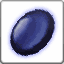

<!-- generated:start -->
<!-- generated-keys: title=26bd91 type=61613a id=628c93 sources=07c430 result=10c2ed materials=4d9dbd gold=c2d4c5 success_rate=310b86 category=1b6453 filter_mask=1b6453 level=b1d578 -->
|  |  |
|---|---|
|  |  |
| **Recipe id** | `1816` (`Item_Make`) |
| **Makes** | [[wiki/items/7152-pvp-armor-rune\|PvP Armor Rune]] × 1 |
| **Gold** | 50,000 (before the fort's price rate; one screenshot shows × 1.5) |
| **Success** | 100 % |
| **Level (c24, *guess*)** | 10 |
| **Category / filter** | 4 / `0x4` |
| **Crafted at** | unknown (not in the client; add `npc:`) |

### Materials

|  | item | count | x |
|---|---|---|---|
|  | [[wiki/items/703-crystal-black\|Crystal : Black]] | 10 |  |
|  | [[wiki/items/702-crystal-red\|Crystal : Red]] | 10 |  |
|  | [[wiki/items/854-shining-passion\|Shining Passion]] | 3 |  |

NPCs named as crafters in the guides: Farrell (weapons, passion conversion), Odin (gear), Alan (runes), Owen (alchemy), Paraman (superior weapons) — [[gameplay/items-and-crafting|Items and crafting]] §3.

### Result mentioned in

- [[gameplay/items-and-crafting|Items, upgrades and crafting]]
- [[gameplay/reinforce-and-runes|Reinforce, tier-up and rune numbers]]
- [[gameplay/sources|Sources and gaps]]
<!-- generated:end -->

## Notes

Runes are crafted at **Alan** (Rune Maker, unit 323) in the fortress; T2/T3 runes need the fort's Rune mastery ([[gameplay/items-and-crafting|Items and crafting]] §2, *guide*). From WM 0824 yellow jewels can stand in for missing materials on T1 runes ([[gameplay/reinforce-and-runes|Reinforce and runes]] §4, *notes*).

Gold here is the client's base cost. In-game screenshots show the fort's price rate on top, ×1.5 in the fort that was photographed ([[gameplay/items-and-crafting|Items and crafting]] §3, [[gameplay/consumables|Consumables]] §1, *image*).

## Behaviour

<!-- hand-written: add what you know, with a source -->

## Sources

- guide: [[gameplay/items-and-crafting]] §2 (runes are crafted at Alan, Rune Maker, unit 323 per [[gameplay/npc-locations]] §3)

## Open questions

<!-- hand-written: add what you know, with a source -->

<!-- credit:start -->
---
*Game content © GAMESinFLAMES / Joyimpact; reproduced for preservation and reference.*
<!-- credit:end -->
