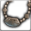
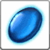

<!-- generated:start -->
<!-- generated-keys: title=17363f type=61613a id=7263d6 sources=082140 result=3db1ba materials=f2c969 gold=8a12a3 success_rate=310b86 category=c1dfd9 filter_mask=208649 superior=179c0b level=356a19 raw=d75d65 -->
|  |  |
|---|---|
|  |  |
| **Recipe id** | `2009` (`Item_Make`) |
| **Makes** | [[wiki/items/405-necklace-of-life\|Necklace of Life]] × 1 |
| **Gold** | 10,000 (before the fort's price rate; one screenshot shows × 1.5) |
| **Success** | 100 % |
| **Superior result** | 5 % → [[wiki/items/449-necklace-of-life\|Necklace of Life]] (*guess*: c19@40 / @44) |
| **Level (c24, *guess*)** | 1 |
| **Category / filter** | 6 / `0x1000010` |
| **Crafted at** | unknown (not in the client; add `npc:`) |

### Materials

|  | item | count | x |
|---|---|---|---|
|  | [[wiki/items/700-crystal-blue\|Crystal : Blue]] | 10 |  |

Unknown columns: `c28` = 150 (`c28` is the decoder's `gold@28`, which is not the gold cost).

Other recipes for the same item: [[wiki/recipes/9-necklace-of-life-recipe|recipe 9]]

NPCs named as crafters in the guides: Farrell (weapons, passion conversion), Odin (gear), Alan (runes), Owen (alchemy), Paraman (superior weapons) — [[gameplay/items-and-crafting|Items and crafting]] §3.

### Result mentioned in

- [[gameplay/video-character-creation-and-tutorial|Video notes: character creation and tutorial (ZonderCoRe, June 2018)]]
- [[gameplay/video-early-quests|Video notes: first session, levels 1+ (charmanmugen)]]
- [[gameplay/video-tutorial-walkthrough|Video notes: tutorial walkthrough (Bravely Forward 2)]]
<!-- generated:end -->

## Notes

Training Camp copy of Odin's gear list, offered by the camp's Odin (unit 335) ([[gameplay/consumables|Consumables]] §4, *client*).

Gold here is the client's base cost. In-game screenshots show the fort's price rate on top, ×1.5 in the fort that was photographed ([[gameplay/items-and-crafting|Items and crafting]] §3, [[gameplay/consumables|Consumables]] §1, *image*).

## Behaviour

<!-- hand-written: add what you know, with a source -->

## Sources

- client: [[gameplay/consumables]] §4 (Training Camp Odin, unit 335, craft list 6 in UnitDB)

## Open questions

<!-- hand-written: add what you know, with a source -->

<!-- credit:start -->
---
*Game content © GAMESinFLAMES / Joyimpact; reproduced for preservation and reference.*
<!-- credit:end -->
