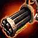

<!-- generated:start -->
<!-- generated-keys: title=60bca0 type=61613a id=0ad014 sources=28427f result=57e61d materials=c06eb2 gold=8a12a3 success_rate=310b86 category=902ba3 filter_mask=24f4fd superior=cd96e1 level=356a19 -->
|  |  |
|---|---|
|  |  |
| **Recipe id** | `2206` (`Item_Make`) |
| **Makes** | [[wiki/items/20021-magical-protect-cannon\|Magical Protect Cannon]] × 1 |
| **Gold** | 10,000 (before the fort's price rate; one screenshot shows × 1.5) |
| **Success** | 100 % |
| **Superior result** | 5 % → [[wiki/items/21021-magical-protect-cannon\|Magical Protect Cannon]] (*guess*: c19@40 / @44) |
| **Level (c24, *guess*)** | 1 |
| **Category / filter** | 7 / `0x1000041` |
| **Crafted at** | unknown (not in the client; add `npc:`) |

### Materials

|  | item | count | x |
|---|---|---|---|
|  | [[wiki/items/854-shining-passion\|Shining Passion]] | 3 |  |
|  | [[wiki/items/700-crystal-blue\|Crystal : Blue]] | 50 |  |

Other recipes for the same item: [[wiki/recipes/916-magical-protect-cannon-recipe|recipe 916]]

NPCs named as crafters in the guides: Farrell (weapons, passion conversion), Odin (gear), Alan (runes), Owen (alchemy), Paraman (superior weapons) — [[gameplay/items-and-crafting|Items and crafting]] §3.

### Result mentioned in

- [[gameplay/video-character-creation-and-tutorial|Video notes: character creation and tutorial (ZonderCoRe, June 2018)]]
<!-- generated:end -->

## Notes

Training Camp list (UnitDB list 7): passion conversion at a worse rate than the fortress (220 instead of 200 fragments) plus a few weapons ([[gameplay/consumables|Consumables]] §4, *client*).

Gold here is the client's base cost. In-game screenshots show the fort's price rate on top, ×1.5 in the fort that was photographed ([[gameplay/items-and-crafting|Items and crafting]] §3, [[gameplay/consumables|Consumables]] §1, *image*).

## Behaviour

<!-- hand-written: add what you know, with a source -->

## Sources

- client: [[gameplay/consumables]] §4 (category 7 = the Training Camp passion converter, 220 instead of 200 fragments); unit 336 is the Training Camp unit whose UnitDB list is 7 ([[wiki/npcs/336-paraman|unit 336]])

## Open questions

Unit 336 is named Paraman (Legendary Blacksmith) in the client but carries list 7; no video shows who offered this list in the camp.

<!-- credit:start -->
---
*Game content © GAMESinFLAMES / Joyimpact; reproduced for preservation and reference.*
<!-- credit:end -->
