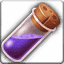

<!-- generated:start -->
<!-- generated-keys: title=a4aff6 type=61613a id=600aec sources=6aa585 result=3bef90 materials=71d928 gold=e3cbba success_rate=310b86 category=fe5dbb filter_mask=06f592 level=ac3478 -->
|  |  |
|---|---|
|  |  |
| **Recipe id** | `2503` (`Item_Make`) |
| **Makes** | [[wiki/items/889-potion-of-mana-c\|Potion of Mana (C)]] × 100 |
| **Gold** | 1,000 (before the fort's price rate; one screenshot shows × 1.5) |
| **Success** | 100 % |
| **Level (c24, *guess*)** | 5 |
| **Category / filter** | 8 / `0x100001` |
| **Crafted at** | unknown (not in the client; add `npc:`) |

### Materials

|  | item | count | x |
|---|---|---|---|
|  | [[wiki/items/834-empty-flask-c\|Empty Flask (C)]] | 100 |  |
|  | [[wiki/items/700-crystal-blue\|Crystal : Blue]] | 3 |  |

Other recipes for the same item: [[wiki/recipes/705-potion-of-mana-c-recipe|recipe 705]]

NPCs named as crafters in the guides: Farrell (weapons, passion conversion), Odin (gear), Alan (runes), Owen (alchemy), Paraman (superior weapons) — [[gameplay/items-and-crafting|Items and crafting]] §3.

### Result mentioned in

- [[gameplay/consumables|Consumables and clickables]]
- [[gameplay/items-and-crafting|Items, upgrades and crafting]]
- [[gameplay/potion-regen|Potion regeneration ticks]]
- [[gameplay/video-early-quests|Video notes: first session, levels 1+ (charmanmugen)]]
- [[gameplay/video-tutorial-walkthrough|Video notes: tutorial walkthrough (Bravely Forward 2)]]
<!-- generated:end -->

## Notes

Training Camp Owen (unit 337) offers a short list: only B-grade scrolls, tomes, elixirs and flasks and only C and B potions ([[gameplay/consumables|Consumables]] §4, *client*).

## Behaviour

<!-- hand-written: add what you know, with a source -->

## Sources

- client: [[gameplay/consumables]] §4 (Training Camp Owen, unit 337, craft list 8 in UnitDB)

## Open questions

<!-- hand-written: add what you know, with a source -->

<!-- credit:start -->
---
*Game content © GAMESinFLAMES / Joyimpact; reproduced for preservation and reference.*
<!-- credit:end -->
