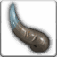

<!-- generated:start -->
<!-- generated-keys: title=296735 type=61613a id=1b04f2 sources=9908a0 result=61eb6d materials=33b7eb gold=409e95 success_rate=e6c3dd category=b6589f filter_mask=6ae6eb level=b1d578 -->
|  |  |
|---|---|
|  |  |
| **Recipe id** | `347` (`Item_Make`) |
| **Makes** | [[wiki/items/3057-garon-s-bracelet\|Garon's Bracelet]] × 1 |
| **Gold** | 100,000 (before the fort's price rate; one screenshot shows × 1.5) |
| **Success** | 60 % |
| **Level (c24, *guess*)** | 10 |
| **Category / filter** | 0 / `0x2000040` |
| **Crafted at** | unknown (not in the client; add `npc:`) |

### Materials

|  | item | count | x |
|---|---|---|---|
|  | [[wiki/items/2706-horn-of-garon\|Horn of Garon]] | 1 |  |
|  | [[wiki/items/1934-essence-of-earth\|Essence of Earth]] | 1 |  |

NPCs named as crafters in the guides: Farrell (weapons, passion conversion), Odin (gear), Alan (runes), Owen (alchemy), Paraman (superior weapons) — [[gameplay/items-and-crafting|Items and crafting]] §3.
<!-- generated:end -->

## Notes

<!-- hand-written: add what you know, with a source -->

## Behaviour

<!-- hand-written: add what you know, with a source -->

## Sources

<!-- hand-written: add what you know, with a source -->

## Open questions

<!-- hand-written: add what you know, with a source -->

<!-- credit:start -->
---
*Game content © GAMESinFLAMES / Joyimpact; reproduced for preservation and reference.*
<!-- credit:end -->
