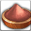

<!-- generated:start -->
<!-- generated-keys: title=de265a type=61613a id=80cc9f sources=07c8dd result=9b5d99 materials=7e7991 gold=e1822d success_rate=310b86 category=356a19 filter_mask=b48f6f level=f1abd6 -->
|  |  |
|---|---|
|  |  |
| **Recipe id** | `609` (`Item_Make`) |
| **Makes** | [[wiki/items/819-lavender-powder\|Lavender powder]] × 10 |
| **Gold** | 50 (before the fort's price rate; one screenshot shows × 1.5) |
| **Success** | 100 % |
| **Level (c24, *guess*)** | 15 |
| **Category / filter** | 1 / `0x2000` |
| **Crafted at** | unknown (not in the client; add `npc:`) |

### Materials

|  | item | count | x |
|---|---|---|---|
|  | [[wiki/items/818-lavender\|Lavender]] | 1 |  |

Other recipes for the same item: [[wiki/recipes/2409-lavender-powder-recipe|recipe 2409]]

NPCs named as crafters in the guides: Farrell (weapons, passion conversion), Odin (gear), Alan (runes), Owen (alchemy), Paraman (superior weapons) — [[gameplay/items-and-crafting|Items and crafting]] §3.

### Result mentioned in

- [[gameplay/consumables|Consumables and clickables]]
<!-- generated:end -->

## Notes

Crafted at **Owen** (Red Union, unit 214) in the fortress, which has the full alchemy list ([[gameplay/consumables|Consumables]] §4, *client*). Alchemy recipes always succeed (100 %) ([[gameplay/consumables|Consumables]] §1, *client*).

Gold here is the client's base cost. In-game screenshots show the fort's price rate on top, ×1.5 in the fort that was photographed ([[gameplay/items-and-crafting|Items and crafting]] §3, [[gameplay/consumables|Consumables]] §1, *image*).

## Behaviour

<!-- hand-written: add what you know, with a source -->

## Sources

- client: [[gameplay/consumables]] §4 (fortress Owen, unit 214, has the full Item_Make category 1 list)

## Open questions

<!-- hand-written: add what you know, with a source -->

<!-- credit:start -->
---
*Game content © GAMESinFLAMES / Joyimpact; reproduced for preservation and reference.*
<!-- credit:end -->
