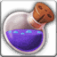
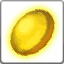

<!-- generated:start -->
<!-- generated-keys: title=433939 type=61613a id=de9a90 sources=2b9c61 result=2422e5 materials=ec7a4d gold=a4ac91 success_rate=310b86 category=356a19 filter_mask=9aa98e level=91032a -->
|  |  |
|---|---|
|  |  |
| **Recipe id** | `706` (`Item_Make`) |
| **Makes** | [[wiki/items/890-potion-of-mana-b\|Potion of Mana (B)]] × 100 |
| **Gold** | 2,000 (before the fort's price rate; one screenshot shows × 1.5) |
| **Success** | 100 % |
| **Level (c24, *guess*)** | 20 |
| **Category / filter** | 1 / `0x200001` |
| **Crafted at** | unknown (not in the client; add `npc:`) |

### Materials

|  | item | count | x |
|---|---|---|---|
|  | [[wiki/items/835-empty-flask-b\|Empty Flask (B)]] | 100 |  |
|  | [[wiki/items/701-crystal-yellow\|Crystal : Yellow]] | 3 |  |

Other recipes for the same item: [[wiki/recipes/2504-potion-of-mana-b-recipe|recipe 2504]]

NPCs named as crafters in the guides: Farrell (weapons, passion conversion), Odin (gear), Alan (runes), Owen (alchemy), Paraman (superior weapons) — [[gameplay/items-and-crafting|Items and crafting]] §3.

### Result mentioned in

- [[gameplay/potion-regen|Potion regeneration ticks]]
<!-- generated:end -->

## Notes

Crafted at **Owen** (Red Union, unit 214) in the fortress, which has the full alchemy list ([[gameplay/consumables|Consumables]] §4, *client*). Alchemy recipes always succeed (100 %) ([[gameplay/consumables|Consumables]] §1, *client*).

Gold here is the client's base cost. In-game screenshots show the fort's price rate on top, ×1.5 in the fort that was photographed ([[gameplay/items-and-crafting|Items and crafting]] §3, [[gameplay/consumables|Consumables]] §1, *image*).

## Behaviour

<!-- hand-written: add what you know, with a source -->

## Sources

- client: [[gameplay/consumables]] §4 (fortress Owen, unit 214, has the full Item_Make category 1 list)

## Open questions

<!-- hand-written: add what you know, with a source -->

<!-- credit:start -->
---
*Game content © GAMESinFLAMES / Joyimpact; reproduced for preservation and reference.*
<!-- credit:end -->
