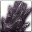

<!-- generated:start -->
<!-- generated-keys: title=f7334e type=ffcf9c id=baab34 sources=fb7f80 npc=97d170 stock=9715af prices=ce4953 price_rates=c44eae header=5929ec -->
|  |  |
|---|---|
| **Shop id** | `208` (`Npc_Carry` shop_id = `UnitDB` u16@a2) |
| **Run by** | no unit in `UnitDB` opens this shop |
| **Stock** | 30 entries, 5 distinct items |
| **Price rates** | buy 720 %, sell 700 % (0x452) |
| **Header** | `c2` = 1, `c3` = 1, `c4` = 4 (meaning unknown) |

> [!note]
> No NPC in the client opens this shop, so players could not reach it unless the server pushed it with `0x42f`. Rows like this look like test or leftover data (*guess*).

### Stock

`slot` is the index the client sends as `shop_index` when buying (C->S `0x430`). *Base* is `Item_Base` buy_price@20; *buy* and *sell* are what the shop window shows at this page's `price_rates` (client formula, see below). `p1` is the enchant level for weapons/armour or the dye colour for costumes.

| slot |  | item | count | p1 | currency | base | buy | sell |
|---|---|---|---|---|---|---|---|---|
| 0 |  | [[wiki/items/1900-faded-passion-fragments\|Faded Passion fragments]] | 2 |  | Gold | 50 | 396 | 315 |
| 1 |  | [[wiki/items/1900-faded-passion-fragments\|Faded Passion fragments]] | 2 |  | Gold | 50 | 396 | 315 |
| 2 |  | [[wiki/items/1900-faded-passion-fragments\|Faded Passion fragments]] | 2 |  | Gold | 50 | 396 | 315 |
| 3 |  | [[wiki/items/1900-faded-passion-fragments\|Faded Passion fragments]] | 2 |  | Gold | 50 | 396 | 315 |
| 4 |  | [[wiki/items/1900-faded-passion-fragments\|Faded Passion fragments]] | 2 |  | Gold | 50 | 396 | 315 |
| 5 |  | [[wiki/items/812-red-bloodstone\|Red bloodstone]] | 2 |  | Gold | 20 | 158 | 126 |
| 6 |  | [[wiki/items/810-diamond\|Diamond]] | 2 |  | Gold | 40 | 316 | 252 |
| 7 |  | [[wiki/items/802-garnet\|Garnet]] | 2 |  | Gold | 20 | 158 | 126 |
| 8 |  | [[wiki/items/814-topaz\|Topaz]] | 2 |  | Gold | 30 | 237 | 189 |
| 9 |  | [[wiki/items/812-red-bloodstone\|Red bloodstone]] | 2 |  | Gold | 20 | 158 | 126 |
| 10 |  | [[wiki/items/1900-faded-passion-fragments\|Faded Passion fragments]] | 3 |  | Gold | 50 | 396 | 315 |
| 11 |  | [[wiki/items/1900-faded-passion-fragments\|Faded Passion fragments]] | 3 |  | Gold | 50 | 396 | 315 |
| 12 |  | [[wiki/items/1900-faded-passion-fragments\|Faded Passion fragments]] | 3 |  | Gold | 50 | 396 | 315 |
| 13 |  | [[wiki/items/1900-faded-passion-fragments\|Faded Passion fragments]] | 3 |  | Gold | 50 | 396 | 315 |
| 14 |  | [[wiki/items/1900-faded-passion-fragments\|Faded Passion fragments]] | 3 |  | Gold | 50 | 396 | 315 |
| 15 |  | [[wiki/items/802-garnet\|Garnet]] | 3 |  | Gold | 20 | 158 | 126 |
| 16 |  | [[wiki/items/814-topaz\|Topaz]] | 3 |  | Gold | 30 | 237 | 189 |
| 17 |  | [[wiki/items/812-red-bloodstone\|Red bloodstone]] | 3 |  | Gold | 20 | 158 | 126 |
| 18 |  | [[wiki/items/810-diamond\|Diamond]] | 3 |  | Gold | 40 | 316 | 252 |
| 19 |  | [[wiki/items/802-garnet\|Garnet]] | 3 |  | Gold | 20 | 158 | 126 |
| 20 |  | [[wiki/items/814-topaz\|Topaz]] | 3 |  | Gold | 30 | 237 | 189 |
| 21 |  | [[wiki/items/812-red-bloodstone\|Red bloodstone]] | 3 |  | Gold | 20 | 158 | 126 |
| 22 |  | [[wiki/items/810-diamond\|Diamond]] | 2 |  | Gold | 40 | 316 | 252 |
| 23 |  | [[wiki/items/802-garnet\|Garnet]] | 2 |  | Gold | 20 | 158 | 126 |
| 24 |  | [[wiki/items/814-topaz\|Topaz]] | 2 |  | Gold | 30 | 237 | 189 |
| 25 |  | [[wiki/items/812-red-bloodstone\|Red bloodstone]] | 2 |  | Gold | 20 | 158 | 126 |
| 26 |  | [[wiki/items/810-diamond\|Diamond]] | 2 |  | Gold | 40 | 316 | 252 |
| 27 |  | [[wiki/items/802-garnet\|Garnet]] | 3 |  | Gold | 20 | 158 | 126 |
| 28 |  | [[wiki/items/814-topaz\|Topaz]] | 3 |  | Gold | 30 | 237 | 189 |
| 29 |  | [[wiki/items/812-red-bloodstone\|Red bloodstone]] | 3 |  | Gold | 20 | 158 | 126 |

25 entries repeat an item already listed (the client shows every entry).

### How prices are worked out

The client computes every price from `Item_Base` (contract `price_formula`, `FUN_004e0603` buy, `FUN_004e06b5` sell): gold-type prices are *base × buy_rate / 100 + 10 %*, sell prices *base × sell_rate / 100 − 10 %*; Dimensional Energy (currency 17) costs base + 10 %; medal currencies (9–12, 15, 16) are charged as listed and cannot be sold back. The rates come from the server (`0x452`). In 2018 gold items cost **7.92 ×** base and sold for **6.3 ×** base ([[gameplay/progression-and-economy|economy]] §4, [[gameplay/video-tutorial-walkthrough|tutorial video]] 14:20), which is buy_rate 720 and sell_rate 700 (*inferred*). The guide's 10 % fort tax may be the +10 % (*guess*).
<!-- generated:end -->

## Notes

<!-- hand-written: add what you know, with a source -->

## Behaviour

<!-- hand-written: add what you know, with a source -->

## Sources

<!-- hand-written: add what you know, with a source -->

## Open questions

<!-- hand-written: add what you know, with a source -->

<!-- credit:start -->
---
*Game content © GAMESinFLAMES / Joyimpact; reproduced for preservation and reference.*
<!-- credit:end -->
