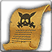

<!-- generated:start -->
<!-- generated-keys: title=3c2e1d type=ffcf9c id=267b97 sources=cc7d92 npc=631917 stock=61b65a prices=49a5ca price_rates=c44eae header=702516 -->
|  |  |
|---|---|
|  |  |
| **Shop id** | `282` (`Npc_Carry` shop_id = `UnitDB` u16@a2) |
| **Run by** | [[wiki/npcs/205-lewellyn\|Lewellyn]] (Scroll Merchant), [[wiki/npcs/315-lewellyn\|Lewellyn]] (Scroll Merchant), [[wiki/npcs/316-lewellyn\|Lewellyn]] (Scroll Merchant) |
| **Stock** | 12 entries, 12 distinct items |
| **Price rates** | buy 720 %, sell 700 % (0x452) |
| **Header** | `c2` = 0, `c3` = 1, `c4` = 0 (meaning unknown) |

### Stock

`slot` is the index the client sends as `shop_index` when buying (C->S `0x430`). *Base* is `Item_Base` buy_price@20; *buy* and *sell* are what the shop window shows at this page's `price_rates` (client formula, see below). `p1` is the enchant level for weapons/armour or the dye colour for costumes.

| slot |  | item | count | p1 | currency | base | buy | sell |
|---|---|---|---|---|---|---|---|---|
| 0 |  | [[wiki/items/704-scroll-of-the-warrior-c\|Scroll of the Warrior (C)]] | 1 |  | Gold | 60 | 475 | 378 |
| 1 |  | [[wiki/items/708-scroll-of-the-magician-c\|Scroll of the Magician (C)]] | 1 |  | Gold | 60 | 475 | 378 |
| 2 |  | [[wiki/items/712-tome-of-attack-spd-c\|Tome of Attack SPD (C)]] | 1 |  | Gold | 70 | 554 | 441 |
| 3 |  | [[wiki/items/716-tome-of-cooldown-c\|Tome of Cooldown (C)]] | 1 |  | Gold | 70 | 554 | 441 |
| 4 |  | [[wiki/items/720-tome-of-patience-c\|Tome of Patience (C)]] | 1 |  | Gold | 60 | 475 | 378 |
| 5 |  | [[wiki/items/724-tome-of-critical-c\|Tome of Critical (C)]] | 1 |  | Gold | 60 | 475 | 378 |
| 6 |  | [[wiki/items/736-elixir-of-health-c\|Elixir of Health (C)]] | 1 |  | Gold | 70 | 554 | 441 |
| 7 |  | [[wiki/items/740-flask-of-mana-c\|Flask of Mana (C)]] | 1 |  | Gold | 70 | 554 | 441 |
| 8 |  | [[wiki/items/744-elixir-of-vampirism-c\|Elixir of Vampirism (C)]] | 1 |  | Gold | 60 | 475 | 378 |
| 9 |  | [[wiki/items/748-flask-of-devour-c\|Flask of Devour (C)]] | 1 |  | Gold | 60 | 475 | 378 |
| 10 |  | [[wiki/items/752-elixir-of-tenacity-c\|Elixir of Tenacity (C)]] | 1 |  | Gold | 50 | 396 | 315 |
| 11 |  | [[wiki/items/756-flask-of-tenacity-c\|Flask of Tenacity (C)]] | 1 |  | Gold | 50 | 396 | 315 |

### How prices are worked out

The client computes every price from `Item_Base` (contract `price_formula`, `FUN_004e0603` buy, `FUN_004e06b5` sell): gold-type prices are *base × buy_rate / 100 + 10 %*, sell prices *base × sell_rate / 100 − 10 %*; Dimensional Energy (currency 17) costs base + 10 %; medal currencies (9–12, 15, 16) are charged as listed and cannot be sold back. The rates come from the server (`0x452`). In 2018 gold items cost **7.92 ×** base and sold for **6.3 ×** base ([[gameplay/progression-and-economy|economy]] §4, [[gameplay/video-tutorial-walkthrough|tutorial video]] 14:20), which is buy_rate 720 and sell_rate 700 (*inferred*). The guide's 10 % fort tax may be the +10 % (*guess*).

### Seen in

- Seen in [[gameplay/consumables|Consumables and clickables]], section *5. Where the inputs come from*
- Seen in [[gameplay/npc-locations|NPC and point-of-interest locations]], section *3. Fortress (field 120)* at 34:45
<!-- generated:end -->

## Notes

<!-- hand-written: add what you know, with a source -->

## Behaviour

<!-- hand-written: add what you know, with a source -->

## Sources

<!-- hand-written: add what you know, with a source -->

## Open questions

<!-- hand-written: add what you know, with a source -->

<!-- credit:start -->
---
*Game content © GAMESinFLAMES / Joyimpact; reproduced for preservation and reference.*
<!-- credit:end -->
