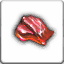

<!-- generated:start -->
<!-- generated-keys: title=281365 type=ffcf9c id=812ed4 sources=dcfe69 npc=97d170 stock=636a2b prices=79f129 price_rates=c44eae header=5929ec -->
|  |  |
|---|---|
| **Shop id** | `97` (`Npc_Carry` shop_id = `UnitDB` u16@a2) |
| **Run by** | no unit in `UnitDB` opens this shop |
| **Stock** | 25 entries, 13 distinct items |
| **Price rates** | buy 720 %, sell 700 % (0x452) |
| **Header** | `c2` = 1, `c3` = 1, `c4` = 4 (meaning unknown) |

> [!note]
> No NPC in the client opens this shop, so players could not reach it unless the server pushed it with `0x42f`. Rows like this look like test or leftover data (*guess*).

### Stock

`slot` is the index the client sends as `shop_index` when buying (C->S `0x430`). *Base* is `Item_Base` buy_price@20; *buy* and *sell* are what the shop window shows at this page's `price_rates` (client formula, see below). `p1` is the enchant level for weapons/armour or the dye colour for costumes.

| slot |  | item | count | p1 | currency | base | buy | sell |
|---|---|---|---|---|---|---|---|---|
| 0 |  | [[wiki/items/1901-faded-passion-piece\|Faded Passion Piece]] | 1 |  | Gold | 100 | 792 | 630 |
| 1 |  | [[wiki/items/612-red-passion-piece-d\|Red Passion Piece (D)]] | 2 |  | Gold | 20 | 158 | 126 |
| 2 |  | [[wiki/items/612-red-passion-piece-d\|Red Passion Piece (D)]] | 2 |  | Gold | 20 | 158 | 126 |
| 3 |  | [[wiki/items/613-red-passion-fragments-c\|Red Passion Fragments (C)]] | 1 |  | Gold | 20 | 158 | 126 |
| 4 |  | [[wiki/items/694-gem-stone-yellow\|Gem Stone : Yellow]] | 1 |  | Gold | 200 | 1,584 | 1,260 |
| 5 |  | [[wiki/items/842-burned-sulphur\|Burned sulphur]] | 1 |  | Gold | 50 | 396 | 315 |
| 6 |  | [[wiki/items/842-burned-sulphur\|Burned sulphur]] | 1 |  | Gold | 50 | 396 | 315 |
| 7 |  | [[wiki/items/842-burned-sulphur\|Burned sulphur]] | 1 |  | Gold | 50 | 396 | 315 |
| 8 |  | [[wiki/items/849-burning-water\|Burning water]] | 1 |  | Gold | 50 | 396 | 315 |
| 9 |  | [[wiki/items/842-burned-sulphur\|Burned sulphur]] | 1 |  | Gold | 50 | 396 | 315 |
| 10 |  | [[wiki/items/613-red-passion-fragments-c\|Red Passion Fragments (C)]] | 1 |  | Gold | 20 | 158 | 126 |
| 11 |  | [[wiki/items/613-red-passion-fragments-c\|Red Passion Fragments (C)]] | 1 |  | Gold | 20 | 158 | 126 |
| 12 |  | [[wiki/items/694-gem-stone-yellow\|Gem Stone : Yellow]] | 1 |  | Gold | 200 | 1,584 | 1,260 |
| 13 |  | [[wiki/items/693-gem-stone-blue\|Gem Stone : Blue]] | 1 |  | Gold | 0 | 0 | 0 |
| 14 |  | [[wiki/items/612-red-passion-piece-d\|Red Passion Piece (D)]] | 2 |  | Gold | 20 | 158 | 126 |
| 15 |  | [[wiki/items/612-red-passion-piece-d\|Red Passion Piece (D)]] | 2 |  | Gold | 20 | 158 | 126 |
| 16 |  | [[wiki/items/612-red-passion-piece-d\|Red Passion Piece (D)]] | 2 |  | Gold | 20 | 158 | 126 |
| 17 |  | [[wiki/items/401-helmet-of-life\|Helmet of Life]] | 1 | 1 | Gold | 100 | 792 | 630 |
| 18 |  | [[wiki/items/402-armor-of-life\|Armor of Life]] | 1 | 1 | Gold | 150 | 1,188 | 945 |
| 19 |  | [[wiki/items/427-bracelet-of-transcendency\|Bracelet of Transcendency]] | 1 | 1 | Gold | 130 | 1,029 | 819 |
| 20 |  | [[wiki/items/428-ring-of-transcendency\|Ring of Transcendency]] | 1 | 1 | Gold | 120 | 950 | 756 |
| 21 |  | [[wiki/items/419-shoes-of-honor\|Shoes of Honor]] | 1 | 1 | Gold | 130 | 1,029 | 819 |
| 22 |  | [[wiki/items/420-gloves-of-honor\|Gloves of Honor]] | 1 | 1 | Gold | 120 | 950 | 756 |
| 23 |  | [[wiki/items/427-bracelet-of-transcendency\|Bracelet of Transcendency]] | 1 | 1 | Gold | 130 | 1,029 | 819 |
| 24 |  | [[wiki/items/428-ring-of-transcendency\|Ring of Transcendency]] | 1 | 1 | Gold | 120 | 950 | 756 |

12 entries repeat an item already listed (the client shows every entry).

### How prices are worked out

The client computes every price from `Item_Base` (contract `price_formula`, `FUN_004e0603` buy, `FUN_004e06b5` sell): gold-type prices are *base × buy_rate / 100 + 10 %*, sell prices *base × sell_rate / 100 − 10 %*; Dimensional Energy (currency 17) costs base + 10 %; medal currencies (9–12, 15, 16) are charged as listed and cannot be sold back. The rates come from the server (`0x452`). In 2018 gold items cost **7.92 ×** base and sold for **6.3 ×** base ([[gameplay/progression-and-economy|economy]] §4, [[gameplay/video-tutorial-walkthrough|tutorial video]] 14:20), which is buy_rate 720 and sell_rate 700 (*inferred*). The guide's 10 % fort tax may be the +10 % (*guess*).
<!-- generated:end -->

## Notes

`Npc_Carry` lists 73-113 are where the dungeon secondaries (838-850) turn up in the client. They are flagged as non-shop lists and are probably drop pools, not shops (*guess*, [[gameplay/consumables|consumables]] §5). In play the secondaries were dungeon mob drops and were sold nowhere (*guide*, [[gameplay/consumables|consumables]] §5). This list leans on **Burned sulphur (842)** ([[gameplay/consumables|consumables]] §5).

## Behaviour

<!-- hand-written: add what you know, with a source -->

## Sources

- [[gameplay/consumables]] §5 (lists 73-113 are non-shop lists, probably drop pools) (*client + guess*)

## Open questions

<!-- hand-written: add what you know, with a source -->

<!-- credit:start -->
---
*Game content © GAMESinFLAMES / Joyimpact; reproduced for preservation and reference.*
<!-- credit:end -->
