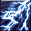

<!-- generated:start -->
<!-- generated-keys: title=b22690 type=86a754 id=8b954a sources=872a23 name_key=e5a5ed desc_key=737610 kind=356a19 kind_name=9bc378 target=138a60 range=902ba3 area=6d01a6 cost=d57e66 cooldown=f8ee77 delivery=d66f33 effect_kind=da4b92 effects=83a2d6 damage_or_effect=34acac tooltip_formula=920e59 visual=78a8ef icon=eb1101 used_by=1b5882 -->
|  |  |
|---|---|
|  |  |
| **Skill id** | `10005` |
| **Kind** | active (1) |
| **Target** | ground; enemy; units: monster, player; up to 12 |
| **Range** | 7 (world units) |
| **Area** | circle, radius 4, width/angle 4 |
| **Cost** | 105 MP |
| **Cooldown** | 13 s |
| **Delivery** | projectile / SFX (4), tick 1.3 |
| **Effect kind** | damage (magic?) (2) |
| **Visual** | skillVisual 104 `PCE_Staff_02_W_낙뢰` |
| **Icon** | `ui/icons/Skill_Einsel_01.png` cell 5 |

### Tooltip

> [Active] Thunder strikes in the targeted area that deals `{EF_STATIC 100}``{EF_R_MDAM 105}`damage.

Tooltip formula: **100 + 105% Ability Power** (the client fills these in from the caster's stats).

### Effect slots

Raw `Skill_Base` effect slots; the client never applies them, the server does. Meanings are *inferred* from the data (see the module notes in `wiki/gamewiki/skills.py`).

| slot | type | meaning | value | rate |
|---|---|---|---|---|
| 1 | 330 | base amount (tooltip `EF_STATIC`) | 100 | 100 |
| 2 | 102 | % of Ability Power (tooltip `EF_R_MDAM`) | 105 | 0 |

**Reading:** amount **100 + 105% Ability Power**; damage (magic?).

### Used by

- Weapon skill **W** of WeaponBase 102: [[wiki/items/11001-magical-thunder-wand|Magical Thunder Wand]]
- Nation policy 6 `PolicyName_6` (Policy.cdb, server-only; buff_or_skill)
<!-- generated:end -->

## Notes

- Patch history: [WM 0412](https://steamcommunity.com/games/718790/announcements/detail/2394102381817542359) raised Magical Thunder Wand's W base 90 → 100; the client tooltip base is 100. ([[gameplay/classes-and-legions]] §5 Weapons). *notes*

## Behaviour

<!-- hand-written: add what you know, with a source -->

## Sources

- Gameplay pages this page draws on: [[gameplay/classes-and-legions]] §5 Weapons.

## Open questions

<!-- hand-written: add what you know, with a source -->

<!-- credit:start -->
---
*Game content © GAMESinFLAMES / Joyimpact; reproduced for preservation and reference.*
<!-- credit:end -->
