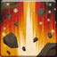

<!-- generated:start -->
<!-- generated-keys: title=c1f9ab type=86a754 id=31146f sources=d4dfc2 name_key=a5ad74 desc_key=2b037b kind=356a19 kind_name=9bc378 target=138a60 range=9e6a55 area=9876f1 cost=ff5a60 cooldown=ad2ac8 delivery=93a212 effect_kind=356a19 effects=143802 damage_or_effect=80708c tooltip_formula=834953 visual=3464dc icon=e8b47d used_by=a3fb9e -->
|  |  |
|---|---|
|  |  |
| **Skill id** | `10111` |
| **Kind** | active (1) |
| **Target** | ground; enemy; units: monster, player; up to 12 |
| **Range** | 18 (world units) |
| **Area** | circle, radius 4, width/angle 10 |
| **Cost** | 390 MP |
| **Cooldown** | 70 s |
| **Delivery** | projectile / SFX |
| **Effect kind** | damage (physical?) (1) |
| **Visual** | skillVisual 246 `PCD_Cannon_01_R 포탄 폭발` |
| **Icon** | `ui/icons/Skill_Dolorece_01.png` cell 19 |

### Tooltip

> [Active] Deals `{EF_STATIC 120}``{EF_R_DAM 115}` Damage to all enemies in the designated area and knocks them back.

Tooltip formula: **120 + 115% Attack** (the client fills these in from the caster's stats).

### Effect slots

Raw `Skill_Base` effect slots; the client never applies them, the server does. Meanings are *inferred* from the data (see the module notes in `wiki/gamewiki/skills.py`).

| slot | type | meaning | value | rate |
|---|---|---|---|---|
| 1 | 330 | base amount (tooltip `EF_STATIC`) | 120 | 100 |
| 2 | 101 | % of Attack (tooltip `EF_R_DAM`) | 115 | 0 |

**Reading:** amount **120 + 115% Attack**; damage (physical?).

### Used by

- Weapon skill **R** of WeaponBase 163: [[wiki/items/21021-magical-protect-cannon|Magical Protect Cannon]]

### Mentioned in

- [[gameplay/video-character-creation-and-tutorial|Video notes: character creation and tutorial (ZonderCoRe, June 2018)]] § 1. Character creation (line 36): Guardian · 20001 Magical Demolition Hammer (Mace) · 20021 Magical Protect Cannon (Cannon) · 20003 Magical Crush Hammer (no label string) · 43: Soul Infestati...
<!-- generated:end -->

## Notes

<!-- hand-written: add what you know, with a source -->

## Behaviour

<!-- hand-written: add what you know, with a source -->

## Sources

<!-- hand-written: add what you know, with a source -->

## Open questions

<!-- hand-written: add what you know, with a source -->

<!-- credit:start -->
---
*Game content © GAMESinFLAMES / Joyimpact; reproduced for preservation and reference.*
<!-- credit:end -->
