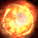

<!-- generated:start -->
<!-- generated-keys: title=8e8360 type=86a754 id=b42a6d sources=c6ae35 name_key=da383f desc_key=1fe400 kind=356a19 kind_name=9bc378 target=5c059d range=da4b92 cost=e01d1d cooldown=9ded33 effect_kind=da4b92 effects=89518c damage_or_effect=84a00d requirements=adeac3 visual=93ac19 icon=7dc0ee used_by=f6dd6f -->
|  |  |
|---|---|
|  |  |
| **Skill id** | `20107` |
| **Kind** | active (1) |
| **Target** | self; -; units: monster, player; up to 1 |
| **Range** | 2 (world units) |
| **Cost** | 80 MP |
| **Cooldown** | 8 s |
| **Effect kind** | damage (magic?) (2) |
| **Visual** | skillVisual 418 `아마테라스_태양의 근원` |
| **Icon** | `ui/icons/Skill_Boss_01.dds` cell 17 |

### Tooltip

> [Active]You can increase your stack by consuming your mana. 
> Kra Sun Stack +2

### Effect slots

Raw `Skill_Base` effect slots; the client never applies them, the server does. Meanings are *inferred* from the data (see the module notes in `wiki/gamewiki/skills.py`).

| slot | type | meaning | value | rate |
|---|---|---|---|---|
| 1 | 301 | applies buff (variant 301) | [[wiki/buffs/20107-kra-sun\|Kra Sun]] | 100 |
| 2 | 301 | applies buff (variant 301) | [[wiki/buffs/20109\|Buff 20109]] | 100 |

**Reading:** damage (magic?); applies [[wiki/buffs/20107-kra-sun|Kra Sun]] (100%); applies [[wiki/buffs/20109|Buff 20109]] (100%).

### Requirements

`Skill_Base` requirement slots (type 1 = needs a buff or item, checked by `FUN_004b981e` / `FUN_004b98ee`; other types not decoded):

| type | a | b |
|---|---|---|
| 20107 | 6 | 20108 |

### Used by

- Weapon skill **hero set 2** of WeaponBase 71: [[wiki/items/8002-amaterasu|Amaterasu]], [[wiki/items/8502-crystal-amaterasu|Crystal : Amaterasu]]
<!-- generated:end -->

## Notes

<!-- hand-written: add what you know, with a source -->

## Behaviour

<!-- hand-written: add what you know, with a source -->

## Sources

<!-- hand-written: add what you know, with a source -->

## Open questions

<!-- hand-written: add what you know, with a source -->

<!-- credit:start -->
---
*Game content © GAMESinFLAMES / Joyimpact; reproduced for preservation and reference.*
<!-- credit:end -->
