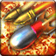

<!-- generated:start -->
<!-- generated-keys: title=06ceac type=86a754 id=361a57 sources=107320 name_key=6bf07c desc_key=7d8a0c kind=356a19 kind_name=9bc378 target=35e077 range=3028f5 area=febbd1 cost=4e6c0e cooldown=d97414 effect_kind=b6589f effects=346202 damage_or_effect=bf21a9 icon=413f00 used_by=97d170 tp=fea8a4 observed=fbb03a -->
|  |  |
|---|---|
|  |  |
| **Skill id** | `4502` |
| **Kind** | active (1) |
| **Target** | self; self; units: player, structure; up to 1 |
| **Range** | 255 (world units) |
| **Area** | circle, radius 255, width/angle 255 |
| **Cost** | 1,500 TP |
| **Cooldown** | 120 s |
| **TP skill** | 1,500 TP, 120 s cooldown (Skill_TP row 4) |
| **Icon** | `ui/icons/Policy_01.png` cell 15 |

### Tooltip

> Attack the middle boss and the boss. If there is an Middle boss, attack the middle boss first

### Effect slots

Raw `Skill_Base` effect slots; the client never applies them, the server does. Meanings are *inferred* from the data (see the module notes in `wiki/gamewiki/skills.py`).

| slot | type | meaning | value | rate |
|---|---|---|---|---|
| 1 | 464 | unknown | 14,005 | 100 |

### Observed in play

Numbers from the gameplay pages (guides, patch notes, video), not from the client:

| cooldown (s) | mana | TP | effect | source |
|---|---|---|---|---|
| 120 |  | 1500 | PvP: hits enemy towers, then the nexus once the attacking towers are gone. PvE: hits every boss after the middle one | [[gameplay/pvp-and-matches]] line 32 |

### Mentioned in

- [[gameplay/maps-and-dungeons|Maps and dungeons]] § 2. Border-area (normal/hard) dungeons (line 60): - Demon Hell's boss is shown as two identical figures and Thorn's Hell's as three (multi-boss fights). The Remote Bomb TP skill text says that in PvE it "att...
- [[gameplay/pvp-and-matches|PvP, land wars and matches]] § TP skills (line 32): Remote Bomb (4502/4527) · Nexus · 1,500 · 120 s · 1500 / 120 · PvP: hits enemy towers, then the nexus once the attacking towers are gone. PvE: hits every bos...
- [[gameplay/video-fort-war|Video notes: fortress war series (ZonderCoRe)]] § TP (line 43, at 37:19, 2:32): Remote Bomb · −1,500 (3,050 → 1,550, 37:19) · P1 2:32 · video, matches Skill_TP 1,500
<!-- generated:end -->

## Notes

- TP is one pool for the whole side: when any ally uses a TP skill the pool drops for everyone ([[gameplay/pvp-and-matches]]; [[gameplay/video-fort-war]] §1 TP). TP skills are opened by right-clicking your Nexus or a Tower ([[gameplay/pvp-and-matches]] TP skills). *guide + video*
- Effect: PvP: hits enemy towers, then the nexus once the attacking towers are gone. PvE: hits every boss after the middle one ([[gameplay/pvp-and-matches]] TP skills, from the guide image; [[gameplay/events-and-schedules]] §7 says the basic Bomb hits a standing tower first, otherwise the nexus). 1,500 TP / 120 s in the guide = client. *image + guide*
- The PvE text fits the multi-boss dungeons: Demon Hell's boss is shown as two figures and Thorn's Hell's as three ([[gameplay/maps-and-dungeons]]). *image*
- Seen in play: Remote Bomb took 1,500 TP from the pool (3,050 → 1,550) in [[gameplay/video-fort-war]] §1 TP ([P1 2:32](https://www.youtube.com/watch?v=XoSM3RbZon0&t=152s)), matching the client. *video*

## Behaviour

- Crush Online rules (history): changing TP skills during a war was allowed but locked them for 180 s ([[gameplay/crush-patch-notes]] 2017-03-02); strategy skills could not be used on fortress floor 2 ([[gameplay/crush-mechanics]] §6, staff).

## Sources

- Gameplay pages this page draws on: [[gameplay/pvp-and-matches]] TP skills, [[gameplay/events-and-schedules]] §7, [[gameplay/maps-and-dungeons]], [[gameplay/video-fort-war]] §1, [[gameplay/crush-patch-notes]] 2017-03-02, [[gameplay/crush-mechanics]] §6.

## Open questions

<!-- hand-written: add what you know, with a source -->

<!-- credit:start -->
---
*Game content © GAMESinFLAMES / Joyimpact; reproduced for preservation and reference.*
<!-- credit:end -->
