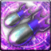

<!-- generated:start -->
<!-- generated-keys: title=de88fe type=86a754 id=3238da sources=6a2174 name_key=eb67b9 desc_key=6813c6 kind=356a19 kind_name=9bc378 target=35e077 range=3028f5 area=febbd1 cost=768946 cooldown=82d6c4 effect_kind=b6589f effects=f3d4da damage_or_effect=bf21a9 icon=503286 used_by=97d170 tp=c1f3f3 -->
|  |  |
|---|---|
|  |  |
| **Skill id** | `4523` |
| **Kind** | active (1) |
| **Target** | self; self; units: player, structure; up to 1 |
| **Range** | 255 (world units) |
| **Area** | circle, radius 255, width/angle 255 |
| **Cost** | 3,000 TP |
| **Cooldown** | 300 s |
| **TP skill** | 3,000 TP, 300 s cooldown (Skill_TP row 16) |
| **Icon** | `ui/icons/Policy_01.png` cell 26 |

### Tooltip

> Use it to attack the Nexus

### Effect slots

Raw `Skill_Base` effect slots; the client never applies them, the server does. Meanings are *inferred* from the data (see the module notes in `wiki/gamewiki/skills.py`).

| slot | type | meaning | value | rate |
|---|---|---|---|---|
| 1 | 463 | unknown | 14,009 | 100 |

### Mentioned in

- [[gameplay/pvp-and-matches|PvP, land wars and matches]] § TP skills (line 37): Further client rows not in any guide: I'll be back! (4509), Recovery Shot (4510, 2,500), Fire Support (4512, 2,000), Blind (4514), Create a Portal (4516), Fr...
<!-- generated:end -->

## Notes

<!-- hand-written: add what you know, with a source -->

## Behaviour

<!-- hand-written: add what you know, with a source -->

## Sources

<!-- hand-written: add what you know, with a source -->

## Open questions

<!-- hand-written: add what you know, with a source -->

<!-- credit:start -->
---
*Game content © GAMESinFLAMES / Joyimpact; reproduced for preservation and reference.*
<!-- credit:end -->
