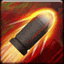

<!-- generated:start -->
<!-- generated-keys: title=c10402 type=86a754 id=3fa79e sources=a1d8dd name_key=8cdee9 desc_key=267a41 kind=356a19 kind_name=9bc378 target=069ef3 range=fe5dbb cost=e01d1d cooldown=9ded33 delivery=93a212 effect_kind=356a19 effects=14fb0f damage_or_effect=f8f6f9 tooltip_formula=74c011 visual=ee44c6 icon=a792ac used_by=753425 -->
|  |  |
|---|---|
|  |  |
| **Skill id** | `5116` |
| **Kind** | active (1) |
| **Target** | unit; enemy; units: monster, player; up to 1 |
| **Range** | 8 (world units) |
| **Cost** | 80 MP |
| **Cooldown** | 8 s |
| **Delivery** | projectile / SFX |
| **Effect kind** | damage (physical?) (1) |
| **Visual** | skillVisual 249 `PCD_Cannon_02_Q  유탄발사` |
| **Icon** | `ui/icons/Skill_Dolorece_01.png` cell 20 |

### Tooltip

> [Active] A single shot that hits the targeted enemy for `{EF_STATIC 75}``{EF_R_DAM 80}` Damage.

Tooltip formula: **75 + 80% Attack** (the client fills these in from the caster's stats).

### Effect slots

Raw `Skill_Base` effect slots; the client never applies them, the server does. Meanings are *inferred* from the data (see the module notes in `wiki/gamewiki/skills.py`).

| slot | type | meaning | value | rate |
|---|---|---|---|---|
| 1 | 330 | base amount (tooltip `EF_STATIC`) | 75 | 100 |
| 2 | 101 | % of Attack (tooltip `EF_R_DAM`) | 80 | 0 |

**Reading:** amount **75 + 80% Attack**; damage (physical?).

### Used by

- Weapon skill **Q** of WeaponBase 53: [[wiki/items/20011-magical-blast-cannon|Magical Blast Cannon]]
<!-- generated:end -->

## Notes

<!-- hand-written: add what you know, with a source -->

## Behaviour

<!-- hand-written: add what you know, with a source -->

## Sources

<!-- hand-written: add what you know, with a source -->

## Open questions

<!-- hand-written: add what you know, with a source -->

<!-- credit:start -->
---
*Game content © GAMESinFLAMES / Joyimpact; reproduced for preservation and reference.*
<!-- credit:end -->
