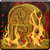

<!-- generated:start -->
<!-- generated-keys: title=25fe5b type=86a754 id=e5e608 sources=0b48ca name_key=40eafa desc_key=ad1d7b kind=356a19 kind_name=9bc378 target=cacd0a range=902ba3 area=d82541 cost=59d981 cooldown=a7242f delivery=8af2f4 effect_kind=da4b92 effects=87f37f damage_or_effect=bf21a9 visual=f44a28 icon=5cb950 used_by=97d170 -->
|  |  |
|---|---|
|  |  |
| **Skill id** | `5186` |
| **Kind** | active (1) |
| **Target** | ground; self; units: monster, player; up to 1 |
| **Range** | 7 (world units) |
| **Area** | circle, radius 6, width/angle 6 |
| **Cost** | 640 MP |
| **Cooldown** | 120 s |
| **Delivery** | projectile / SFX (4), tick 0.1 |
| **Effect kind** | damage (magic?) (2) |
| **Visual** | skillVisual 317 `Skeleton_King_변신스킬_06_망자의 무덤` |
| **Icon** | `ui/icons/Policy.png` cell 42 |

### Tooltip

> [Active] Summon a Tomb in the targeted area. Inflicts 7% of the enemy's current Health as damage on them for 10 seconds.

### Effect slots

Raw `Skill_Base` effect slots; the client never applies them, the server does. Meanings are *inferred* from the data (see the module notes in `wiki/gamewiki/skills.py`).

| slot | type | meaning | value | rate |
|---|---|---|---|---|
| 1 | 324 | unknown | 10,036 | 100 |
<!-- generated:end -->

## Notes

<!-- hand-written: add what you know, with a source -->

## Behaviour

<!-- hand-written: add what you know, with a source -->

## Sources

<!-- hand-written: add what you know, with a source -->

## Open questions

<!-- hand-written: add what you know, with a source -->

<!-- credit:start -->
---
*Game content © GAMESinFLAMES / Joyimpact; reproduced for preservation and reference.*
<!-- credit:end -->
