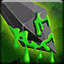

<!-- generated:start -->
<!-- generated-keys: title=79cd7e type=86a754 id=941aed sources=ecf2e8 name_key=c954f1 desc_key=18e890 kind=356a19 kind_name=9bc378 target=5c059d range=da4b92 cost=e01d1d cooldown=9ded33 effect_kind=356a19 effects=d05d7a damage_or_effect=2cc6e4 tooltip_formula=7fd566 visual=6d93f2 icon=78290d used_by=bacb60 -->
|  |  |
|---|---|
|  |  |
| **Skill id** | `5287` |
| **Kind** | active (1) |
| **Target** | self; -; units: monster, player; up to 1 |
| **Range** | 2 (world units) |
| **Cost** | 80 MP |
| **Cooldown** | 8 s |
| **Effect kind** | damage (physical?) (1) |
| **Visual** | skillVisual 372 `시즌1_PCM_Knife_05_Q_독 묻은 검` |
| **Icon** | `ui/icons/Skill_Miriam_01.png` cell 24 |

### Tooltip

> [Active] Inflicts `{EF_STATIC 70}``{EF_R_MDAM 70}` Damage and stuns the enemy during the first attack.

Tooltip formula: **70 + 70% Ability Power** (the client fills these in from the caster's stats).

### Effect slots

Raw `Skill_Base` effect slots; the client never applies them, the server does. Meanings are *inferred* from the data (see the module notes in `wiki/gamewiki/skills.py`).

| slot | type | meaning | value | rate |
|---|---|---|---|---|
| 1 | 301 | applies buff (variant 301) | [[wiki/buffs/10341-poisonous-blade-next-attack-stunned\|Poisonous Blade : Next Attack Stunned]] | 100 |

**Reading:** damage (physical?); applies [[wiki/buffs/10341-poisonous-blade-next-attack-stunned|Poisonous Blade : Next Attack Stunned]] (100%).

### Used by

- Weapon skill **Q** of WeaponBase 66: [[wiki/items/15009-skeleton-king-s-magic-dagger|Skeleton King's Magic Dagger]]
<!-- generated:end -->

## Notes

<!-- hand-written: add what you know, with a source -->

## Behaviour

<!-- hand-written: add what you know, with a source -->

## Sources

<!-- hand-written: add what you know, with a source -->

## Open questions

<!-- hand-written: add what you know, with a source -->

<!-- credit:start -->
---
*Game content © GAMESinFLAMES / Joyimpact; reproduced for preservation and reference.*
<!-- credit:end -->
