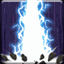

<!-- generated:start -->
<!-- generated-keys: title=5ad6d5 type=86a754 id=8de8d2 sources=28266d name_key=4277e4 desc_key=f5eb88 kind=356a19 kind_name=9bc378 target=7056fd range=902ba3 area=e8b0ea cost=ff5a60 cooldown=ad2ac8 delivery=9e15a4 effect_kind=da4b92 effects=9b462c damage_or_effect=48bd84 tooltip_formula=bb1008 requirements=7b99b7 visual=86cf29 icon=62f758 used_by=e4be73 -->
|  |  |
|---|---|
|  |  |
| **Skill id** | `5306` |
| **Kind** | active (1) |
| **Target** | ground; enemy; units: monster, player; up to 7 |
| **Range** | 7 (world units) |
| **Area** | circle, radius 5, width/angle 5 |
| **Cost** | 390 MP |
| **Cooldown** | 70 s |
| **Delivery** | projectile / SFX (4), tick 1.2 |
| **Effect kind** | damage (magic?) (2) |
| **Visual** | skillVisual 395 `시즌2_PCE_Staff_01_R_천벌_01` |
| **Icon** | `ui/icons/Skill_Einsel_01.png` cell 7 |

### Tooltip

> [Active] All enemy located in the area are hit by thunder and receive `{EF_STATIC 120}``{EF_R_MDAM 120}` Magic Damage.

Tooltip formula: **120 + 120% Ability Power** (the client fills these in from the caster's stats).

### Effect slots

Raw `Skill_Base` effect slots; the client never applies them, the server does. Meanings are *inferred* from the data (see the module notes in `wiki/gamewiki/skills.py`).

| slot | type | meaning | value | rate |
|---|---|---|---|---|
| 1 | 304 | applies buff (variant 304) | [[wiki/buffs/10359-punishment-second-skill-available\|Punishment : Second skill available]] | 100 |
| 2 | 330 | base amount (tooltip `EF_STATIC`) | 120 | 100 |
| 3 | 102 | % of Ability Power (tooltip `EF_R_MDAM`) | 120 | 0 |

**Reading:** amount **120 + 120% Ability Power**; damage (magic?); applies [[wiki/buffs/10359-punishment-second-skill-available|Punishment : Second skill available]] (100%).

### Requirements

`Skill_Base` requirement slots (type 1 = needs a buff or item, checked by `FUN_004b981e` / `FUN_004b98ee`; other types not decoded):

| type | a | b |
|---|---|---|
| 10359 | 5 | 5307 |

### Used by

- Weapon skill **R** of WeaponBase 5: [[wiki/items/10004-tempest-s-magical-wand|Tempest's magical wand]]
<!-- generated:end -->

## Notes

<!-- hand-written: add what you know, with a source -->

## Behaviour

<!-- hand-written: add what you know, with a source -->

## Sources

<!-- hand-written: add what you know, with a source -->

## Open questions

<!-- hand-written: add what you know, with a source -->

<!-- credit:start -->
---
*Game content © GAMESinFLAMES / Joyimpact; reproduced for preservation and reference.*
<!-- credit:end -->
