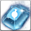
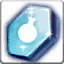
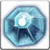
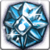

<!-- generated:start -->
<!-- generated-keys: title=10d69b type=4389c5 id=8554fe sources=345d54 group=c1dfd9 rune=6ed3c5 levels=23a618 kind=6a6d0e -->
|  |  |
|---|---|
|  |  |
| **Rune line** | `JewelSocketMake` group 6 |
| **Starts at** | [[wiki/items/7052-mana-rune\|Mana Rune]] |
| **Success rates** | unknown (server side; patch notes give only trends) |

### Levels

Each row upgrades the rune to the next item (C->S `0x4a8`). The +9 row has no next item, so its cost is never used. The costs match the 20 Sep 2018 patch table ([[gameplay/reinforce-and-runes|Reinforce and runes]] §1).

| level |  | rune | becomes | materials | row |
|---|---|---|---|---|---|
| +0 |  | [[wiki/items/7052-mana-rune\|Mana Rune]] | [[wiki/items/7053-mana-rune\|Mana Rune]] | [[wiki/items/700-crystal-blue\|Crystal : Blue]] × 10, [[wiki/items/611-red-passion-fragments-d\|Red Passion Fragments (D)]] × 10 | 51 |
| +1 |  | [[wiki/items/7053-mana-rune\|Mana Rune]] | [[wiki/items/7054-mana-rune\|Mana Rune]] | [[wiki/items/700-crystal-blue\|Crystal : Blue]] × 15, [[wiki/items/611-red-passion-fragments-d\|Red Passion Fragments (D)]] × 15 | 52 |
| +2 |  | [[wiki/items/7054-mana-rune\|Mana Rune]] | [[wiki/items/7055-mana-rune\|Mana Rune]] | [[wiki/items/700-crystal-blue\|Crystal : Blue]] × 20, [[wiki/items/611-red-passion-fragments-d\|Red Passion Fragments (D)]] × 20 | 53 |
| +3 |  | [[wiki/items/7055-mana-rune\|Mana Rune]] | [[wiki/items/7056-mana-rune\|Mana Rune]] | [[wiki/items/700-crystal-blue\|Crystal : Blue]] × 30, [[wiki/items/611-red-passion-fragments-d\|Red Passion Fragments (D)]] × 30 | 54 |
| +4 |  | [[wiki/items/7056-mana-rune\|Mana Rune]] | [[wiki/items/7057-mana-rune\|Mana Rune]] | [[wiki/items/700-crystal-blue\|Crystal : Blue]] × 60, [[wiki/items/611-red-passion-fragments-d\|Red Passion Fragments (D)]] × 40, [[wiki/items/854-shining-passion\|Shining Passion]] × 1 | 55 |
| +5 |  | [[wiki/items/7057-mana-rune\|Mana Rune]] | [[wiki/items/7058-mana-rune\|Mana Rune]] | [[wiki/items/700-crystal-blue\|Crystal : Blue]] × 80, [[wiki/items/611-red-passion-fragments-d\|Red Passion Fragments (D)]] × 50, [[wiki/items/854-shining-passion\|Shining Passion]] × 1 | 56 |
| +6 |  | [[wiki/items/7058-mana-rune\|Mana Rune]] | [[wiki/items/7059-mana-rune\|Mana Rune]] | [[wiki/items/700-crystal-blue\|Crystal : Blue]] × 100, [[wiki/items/611-red-passion-fragments-d\|Red Passion Fragments (D)]] × 60, [[wiki/items/854-shining-passion\|Shining Passion]] × 1 | 57 |
| +7 |  | [[wiki/items/7059-mana-rune\|Mana Rune]] | [[wiki/items/7060-mana-rune\|Mana Rune]] | [[wiki/items/701-crystal-yellow\|Crystal : Yellow]] × 10, [[wiki/items/612-red-passion-piece-d\|Red Passion Piece (D)]] × 10, [[wiki/items/854-shining-passion\|Shining Passion]] × 1 | 58 |
| +8 |  | [[wiki/items/7060-mana-rune\|Mana Rune]] | [[wiki/items/7061-mana-rune\|Mana Rune]] | [[wiki/items/701-crystal-yellow\|Crystal : Yellow]] × 20, [[wiki/items/612-red-passion-piece-d\|Red Passion Piece (D)]] × 15, [[wiki/items/854-shining-passion\|Shining Passion]] × 1 | 59 |
| +9 |  | [[wiki/items/7061-mana-rune\|Mana Rune]] | – (max) | [[wiki/items/701-crystal-yellow\|Crystal : Yellow]] × 30, [[wiki/items/612-red-passion-piece-d\|Red Passion Piece (D)]] × 20, [[wiki/items/854-shining-passion\|Shining Passion]] × 1 | 60 |

### Rules from the patch notes

- Cap +5 at launch, +9 from WM 0726; success falls with level, earlier for rarer runes (WM 0406); raised overall in WM 0920. A failure usually loses one level.
- Source: [[gameplay/reinforce-and-runes|Reinforce and runes]] §3.
<!-- generated:end -->

## Notes

Tier 1 rune line (level-0 cost in Blue) ([[gameplay/reinforce-and-runes|Reinforce and runes]] §1, *client*). The 20 Sep 2018 cost table matches this line's materials; before that, upgrades cost crystals only ([[gameplay/reinforce-and-runes|Reinforce and runes]] §2, WM 0420 images).

## Behaviour

On a failed upgrade the rune drops **one level**; gold and materials are spent on every try ([[gameplay/video-rune-upgrades|Rune upgrade video]] §1, 41 of 41 failures, *video*; the blog says the same, [[gameplay/reinforce-and-runes|Reinforce and runes]] §3). The window still shows a "destruction of rune in case of failure" warning beside an optional sub-material slot.

Gold per attempt = **1,000 × the level after the upgrade** (+4→+5 costs 5,000). `JewelSocketMake` has no gold column, so this rule comes only from the video ([[gameplay/video-rune-upgrades|Rune upgrade video]] §2, *video*).

Cap: +5 at launch (WM 0613), about +7 on 12 Jul 2018 (*video*), **+9** from WM 0726 ([[gameplay/reinforce-and-runes|Reinforce and runes]] §3, [[gameplay/video-rune-upgrades|Rune upgrade video]] §1).

Success rates were never published. Patch notes give only trends: until WM 0404 tier-1 runes could not fail at all (bug), then got a "really small" fail chance at +8 and +9; WM 0406 made success fall slowly with level, starting earlier for rarer runes (rarity 1, from level 6–7; rarity = tier is a *guess*); WM 0920 raised rune success overall ([[gameplay/reinforce-and-runes|Reinforce and runes]] §3, *notes*).

From WM 1107 runes are affected by the PvP stat correction ([[gameplay/reinforce-and-runes|Reinforce and runes]] §3, *notes*).

## Sources

- video: [[gameplay/video-rune-upgrades]] §1 (83 attempts, all 41 failures dropped exactly one level, materials and gold spent on every try; Jul 2018) + guide: [[gameplay/reinforce-and-runes]] §3 (blog runas)
- notes: [[gameplay/reinforce-and-runes]] §3 (cap +5 at launch WM 0613, +9 from WM 0726)
- video: [[gameplay/video-rune-upgrades]] §2 (gold per attempt = 1,000 × level after the upgrade, tier-1 Attack rune, steps +2→+3 … +6→+7)

## Open questions

Destruction or one-level drop? The UI warns of destruction without a sub-material, but every recorded failure only dropped one level ([[gameplay/video-rune-upgrades|Rune upgrade video]] §1, [[gameplay/reinforce-and-runes|Reinforce and runes]] §3).

<!-- credit:start -->
---
*Game content © GAMESinFLAMES / Joyimpact; reproduced for preservation and reference.*
<!-- credit:end -->
