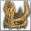

<!-- generated:start -->
<!-- generated-keys: title=fcb00b type=4389c5 id=92cfce sources=27db2c gold=f8237d steps=011dc7 used_by=c2c5b8 kind=701a6f -->
|  |  |
|---|---|
|  |  |
| **Table** | `ItemSancMet` row 42 |
| **Gold per attempt** | 5,000 |
| **Success rates** | unknown (server side) |
| **Used by** | 72 items |

### Materials per step

Six material steps per row. Whether a step is a reinforce level band or a tier is not settled: the patch notes' six planned tiers fit six steps ([[gameplay/reinforce-and-runes|Reinforce and runes]] §4, *guess*). One 2018 screenshot shows a T1 weapon +0→+1 costing 1,000 gold + 3 Red Passion Fragments [D].

| step | materials |
|---|---|
| 1 | [[wiki/items/602-blue-passion-piece-d\|Blue Passion Piece (D)]] × 6 |
| 2 | [[wiki/items/603-blue-passion-fragments-c\|Blue Passion Fragments (C)]] × 8 |
| 3 | [[wiki/items/604-blue-passion-piece-c\|Blue Passion Piece (C)]] × 8 |
| 4 | [[wiki/items/605-blue-passion-fragments-b\|Blue Passion Fragments (B)]] × 10 |
| 5 | [[wiki/items/606-blue-passion-piece-b\|Blue Passion Piece (B)]] × 10 |
| 6 | [[wiki/items/607-blue-passion-fragments-a\|Blue Passion Fragments (A)]] × 15 |

### Items that use it

[[wiki/items/3001-death-head-s-helmet|Death Head's Helmet]], [[wiki/items/3002-death-head-s-armor|Death Head's Armor]], [[wiki/items/3003-death-head-s-gloves|Death Head's Gloves]], [[wiki/items/3004-death-head-s-shoes|Death Head's Shoes]], [[wiki/items/3005-death-head-s-necklace|Death Head's Necklace]], [[wiki/items/3006-death-head-s-belt|Death Head's Belt]], [[wiki/items/3007-death-head-s-bracelet|Death Head's Bracelet]], [[wiki/items/3008-death-head-s-ring|Death Head's Ring]], [[wiki/items/3011-skull-s-helmet|Skull's Helmet]], [[wiki/items/3012-skull-s-armor|Skull's Armor]], [[wiki/items/3013-skull-s-gloves|Skull's Gloves]], [[wiki/items/3014-skull-s-shoes|Skull's Shoes]], [[wiki/items/3015-skull-s-necklace|Skull's Necklace]], [[wiki/items/3016-skull-s-belt|Skull's Belt]], [[wiki/items/3017-skull-s-bracelet|Skull's Bracelet]], [[wiki/items/3018-skull-s-ring|Skull's Ring]], [[wiki/items/3021-fisher-s-helmet|Fisher's Helmet]], [[wiki/items/3022-fisher-s-armor|Fisher's Armor]], [[wiki/items/3023-fisher-s-gloves|Fisher's Gloves]], [[wiki/items/3024-fisher-s-shoes|Fisher's Shoes]], [[wiki/items/3025-fisher-s-necklace|Fisher's Necklace]], [[wiki/items/3026-fisher-s-belt|Fisher's Belt]], [[wiki/items/3027-fisher-s-bracelet|Fisher's Bracelet]], [[wiki/items/3028-fisher-s-ring|Fisher's Ring]], [[wiki/items/3031-komodo-s-helmet|Komodo's Helmet]], [[wiki/items/3032-komodo-s-armor|Komodo's Armor]], [[wiki/items/3033-komodo-s-gloves|Komodo's Gloves]], [[wiki/items/3034-komodo-s-shoes|Komodo's Shoes]], [[wiki/items/3035-komodo-s-necklace|Komodo's Necklace]], [[wiki/items/3036-komodo-s-belt|Komodo's Belt]], [[wiki/items/3037-komodo-s-bracelet|Komodo's Bracelet]], [[wiki/items/3038-komodo-s-ring|Komodo's Ring]], [[wiki/items/3041-spector-s-earring|Spector's Earring]], [[wiki/items/3042-spector-s-armor|Spector's Armor]], [[wiki/items/3043-spector-s-gloves|Spector's Gloves]], [[wiki/items/3044-spector-s-shoes|Spector's Shoes]], [[wiki/items/3045-spector-s-necklace|Spector's Necklace]], [[wiki/items/3046-spector-s-belt|Spector's Belt]], [[wiki/items/3047-spector-s-bracelet|Spector's Bracelet]], [[wiki/items/3048-spector-s-ring|Spector's Ring]], [[wiki/items/3051-garon-s-helmet|Garon's Helmet]], [[wiki/items/3052-garon-s-armor|Garon's Armor]], [[wiki/items/3053-garon-s-gloves|Garon's Gloves]], [[wiki/items/3054-garon-s-shoes|Garon's Shoes]], [[wiki/items/3055-garon-s-orb|Garon's Orb]], [[wiki/items/3056-garon-s-belt|Garon's Belt]], [[wiki/items/3057-garon-s-bracelet|Garon's Bracelet]], [[wiki/items/3058-garon-s-ring|Garon's Ring]], [[wiki/items/3061-leviathan-s-helmet|Leviathan's Helmet]], [[wiki/items/3062-leviathan-s-armor|Leviathan's Armor]], [[wiki/items/3063-leviathan-s-gloves|Leviathan's Gloves]], [[wiki/items/3064-leviathan-s-shoes|Leviathan's Shoes]], [[wiki/items/3065-leviathan-s-necklace|Leviathan's Necklace]], [[wiki/items/3066-leviathan-s-belt|Leviathan's Belt]], [[wiki/items/3067-leviathan-s-bracelet|Leviathan's Bracelet]], [[wiki/items/3068-leviathan-s-ring|Leviathan's Ring]], [[wiki/items/3501-fame-knight-helmet|Fame knight Helmet]], [[wiki/items/3502-fame-knight-armor|Fame knight Armor]], [[wiki/items/3503-fame-knight-gloves|Fame knight Gloves]], [[wiki/items/3504-fame-knight-shoes|Fame knight Shoes]], [[wiki/items/3505-fame-knight-necklace|Fame knight Necklace]], [[wiki/items/3506-fame-knight-belt|Fame knight Belt]], [[wiki/items/3507-fame-knight-bracelet|Fame knight Bracelet]], [[wiki/items/3508-fame-knight-ring|Fame knight Ring]], [[wiki/items/3511-fame-warrior-helmet|Fame warrior Helmet]], [[wiki/items/3512-fame-warrior-armor|Fame warrior Armor]], [[wiki/items/3513-fame-warrior-gloves|Fame warrior Gloves]], [[wiki/items/3514-fame-warrior-shoes|Fame warrior Shoes]], [[wiki/items/3515-fame-warrior-necklace|Fame warrior Necklace]], [[wiki/items/3516-fame-warrior-belt|Fame warrior Belt]], [[wiki/items/3517-fame-warrior-bracelet|Fame warrior Bracelet]], [[wiki/items/3518-fame-warrior-ring|Fame warrior Ring]]

### Rules from the patch notes

- A failed reinforce drops the item one level and uses up the materials; Reinforcing Adjuvants (item 1100) prevent the drop (WM 0412).
- Success falls slowly with tier and rarity; Rainbow Reinforcing Stones only work on their own rarity (WM 0406 / 0420).
- Source: [[gameplay/reinforce-and-runes|Reinforce and runes]] §4.
<!-- generated:end -->

## Notes

<!-- hand-written: add what you know, with a source -->

## Behaviour

<!-- hand-written: add what you know, with a source -->

## Sources

<!-- hand-written: add what you know, with a source -->

## Open questions

<!-- hand-written: add what you know, with a source -->

<!-- credit:start -->
---
*Game content © GAMESinFLAMES / Joyimpact; reproduced for preservation and reference.*
<!-- credit:end -->
