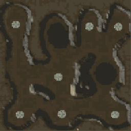

<!-- generated:start -->
<!-- generated-keys: title=c1cc34 type=c899cd id=7224f9 sources=df03c5 name_kr=355ea6 terrain=bd9154 bounds=357a17 size=114466 segments=2e62a6 fields=97d170 minimap=5cb427 -->
|  |  |
|---|---|
|  |  |
| **Zone id** | `106` |
| **ZoneDB name** | 5x5_test (English gloss: 5x5 test) |
| **Terrain name** | `01` |
| **Rectangle** | x 2624–2783, z 1568–1727 (160 × 160 units) |
| **Minimap** | `map/minimap/minimap_z106_00.dds` |
| **Lighting** | `Setting/weather/01.dat` |

No field is known to use this zone: no gate or trigger lies inside it. It may be a test, a UI scene or a leftover. Add `fields:` if you know better.

### Segments

Terrain segments `ZPxx_zz` (x = column, z = row; 256 × 256 units) the rectangle touches. Navmesh format and the walkability check: [[spec/navmesh|Navmesh]].

| segment | navmesh (.nav) | terrain (.zp) |
|---|---|---|
| ZP10_06 | yes | yes |

### Overlapping zones

[[wiki/zones/151-tower-of-fate-basement|Tower of Fate basement]]
<!-- generated:end -->

## Notes

<!-- hand-written: add what you know, with a source -->

## Behaviour

<!-- hand-written: add what you know, with a source -->

## Sources

<!-- hand-written: add what you know, with a source -->

## Open questions

<!-- hand-written: add what you know, with a source -->

<!-- credit:start -->
---
*Game content © GAMESinFLAMES / Joyimpact; reproduced for preservation and reference.*
<!-- credit:end -->
