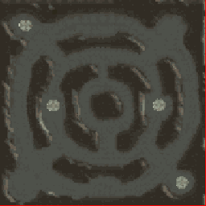

<!-- generated:start -->
<!-- generated-keys: title=4bd170 type=c899cd id=17ba07 sources=7b4d04 name_kr=5f3fd0 terrain=355668 bounds=666fe3 size=114466 segments=63c97d fields=97d170 minimap=460a27 -->
|  |  |
|---|---|
|  |  |
| **Zone id** | `11` |
| **ZoneDB name** | 인던_1F (English gloss: Instance dungeon 1F) |
| **Terrain name** | `Indun_01` |
| **Rectangle** | x 320–479, z 1824–1983 (160 × 160 units) |
| **Minimap** | `map/minimap/minimap_z11_00.dds` |

No field is known to use this zone: no gate or trigger lies inside it. It may be a test, a UI scene or a leftover. Add `fields:` if you know better.

### Segments

Terrain segments `ZPxx_zz` (x = column, z = row; 256 × 256 units) the rectangle touches. Navmesh format and the walkability check: [[spec/navmesh|Navmesh]].

| segment | navmesh (.nav) | terrain (.zp) |
|---|---|---|
| ZP01_07 | yes | yes |

### Overlapping zones

[[wiki/zones/3-dungeon|Dungeon]], [[wiki/zones/147-field-26-test|Field 26 test]], [[wiki/zones/148-new-arena-battle-arena|New arena (Battle Arena)]]
<!-- generated:end -->

## Notes

<!-- hand-written: add what you know, with a source -->

## Behaviour

<!-- hand-written: add what you know, with a source -->

## Sources

<!-- hand-written: add what you know, with a source -->

## Open questions

<!-- hand-written: add what you know, with a source -->

<!-- credit:start -->
---
*Game content © GAMESinFLAMES / Joyimpact; reproduced for preservation and reference.*
<!-- credit:end -->
