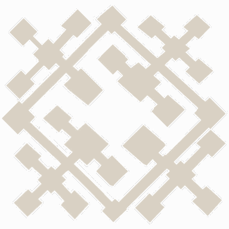

<!-- generated:start -->
<!-- generated-keys: title=bb3646 type=c899cd id=05a8ea sources=427712 name_kr=a21788 terrain=04c7b1 bounds=b0ade3 size=be57ee segments=14e8a7 fields=48700a minimap=f94c05 -->
|  |  |
|---|---|
|  |  |
| **Zone id** | `122` |
| **ZoneDB name** | 어비스_LV4_112 (English gloss: Abyss LV4 112 (Death's Rest)) |
| **Terrain name** | `Abyss_Lv04` |
| **Rectangle** | x 288–479, z 2848–3039 (192 × 192 units) |
| **Fields** | [[wiki/fields/112-death-s-rest\|Death's Rest]] |
| **Minimap** | `map/minimap/minimap_z122_00.dds` |
| **Lighting** | `Setting/weather/Abyss_Lv04.dat` |

### Segments

Terrain segments `ZPxx_zz` (x = column, z = row; 256 × 256 units) the rectangle touches. Navmesh format and the walkability check: [[spec/navmesh|Navmesh]].

| segment | navmesh (.nav) | terrain (.zp) |
|---|---|---|
| ZP01_11 | yes | yes |
<!-- generated:end -->

## Notes

- Abyss tile of field 112. Each Abyss field fills one 256-unit segment on a grid from x = 256, z = 2048; the tier is the `LV<n>` in the zone name. On the stitched player map the minimap is north-up (+x right, +z up) and shows about 175 units around the rectangle's centre, at about 1.53 px per unit ([[gameplay/abyss-map|Abyss map]]). *client + image*

## Behaviour

<!-- hand-written: add what you know, with a source -->

## Sources

<!-- hand-written: add what you know, with a source -->

## Open questions

<!-- hand-written: add what you know, with a source -->

<!-- credit:start -->
---
*Game content © GAMESinFLAMES / Joyimpact; reproduced for preservation and reference.*
<!-- credit:end -->
