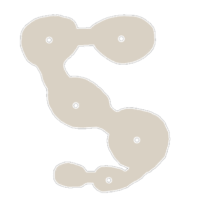

<!-- generated:start -->
<!-- generated-keys: title=cc4f5a type=c899cd id=95e815 sources=ebae24 name_kr=266558 terrain=3de06a bounds=d6923d size=6f2826 segments=7277be fields=0ae2ea minimap=2d4378 -->
|  |  |
|---|---|
|  |  |
| **Zone id** | `134` |
| **ZoneDB name** | 필드던전_07(데몬2) (English gloss: Field dungeon 07(demon2) ([Lv 8] Thorn's Hell)) |
| **Terrain name** | `129` |
| **Rectangle** | x 800–991, z 1792–2047 (192 × 256 units) |
| **Fields** | [[wiki/fields/129-lv-8-thorn-s-hell\|(Lv 8) Thorn's Hell]] |
| **Minimap** | `map/minimap/minimap_z134_00.dds` |
| **Lighting** | `Setting/weather/129.dat` |

### Segments

Terrain segments `ZPxx_zz` (x = column, z = row; 256 × 256 units) the rectangle touches. Navmesh format and the walkability check: [[spec/navmesh|Navmesh]].

| segment | navmesh (.nav) | terrain (.zp) |
|---|---|---|
| ZP03_07 | yes | yes |
<!-- generated:end -->

## Notes

<!-- hand-written: add what you know, with a source -->

## Behaviour

<!-- hand-written: add what you know, with a source -->

## Sources

<!-- hand-written: add what you know, with a source -->

## Open questions

<!-- hand-written: add what you know, with a source -->

<!-- credit:start -->
---
*Game content © GAMESinFLAMES / Joyimpact; reproduced for preservation and reference.*
<!-- credit:end -->
