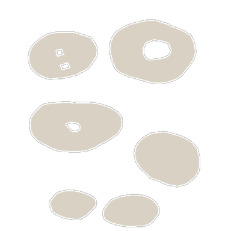

<!-- generated:start -->
<!-- generated-keys: title=94d578 type=c899cd id=9e071a sources=a56842 name_kr=3dc286 terrain=791ea8 bounds=93101d size=6f2826 segments=e56b57 fields=d4ee27 minimap=83b0a1 -->
|  |  |
|---|---|
|  |  |
| **Zone id** | `136` |
| **ZoneDB name** | 필드던전_02 (English gloss: Field dungeon 02 ([Lv 3] Tsunami Lake)) |
| **Terrain name** | `FieldDungeon_02` |
| **Rectangle** | x 1312–1503, z 1792–2047 (192 × 256 units) |
| **Fields** | [[wiki/fields/122-lv-3-tsunami-lake\|(Lv 3) Tsunami Lake]] |
| **Minimap** | `map/minimap/minimap_z136_00.dds` |
| **Fog map** | `map/fogmap/Fog_z136.dds` |
| **Lighting** | `Setting/weather/FieldDungeon_02.dat` |

### Segments

Terrain segments `ZPxx_zz` (x = column, z = row; 256 × 256 units) the rectangle touches. Navmesh format and the walkability check: [[spec/navmesh|Navmesh]].

| segment | navmesh (.nav) | terrain (.zp) |
|---|---|---|
| ZP05_07 | yes | yes |
<!-- generated:end -->

## Notes

<!-- hand-written: add what you know, with a source -->

## Behaviour

<!-- hand-written: add what you know, with a source -->

## Sources

<!-- hand-written: add what you know, with a source -->

## Open questions

<!-- hand-written: add what you know, with a source -->

<!-- credit:start -->
---
*Game content © GAMESinFLAMES / Joyimpact; reproduced for preservation and reference.*
<!-- credit:end -->
