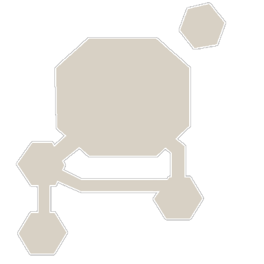

<!-- generated:start -->
<!-- generated-keys: title=22c229 type=c899cd id=fa7557 sources=3881af name_kr=15c3aa terrain=311741 bounds=283ae4 size=a1cfbb segments=e7de41 fields=dd4512 minimap=7aa812 -->
|  |  |
|---|---|
|  |  |
| **Zone id** | `139` |
| **ZoneDB name** | 신장실 (English gloss: Room of the Fortress Keeper) |
| **Terrain name** | `Core_02` |
| **Rectangle** | x 512–767, z 3840–4095 (256 × 256 units) |
| **Fields** | [[wiki/fields/131-room-of-the-fortress-keeper\|Room of the Fortress Keeper]] |
| **Minimap** | `map/minimap/minimap_z139_00.dds` |
| **Fog map** | `map/fogmap/Fog_z139.dds` |
| **Lighting** | `Setting/weather/Core_02.dat` |

### Segments

Terrain segments `ZPxx_zz` (x = column, z = row; 256 × 256 units) the rectangle touches. Navmesh format and the walkability check: [[spec/navmesh|Navmesh]].

| segment | navmesh (.nav) | terrain (.zp) |
|---|---|---|
| ZP02_15 | yes | yes |

### Mentioned in

- [[gameplay/video-fort-war#Room of Core (field 130 "Room of Core", ZoneDB 138 `코어실`, rectangle x 256–511, z 3840–4095)|Video notes: fortress war series (ZonderCoRe) § Room of Core (field 130 "Room of Core", ZoneDB 138 `코어실`, rectangle x 256–511, z 3840–4095)]]
<!-- generated:end -->

## Notes

<!-- hand-written: add what you know, with a source -->

## Behaviour

<!-- hand-written: add what you know, with a source -->

## Sources

<!-- hand-written: add what you know, with a source -->

## Open questions

<!-- hand-written: add what you know, with a source -->

<!-- credit:start -->
---
*Game content © GAMESinFLAMES / Joyimpact; reproduced for preservation and reference.*
<!-- credit:end -->
