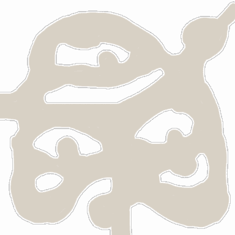

<!-- generated:start -->
<!-- generated-keys: title=718b8e type=c899cd id=cb4e52 sources=ce208f name_kr=f149fd terrain=3a3364 bounds=9a64d1 size=114466 segments=a25a66 fields=f1e31d minimap=e06853 -->
|  |  |
|---|---|
|  |  |
| **Zone id** | `32` |
| **ZoneDB name** | 필드_03 (English gloss: Field 03 (Shade Wood)) |
| **Terrain name** | `03` |
| **Rectangle** | x 800–959, z 544–703 (160 × 160 units) |
| **Fields** | [[wiki/fields/3-shade-wood\|Shade Wood]] |
| **Minimap** | `map/minimap/minimap_z32_00.dds` |
| **Lighting** | `Setting/weather/03.dat` |

### Segments

Terrain segments `ZPxx_zz` (x = column, z = row; 256 × 256 units) the rectangle touches. Navmesh format and the walkability check: [[spec/navmesh|Navmesh]].

| segment | navmesh (.nav) | terrain (.zp) |
|---|---|---|
| ZP03_02 | yes | yes |
<!-- generated:end -->

## Notes

<!-- hand-written: add what you know, with a source -->

## Behaviour

<!-- hand-written: add what you know, with a source -->

## Sources

<!-- hand-written: add what you know, with a source -->

## Open questions

<!-- hand-written: add what you know, with a source -->

<!-- credit:start -->
---
*Game content © GAMESinFLAMES / Joyimpact; reproduced for preservation and reference.*
<!-- credit:end -->
