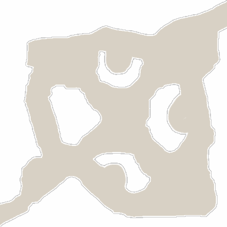

<!-- generated:start -->
<!-- generated-keys: title=796f01 type=c899cd id=5b384c sources=32d370 name_kr=bc8476 terrain=e21789 bounds=d2355b size=114466 segments=9b2e5d fields=758a13 minimap=8a0082 -->
|  |  |
|---|---|
|  |  |
| **Zone id** | `38` |
| **ZoneDB name** | 필드_13 (English gloss: Field 13 (Punish Peak)) |
| **Terrain name** | `13` |
| **Rectangle** | x 3360–3519, z 544–703 (160 × 160 units) |
| **Fields** | [[wiki/fields/13-punish-peak\|Punish Peak]] |
| **Minimap** | `map/minimap/minimap_z38_00.dds` |
| **Lighting** | `Setting/weather/13.dat` |

### Segments

Terrain segments `ZPxx_zz` (x = column, z = row; 256 × 256 units) the rectangle touches. Navmesh format and the walkability check: [[spec/navmesh|Navmesh]].

| segment | navmesh (.nav) | terrain (.zp) |
|---|---|---|
| ZP13_02 | yes | yes |
<!-- generated:end -->

## Notes

<!-- hand-written: add what you know, with a source -->

## Behaviour

<!-- hand-written: add what you know, with a source -->

## Sources

<!-- hand-written: add what you know, with a source -->

## Open questions

<!-- hand-written: add what you know, with a source -->

<!-- credit:start -->
---
*Game content © GAMESinFLAMES / Joyimpact; reproduced for preservation and reference.*
<!-- credit:end -->
