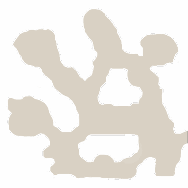

<!-- generated:start -->
<!-- generated-keys: title=d69550 type=c899cd id=fe2ef4 sources=7f6e08 name_kr=596d50 terrain=bb48c0 bounds=bc7713 size=114466 segments=c094f9 fields=6c9878 minimap=c18292 -->
|  |  |
|---|---|
|  |  |
| **Zone id** | `46` |
| **ZoneDB name** | 필드_21 (English gloss: Field 21 (Vortex Plain)) |
| **Terrain name** | `21` |
| **Rectangle** | x 288–447, z 832–991 (160 × 160 units) |
| **Fields** | [[wiki/fields/21-vortex-plain\|Vortex Plain]] |
| **Minimap** | `map/minimap/minimap_z46_00.dds` |
| **Fog map** | `map/fogmap/Fog_z46.dds` |
| **Lighting** | `Setting/weather/21.dat` |

### Segments

Terrain segments `ZPxx_zz` (x = column, z = row; 256 × 256 units) the rectangle touches. Navmesh format and the walkability check: [[spec/navmesh|Navmesh]].

| segment | navmesh (.nav) | terrain (.zp) |
|---|---|---|
| ZP01_03 | yes | yes |
<!-- generated:end -->

## Notes

<!-- hand-written: add what you know, with a source -->

## Behaviour

<!-- hand-written: add what you know, with a source -->

## Sources

<!-- hand-written: add what you know, with a source -->

## Open questions

<!-- hand-written: add what you know, with a source -->

<!-- credit:start -->
---
*Game content © GAMESinFLAMES / Joyimpact; reproduced for preservation and reference.*
<!-- credit:end -->
