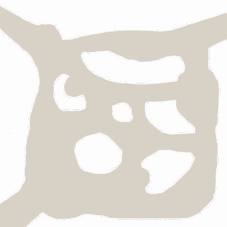

<!-- generated:start -->
<!-- generated-keys: title=0898d7 type=c899cd id=c66c65 sources=399edf name_kr=d36842 terrain=6c7995 bounds=b05017 size=114466 segments=edd5f4 fields=02fb80 minimap=8530ed -->
|  |  |
|---|---|
|  |  |
| **Zone id** | `64` |
| **ZoneDB name** | 필드_45 (English gloss: Field 45 (Sunstone Hill)) |
| **Terrain name** | `45` |
| **Rectangle** | x 1344–1503, z 1056–1215 (160 × 160 units) |
| **Fields** | [[wiki/fields/45-sunstone-hill\|Sunstone Hill]] |
| **Minimap** | `map/minimap/minimap_z64_00.dds` |
| **Lighting** | `Setting/weather/45.dat` |

### Segments

Terrain segments `ZPxx_zz` (x = column, z = row; 256 × 256 units) the rectangle touches. Navmesh format and the walkability check: [[spec/navmesh|Navmesh]].

| segment | navmesh (.nav) | terrain (.zp) |
|---|---|---|
| ZP05_04 | yes | yes |
<!-- generated:end -->

## Notes

<!-- hand-written: add what you know, with a source -->

## Behaviour

<!-- hand-written: add what you know, with a source -->

## Sources

<!-- hand-written: add what you know, with a source -->

## Open questions

<!-- hand-written: add what you know, with a source -->

<!-- credit:start -->
---
*Game content © GAMESinFLAMES / Joyimpact; reproduced for preservation and reference.*
<!-- credit:end -->
