<!-- generated by wiki/gamewiki (index.py); do not edit -->

# Zones

Every terrain zone in the client's `ZoneDB` table, with its minimap: the world rectangle, the terrain segments and navmesh, and the [[wiki/fields/index|fields]] that use it. Names are English glosses of the Korean ZoneDB names.

153 pages: 137 complete, 1 partial, 15 stub. Back to the [[wiki/index|game wiki]].

| | id | name | status | missing |
|---|---|---|---|---|
|  | 0 | [[wiki/zones/0-default\|Default]] | stub | 1 |
|  | 1 | [[wiki/zones/1-field-2\|Field 2]] | stub | 1 |
| 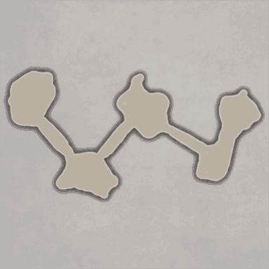 | 2 | [[wiki/zones/2-tutorial-map-01-beginner-s-training-ground\|Tutorial map 01 (Beginner's Training Ground)]] | complete | 0 |
| 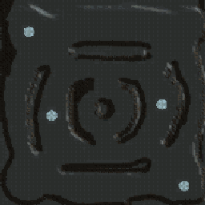 | 3 | [[wiki/zones/3-dungeon\|Dungeon]] | stub | 1 |
|  | 4 | [[wiki/zones/4-logo\|Logo]] | complete | 0 |
|  | 5 | [[wiki/zones/5-battle-arena\|Battle arena]] | partial | 1 |
|  | 6 | [[wiki/zones/6-town-c-village\|Town C (Village)]] | complete | 0 |
|  | 7 | [[wiki/zones/7-new\|New]] | stub | 1 |
|  | 8 | [[wiki/zones/8-town-b-village\|Town B (Village)]] | complete | 0 |
| 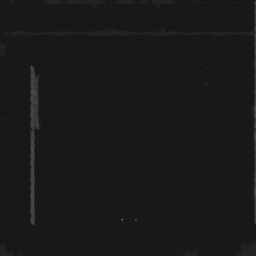 | 9 | [[wiki/zones/9-create\|Create]] | complete | 0 |
|  | 10 | [[wiki/zones/10-login\|Login]] | complete | 0 |
|  | 11 | [[wiki/zones/11-instance-dungeon-1f\|Instance dungeon 1F]] | stub | 1 |
| 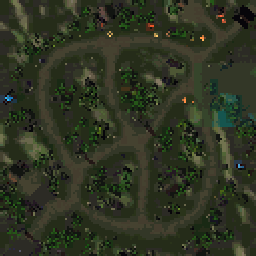 | 12 | [[wiki/zones/12-town-c-field\|Town C Field]] | stub | 1 |
|  | 13 | [[wiki/zones/13-field-74-whistle-hill\|Field 74 (Whistle Hill)]] | complete | 0 |
| 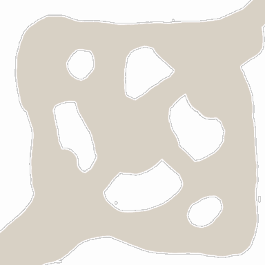 | 14 | [[wiki/zones/14-field-01-end-of-earth\|Field 01 (End of Earth)]] | complete | 0 |
| 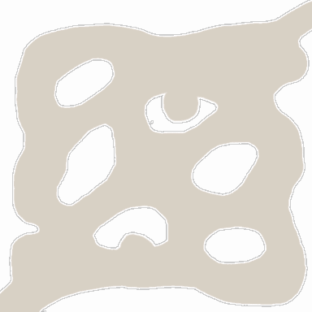 | 15 | [[wiki/zones/15-field-02-exit-of-shadewood\|Field 02 (Exit of Shadewood)]] | complete | 0 |
|  | 16 | [[wiki/zones/16-field-05-fall-of-abyss\|Field 05 (Fall of Abyss)]] | complete | 0 |
| 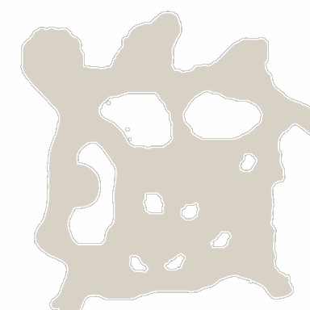 | 17 | [[wiki/zones/17-field-09-thornsbush-peak\|Field 09 (Thornsbush peak)]] | complete | 0 |
| 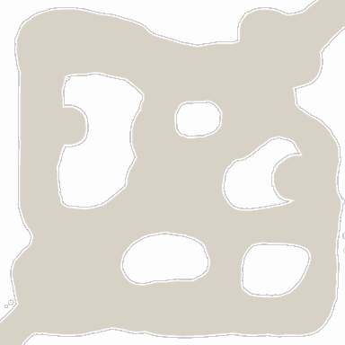 | 18 | [[wiki/zones/18-field-11-punish-canyon\|Field 11 (Punish Canyon)]] | complete | 0 |
|  | 19 | [[wiki/zones/19-field-12-dark-shore\|Field 12 (Dark Shore)]] | complete | 0 |
|  | 20 | [[wiki/zones/20-field-25-mist-wood\|Field 25 (Mist Wood)]] | complete | 0 |
|  | 21 | [[wiki/zones/21-field-26-echo-of-earth\|Field 26 (Echo of Earth)]] | complete | 0 |
|  | 22 | [[wiki/zones/22-field-32-long-road\|Field 32 (Long Road)]] | complete | 0 |
| 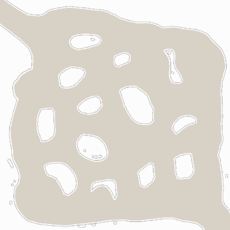 | 23 | [[wiki/zones/23-field-35-skymist-temple\|Field 35 (Skymist Temple)]] | complete | 0 |
|  | 24 | [[wiki/zones/24-field-37-turncoat-place\|Field 37 (Turncoat Place)]] | complete | 0 |
|  | 25 | [[wiki/zones/25-field-46-spider-nest\|Field 46 (Spider Nest)]] | complete | 0 |
|  | 26 | [[wiki/zones/26-field-56-snowflower-plain\|Field 56 (Snowflower Plain)]] | complete | 0 |
|  | 27 | [[wiki/zones/27-field-65-canyon-of-earth\|Field 65 (Canyon of Earth)]] | complete | 0 |
|  | 28 | [[wiki/zones/28-field-66-earth-of-abyss\|Field 66 (Earth of Abyss)]] | complete | 0 |
|  | 29 | [[wiki/zones/29-field-75-thunderstorm-ruin-abyss\|Field 75 (Thunderstorm Ruin - Abyss)]] | complete | 0 |
|  | 30 | [[wiki/zones/30-field-76-thunderstorm-ruin-abaddon\|Field 76 (Thunderstorm Ruin - Abaddon)]] | complete | 0 |
|  | 31 | [[wiki/zones/31-field-39-sunstone-gateway\|Field 39 (Sunstone gateway)]] | complete | 0 |
|  | 32 | [[wiki/zones/32-field-03-shade-wood\|Field 03 (Shade Wood)]] | complete | 0 |
|  | 33 | [[wiki/zones/33-field-04-enter-of-shadewood\|Field 04 (Enter of Shadewood)]] | complete | 0 |
|  | 34 | [[wiki/zones/34-field-06-skywing-yard\|Field 06 (Skywing Yard)]] | complete | 0 |
|  | 35 | [[wiki/zones/35-field-07-moonshadow-wood\|Field 07 (Moonshadow Wood)]] | complete | 0 |
|  | 36 | [[wiki/zones/36-field-08-long-canyon\|Field 08 (Long Canyon)]] | complete | 0 |
|  | 37 | [[wiki/zones/37-field-10-shaking-earth\|Field 10 (Shaking Earth)]] | complete | 0 |
|  | 38 | [[wiki/zones/38-field-13-punish-peak\|Field 13 (Punish Peak)]] | complete | 0 |
|  | 39 | [[wiki/zones/39-field-14-eternal-river-upper-region\|Field 14 (Eternal River - Upper Region)]] | complete | 0 |
| 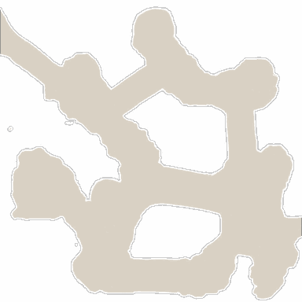 | 40 | [[wiki/zones/40-field-15-twisting-valley\|Field 15 (Twisting Valley)]] | complete | 0 |
|  | 41 | [[wiki/zones/41-field-16-refuge-of-old-dragon\|Field 16 (Refuge of old dragon)]] | complete | 0 |
|  | 42 | [[wiki/zones/42-field-17-eternal-river-middle-region\|Field 17 (Eternal River - Middle Region)]] | complete | 0 |
|  | 43 | [[wiki/zones/43-field-18-eternal-river-lower-region\|Field 18 (Eternal River - Lower Region)]] | complete | 0 |
| 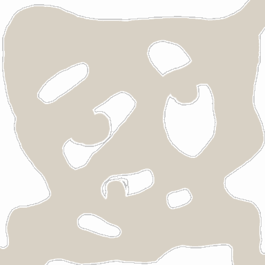 | 44 | [[wiki/zones/44-field-19-death-valley\|Field 19 (Death Valley)]] | complete | 0 |
|  | 45 | [[wiki/zones/45-field-20-windsong-wood\|Field 20 (Windsong Wood)]] | complete | 0 |
|  | 46 | [[wiki/zones/46-field-21-vortex-plain\|Field 21 (Vortex Plain)]] | complete | 0 |
|  | 47 | [[wiki/zones/47-field-22-afterlife-hill\|Field 22 (Afterlife Hill)]] | complete | 0 |
|  | 48 | [[wiki/zones/48-field-23-fairy-s-wood\|Field 23 (Fairy's Wood)]] | complete | 0 |
|  | 49 | [[wiki/zones/49-field-24-silent-garden\|Field 24 (Silent Garden)]] | complete | 0 |
|  | 50 | [[wiki/zones/50-field-27-spirit-s-hill\|Field 27 (Spirit's Hill)]] | complete | 0 |
|  | 51 | [[wiki/zones/51-field-28-spirit-s-refuge\|Field 28 (Spirit's Refuge)]] | complete | 0 |
|  | 52 | [[wiki/zones/52-field-29-spirit-s-temple\|Field 29 (Spirit's Temple)]] | complete | 0 |
|  | 53 | [[wiki/zones/53-field-30-wind-valley\|Field 30 (Wind Valley)]] | complete | 0 |
|  | 54 | [[wiki/zones/54-field-31-mist-lake\|Field 31 (Mist Lake)]] | complete | 0 |
|  | 55 | [[wiki/zones/55-field-33-dreamer-s-refuge\|Field 33 (Dreamer's Refuge)]] | complete | 0 |
|  | 56 | [[wiki/zones/56-field-34-skymist-lake\|Field 34 (Skymist Lake)]] | complete | 0 |
|  | 57 | [[wiki/zones/57-field-36-firepillar-plain\|Field 36 (Firepillar Plain)]] | complete | 0 |
|  | 58 | [[wiki/zones/58-field-38-angry-river-lower-region\|Field 38 (Angry River - Lower Region)]] | complete | 0 |
|  | 59 | [[wiki/zones/59-field-40-angry-river-upper-region\|Field 40 (Angry River - Upper Region)]] | complete | 0 |
|  | 60 | [[wiki/zones/60-field-41-enter-of-twilight\|Field 41 (Enter of Twilight)]] | complete | 0 |
|  | 61 | [[wiki/zones/61-field-42-crater-of-abaddon\|Field 42 (Crater of Abaddon)]] | complete | 0 |
|  | 62 | [[wiki/zones/62-field-43-floor-of-twilight\|Field 43 (Floor of Twilight)]] | complete | 0 |
|  | 63 | [[wiki/zones/63-field-44-sunstone-temple\|Field 44 (Sunstone Temple)]] | complete | 0 |
|  | 64 | [[wiki/zones/64-field-45-sunstone-hill\|Field 45 (Sunstone Hill)]] | complete | 0 |
|  | 65 | [[wiki/zones/65-field-47-burning-earth\|Field 47 (Burning Earth)]] | complete | 0 |
| 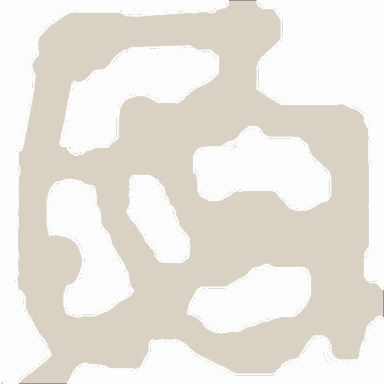 | 66 | [[wiki/zones/66-field-48-ashes-ruin\|Field 48 (Ashes Ruin)]] | complete | 0 |
|  | 67 | [[wiki/zones/67-field-49-weltering-flame\|Field 49 (Weltering Flame)]] | complete | 0 |
|  | 68 | [[wiki/zones/68-field-50-eclipsed-road\|Field 50 (Eclipsed Road)]] | complete | 0 |
|  | 69 | [[wiki/zones/69-field-51-sunup-campsite\|Field 51 (Sunup Campsite)]] | complete | 0 |
|  | 70 | [[wiki/zones/70-field-52-totem-pole-peak\|Field 52 (Totem Pole Peak)]] | complete | 0 |
|  | 71 | [[wiki/zones/71-field-53-ashcolor-hill\|Field 53 (Ashcolor Hill)]] | complete | 0 |
|  | 72 | [[wiki/zones/72-field-54-rotten-twig-wood\|Field 54 (Rotten Twig Wood)]] | complete | 0 |
|  | 73 | [[wiki/zones/73-field-55-sun-hill\|Field 55 (Sun Hill)]] | complete | 0 |
| 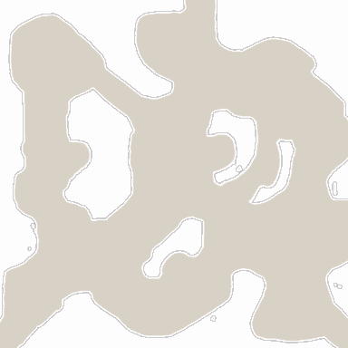 | 74 | [[wiki/zones/74-field-57-raging-wind\|Field 57 (Raging Wind)]] | complete | 0 |
|  | 75 | [[wiki/zones/75-field-58-evil-s-wood\|Field 58 (Evil's Wood)]] | complete | 0 |
|  | 76 | [[wiki/zones/76-field-59-fire-spirit\|Field 59 (Fire Spirit)]] | complete | 0 |
|  | 77 | [[wiki/zones/77-field-60-volcano-heart\|Field 60 (Volcano Heart)]] | complete | 0 |
|  | 78 | [[wiki/zones/78-field-61-fire-calling\|Field 61 (Fire Calling)]] | complete | 0 |
|  | 79 | [[wiki/zones/79-field-62-sad-swamp\|Field 62 (Sad Swamp)]] | complete | 0 |
|  | 80 | [[wiki/zones/80-field-63-cracked-earth\|Field 63 (Cracked Earth)]] | complete | 0 |
|  | 81 | [[wiki/zones/81-field-64-thunderstorm-canyon\|Field 64 (Thunderstorm Canyon)]] | complete | 0 |
|  | 82 | [[wiki/zones/82-field-67-icethorn-plain\|Field 67 (Icethorn Plain)]] | complete | 0 |
| 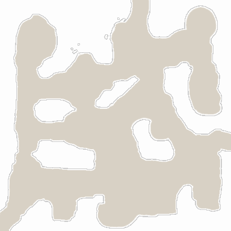 | 83 | [[wiki/zones/83-field-68-frostwind-east\|Field 68 (Frostwind - East)]] | complete | 0 |
|  | 84 | [[wiki/zones/84-field-69-frostwind-west\|Field 69 (Frostwind - West)]] | complete | 0 |
|  | 85 | [[wiki/zones/85-field-70-cold-breath\|Field 70 (Cold Breath)]] | complete | 0 |
|  | 86 | [[wiki/zones/86-field-71-thunderstorm-door\|Field 71 (Thunderstorm door)]] | complete | 0 |
|  | 87 | [[wiki/zones/87-field-72-refuge\|Field 72 (Refuge)]] | complete | 0 |
|  | 88 | [[wiki/zones/88-field-73-left-ground\|Field 73 (Left Ground)]] | complete | 0 |
|  | 89 | [[wiki/zones/89-field-xxxx\|Field xxxx]] | stub | 1 |
|  | 90 | [[wiki/zones/90-field-77-sandairvalley\|Field 77 (SandairValley)]] | complete | 0 |
|  | 91 | [[wiki/zones/91-field-78-moonlight-garden\|Field 78 (Moonlight Garden)]] | complete | 0 |
|  | 92 | [[wiki/zones/92-field-79-moon-lake\|Field 79 (Moon Lake)]] | complete | 0 |
|  | 93 | [[wiki/zones/93-field-80-windmist-valley\|Field 80 (Windmist Valley)]] | complete | 0 |
|  | 94 | [[wiki/zones/94-field-81-windmist-hill\|Field 81 (Windmist Hill)]] | complete | 0 |
|  | 95 | [[wiki/zones/95-field-82-moonlight-plain-west\|Field 82 (Moonlight Plain - West)]] | complete | 0 |
|  | 96 | [[wiki/zones/96-field-83-moonlight-plain-east\|Field 83 (Moonlight Plain - East)]] | complete | 0 |
| 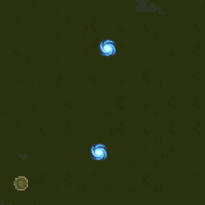 | 97 | [[wiki/zones/97-unused\|Unused]] | stub | 1 |
| 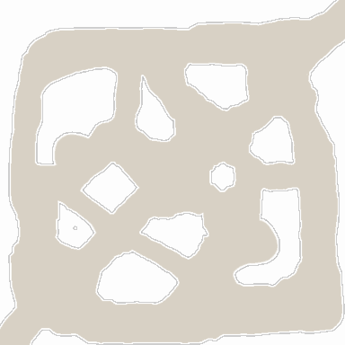 | 98 | [[wiki/zones/98-field-84-eternal-lake\|Field 84 (Eternal Lake)]] | complete | 0 |
|  | 99 | [[wiki/zones/99-field-85-dark-gateway\|Field 85 (Dark Gateway)]] | complete | 0 |
|  | 100 | [[wiki/zones/100-field-86-moonlight-temple\|Field 86 (Moonlight Temple)]] | complete | 0 |
|  | 101 | [[wiki/zones/101-town-c-dummy-shop-street\|Town C dummy shop street]] | stub | 1 |
|  | 102 | [[wiki/zones/102-town-a-village\|Town A (Village)]] | complete | 0 |
|  | 103 | [[wiki/zones/103-a-fortress\|A Fortress]] | complete | 0 |
|  | 104 | [[wiki/zones/104-b-fortress\|B Fortress]] | complete | 0 |
|  | 105 | [[wiki/zones/105-c-fortress\|C Fortress]] | complete | 0 |
|  | 106 | [[wiki/zones/106-5x5-test\|5x5 test]] | stub | 1 |
| 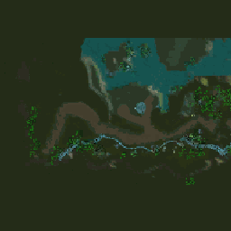 | 107 | [[wiki/zones/107-tutorial-zone\|Tutorial zone]] | stub | 1 |
|  | 108 | [[wiki/zones/108-abyss-lv1-099-corpse-incineration\|Abyss LV1 099 (Corpse incineration)]] | complete | 0 |
|  | 109 | [[wiki/zones/109-tower-basement\|Tower basement]] | stub | 1 |
|  | 110 | [[wiki/zones/110-abyss-lv1-100-corpse-incineration\|Abyss LV1 100 (Corpse incineration)]] | complete | 0 |
|  | 111 | [[wiki/zones/111-abyss-lv1-101-corpse-incineration\|Abyss LV1 101 (Corpse incineration)]] | complete | 0 |
|  | 112 | [[wiki/zones/112-abyss-lv2-102-death-s-rest\|Abyss LV2 102 (Death's Rest)]] | complete | 0 |
|  | 113 | [[wiki/zones/113-abyss-lv3-108-the-land-of-greed\|Abyss LV3 108 (The land of Greed)]] | complete | 0 |
|  | 114 | [[wiki/zones/114-abyss-lv3-109-the-land-of-greed\|Abyss LV3 109 (The land of Greed)]] | complete | 0 |
|  | 115 | [[wiki/zones/115-abyss-lv3-110-prison\|Abyss LV3 110 (Prison)]] | complete | 0 |
|  | 116 | [[wiki/zones/116-abyss-lv3-111-the-land-of-greed\|Abyss LV3 111 (The land of Greed)]] | complete | 0 |
|  | 117 | [[wiki/zones/117-abyss-lv2-103-place-for-scattered-troops\|Abyss LV2 103 (Place for Scattered troops)]] | complete | 0 |
|  | 118 | [[wiki/zones/118-abyss-lv2-104-place-for-scattered-troops\|Abyss LV2 104 (Place for Scattered troops)]] | complete | 0 |
|  | 119 | [[wiki/zones/119-abyss-lv2-105-place-for-scattered-troops\|Abyss LV2 105 (Place for Scattered troops)]] | complete | 0 |
|  | 120 | [[wiki/zones/120-abyss-lv2-106-the-avenue-of-spirit\|Abyss LV2 106 (The avenue of spirit)]] | complete | 0 |
|  | 121 | [[wiki/zones/121-abyss-lv2-107-place-for-scattered-troops\|Abyss LV2 107 (Place for Scattered troops)]] | complete | 0 |
|  | 122 | [[wiki/zones/122-abyss-lv4-112-death-s-rest\|Abyss LV4 112 (Death's Rest)]] | complete | 0 |
| 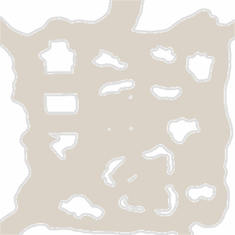 | 123 | [[wiki/zones/123-abyss-lv4-113-the-avenue-of-spirit\|Abyss LV4 113 (The avenue of spirit)]] | complete | 0 |
|  | 124 | [[wiki/zones/124-abyss-lv5-114-the-way-go-to-devildom\|Abyss LV5 114 (The way go to devildom)]] | complete | 0 |
|  | 125 | [[wiki/zones/125-login\|Login]] | complete | 0 |
|  | 126 | [[wiki/zones/126-battlefield-tutorial-sinking-nest\|Battlefield tutorial (Sinking Nest)]] | complete | 0 |
|  | 127 | [[wiki/zones/127-training-ground-a\|Training Ground A]] | complete | 0 |
|  | 128 | [[wiki/zones/128-training-camp-a\|Training Camp A]] | complete | 0 |
|  | 129 | [[wiki/zones/129-training-camp-b\|Training Camp B]] | complete | 0 |
|  | 130 | [[wiki/zones/130-training-camp-c\|Training Camp C]] | complete | 0 |
|  | 131 | [[wiki/zones/131-training-ground-b\|Training Ground B]] | complete | 0 |
|  | 132 | [[wiki/zones/132-training-ground-c\|Training Ground C]] | complete | 0 |
|  | 133 | [[wiki/zones/133-underworld-01-lv-1-skull-temple\|Underworld 01 ((Lv 1) Skull Temple)]] | complete | 0 |
|  | 134 | [[wiki/zones/134-field-dungeon-07-demon2-lv-8-thorn-s-hell\|Field dungeon 07(demon2) ((Lv 8) Thorn's Hell)]] | complete | 0 |
|  | 135 | [[wiki/zones/135-event-dungeon-03\|Event dungeon-03]] | stub | 1 |
|  | 136 | [[wiki/zones/136-field-dungeon-02-lv-3-tsunami-lake\|Field dungeon 02 ((Lv 3) Tsunami Lake)]] | complete | 0 |
|  | 137 | [[wiki/zones/137-field-dungeon-03-lizardman-lv-4-swamps-of-snake-warrior\|Field dungeon 03(lizardman) ((Lv 4) Swamps of Snake Warrior)]] | complete | 0 |
|  | 138 | [[wiki/zones/138-room-of-core\|Room of Core]] | complete | 0 |
|  | 139 | [[wiki/zones/139-room-of-the-fortress-keeper\|Room of the Fortress Keeper]] | complete | 0 |
|  | 140 | [[wiki/zones/140-field-dungeon-04-ghost-lv-6-ghost-fortress\|Field dungeon 04(ghost) ((Lv 6) Ghost Fortress)]] | complete | 0 |
| 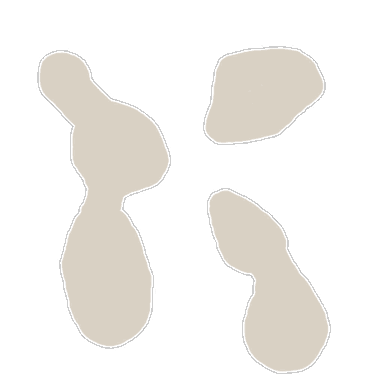 | 141 | [[wiki/zones/141-field-dungeon-05-orc-lv-5-tow-canyon\|Field dungeon 05(orc) ((Lv 5) Tow Canyon)]] | complete | 0 |
|  | 142 | [[wiki/zones/142-field-dungeon-06-demon-lv-7-demon-hell\|Field dungeon 06(demon) ((Lv 7) Demon Hell)]] | complete | 0 |
|  | 143 | [[wiki/zones/143-character-select\|Character select]] | complete | 0 |
|  | 144 | [[wiki/zones/144-a-castle-big-city\|A Castle (big city)]] | complete | 0 |
|  | 145 | [[wiki/zones/145-b-castle-big-city\|B Castle (big city)]] | complete | 0 |
|  | 146 | [[wiki/zones/146-c-castle-big-city\|C Castle (big city)]] | complete | 0 |
|  | 147 | [[wiki/zones/147-field-26-test\|Field 26 test]] | stub | 1 |
|  | 148 | [[wiki/zones/148-new-arena-battle-arena\|New arena (Battle Arena)]] | complete | 0 |
|  | 149 | [[wiki/zones/149-training-ground-border-area-lv-1-chepa-village\|Training Ground (border area) ((Lv 1) Chepa Village)]] | complete | 0 |
|  | 150 | [[wiki/zones/150-skull-cemetery-border-area-02-lv-2-skull-cemetery\|Skull cemetery(border area 02) ((Lv 2) Skull Cemetery)]] | complete | 0 |
|  | 151 | [[wiki/zones/151-tower-of-fate-basement\|Tower of Fate basement]] | stub | 1 |
|  | 152 | [[wiki/zones/152-field-dungeon-08-dragon-lv-9-dragon-island\|Field dungeon 08(dragon) ((Lv 9) Dragon Island)]] | complete | 0 |

*Game content © GAMESinFLAMES / Joyimpact; reproduced for preservation and reference.*
